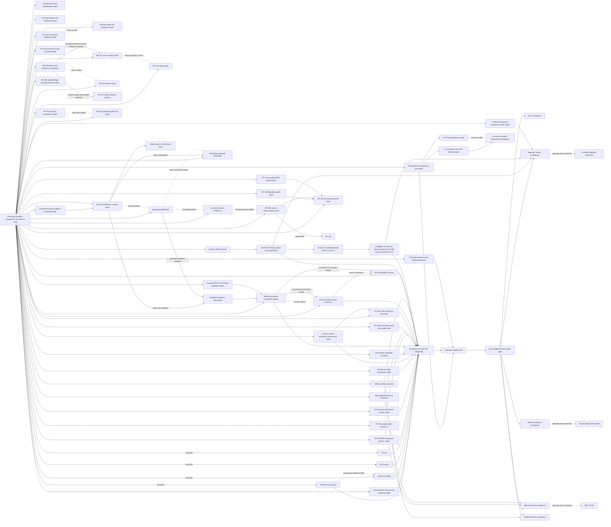

# OM1 Enterprise integration queue

Snapshot: 2026-09-15 22:26 America/New_York

## Authority and deployed state

- Protected authority: `b5c8f427d48028144d58cf7a76e6f4a33729feb5`
- Protected tip: PR #306 historical operational classification, merged from `19225a600b1b40a3e428f05fee4d7966fb377259`; immediately preceded by PR #312's Branch-scoped reconciliation of #303 at `626eb9316d85e6fca52302b845d3fddf0aa17ce8`
- Protected mutation coverage is incomplete: OpenAPI exposes 303 mutation
  operations, while `mutation-coverage.v1.json` classifies 296. The seven missing
  entries are all Payroll cutover-review POST routes (`cutover-review`, approve,
  bridge-period creation/certify/facts, certifications, and facts). Require a
  bounded registry successor before any candidate may claim the platform
  idempotency standard passes; this does not authorize Payroll execution.
- Deployed Preview: `60035693a51ec66328625dfcc78e7cd2dfead824`
- Preview health: old #279. After the earlier recorded incident/recovery windows, SSL connection attempts timed out at 20:35, 20:36, 20:37, 20:38, and 20:40. Healthy old-SHA responses returned at 20:41 and 20:42, HTTP 502 recurred at 20:43, then healthy old-SHA responses returned from 20:44 through 20:53 with PostgreSQL and Redis connected. Preserve the complete new incident/recovery sequence; health does not close the protected deployment gap.
- Deployment gap: protected #280-#289, #291, #294-#298, #300, #303/#312, #306, and #307 are not observed in Preview; deployed remains old #279. After #307 merged, Preview returned HTTP 502 at 21:30 and 21:31, then recovered healthy on old #279 through 22:26 with both dependencies connected. Preserve the incident/recovery; acceptance remains stopped until consecutive exact-`b5c8f427...` healthy responses.
- Acceptance state: pending. Preview initially remained at `b296cc6b...` after
  #265 merged, then by 2026-09-14 14:00 America/New_York returned HTTP 200 at
  exact SHA `b4bf00d3...` with healthy application and connected PostgreSQL and
  Redis. A separate HTTP 502 occurred at 14:16:45 with no authority/PR/head
  change; four consecutive checks from 14:17:23 through 14:17:34 recovered HTTP
  200 at the same exact SHA with both dependencies connected. Preserve both
  transient incidents in acceptance evidence. Required #261-#289 and #291 evidence and
  authenticated persona evidence have not all been supplied. Do not run #265's
  command or #266's generators until repair successors land. During #266 rollout,
  Preview returned HTTP 502 at 15:10, then reported exact `9e866898...` with a
  healthy application and connected PostgreSQL/Redis at 15:11 and 15:12. Preserve
  that transient and require consecutive exact-SHA responses in final acceptance.
  After #268 merged, Preview remained healthy on `9e866898...` at 15:41, then
  reported exact `8b755ee6...` healthy with both dependencies connected at 15:42
  and 15:43. After #269 merged, Preview remained healthy on `8b755ee6...` at
  15:53, then reported exact `60263349...` healthy with both dependencies
  connected at 15:54. Deployment does not authorize the executor command.
  During #270 rollout, Preview returned HTTP 502 at 15:59, then reported exact
  `26469c29...` healthy with both dependencies connected at 16:00, 16:01, and
  16:02. Preserve the transient in acceptance evidence.
  After #271 merged, Preview reported exact `2455cb3d...` healthy with both
  dependencies connected at 16:24.
  After #272 merged, Preview reported exact `cfebd166...` healthy with both
  dependencies connected at 16:27, 16:28, and 16:30.
  After #273 merged, the 16:57 and 17:00 health attempts hit SSL connection
  timeouts; the intervening 16:58 response remained healthy at old SHA
  `cfebd166...`, as did 17:01; requests from 17:02 through 17:05 returned HTTP
  502. Preview recovered healthy at exact `a390c9d8...` with both dependencies
  connected at 17:06 and 17:07. Preserve the rollout incidents. Deployment does
  not qualify the field-readiness mutation for use.
  After #274 merged, Preview remained healthy on `a390c9d8...` at 17:11, then
  reported exact `03eebdf8...` healthy with both dependencies connected at
  17:12 and 17:13. Deployment does not clear the remaining blockers.
  After #275 merged, Preview reported exact `4c072f40...` healthy with both
  dependencies connected at 17:35 and 17:36. Deployment does not qualify the
  field-readiness mutation or its administrator privilege expansion.
  After #276 merged, Preview remained healthy at old `4c072f40...` at 17:49,
  then reported exact `80e665a6...` healthy with both dependencies connected at
  17:50, 17:51, 17:52, and 17:53. Deployment does not clear the remaining
  visible-error or concurrency evidence gates.
  After #277 merged, Preview remained healthy on old `80e665a6...` at 18:47,
  returned HTTP 502 at 18:48, then recovered healthy on the old SHA from 18:49
  through 18:55. Preserve the transient; #278 merged before #277 deployed, so do
  not perform office acceptance until exact `858b59cd...` is healthy in
  consecutive observations and the authorization defect is repaired.
  Preview remained healthy on old `80e665a6...` through 18:59, then deployed
  directly to exact `858b59cd...` with healthy application and connected
  PostgreSQL/Redis at 19:00, 19:01, and 19:02. The intermediate #277 SHA was not
  observed. Deployment health does not cure #278's authorization mismatch.
  After #279 merged, Preview remained healthy on `858b59cd...` at 19:21, then
  reported exact `60035693...` healthy with PostgreSQL/Redis connected at 19:22
  and 19:23. Deployment does not repair the unchanged projection mismatch or
  clear the unexplained broader-suite failure.
  PR #280 merged at 19:31 while Preview remained healthy on `60035693...` from
  19:33 through 19:37. Do not accept #280 until consecutive healthy responses report exact
  `1ba5527a...`; deployment will not repair the unchanged backend authorization
  mismatch.
  PR #281 merged at 19:41 before #280 was observed deployed; Preview returned
  HTTP 502 at 19:42, then recovered healthy on old `60035693...` from 19:43
  through 19:46. Preserve the transient and require consecutive exact
  `7f1d98dc...` healthy responses with both dependencies connected.
  Preview remained healthy on old `60035693...` through 21:23 after the #282 and
  #283 merges; none of #280-#283 was observed as deployed. It then returned HTTP
  502 every minute from 21:24 through 21:30; #284 merged during that outage and
  was not observed deployed. Preview recovered healthy on old
  `60035693...` with both dependencies connected from 21:31 through 22:24;
  #285-#289 merged during those observations and were not deployed. Preserve
  the outage window, stop acceptance, and require consecutive healthy exact-`05c0806b...` responses
  with both dependencies connected before any cutover review acceptance.
  On 2026-09-15, the same old #279 runtime hit an SSL connection timeout at
  10:33:31 and HTTP 502 at 10:34:43, returned one healthy response with
  PostgreSQL and Redis connected at 10:35:51, then timed out again at 10:36:54
  and at 10:38:06. Further timeouts occurred at 10:39:33, 10:40:45, 10:41:57,
  10:44:11, and 10:45:23, separated by isolated healthy old-#279 responses at
  10:43:09 and 10:46:35. PR #291 merged at the latter observation without being
  deployed. Preview was healthy at 10:47:38, returned HTTP 502 at 10:48:41, then
  produced six consecutive healthy old-#279 responses with both dependencies
  connected from 10:49:44 through 10:54:57. Preserve the complete incident and
  recovery window. Sustained old-#279 recovery does not supply the required
  exact-protected-SHA acceptance evidence, so acceptance remains stopped.
- GitHub CI evidence: no check runs or commit statuses are reported for the
  protected SHA. PR #264's body reports 698 migration/job/scheduling regressions,
  16 focused tests, PostgreSQL zero-to-head/current=head, and zero drift, but no
  check run, status, review, comment, or linked qualification log substantiates
  those claims in GitHub. Preserve the originating log before acceptance or
  guarded execution. Local qualification does not substitute for the gates below.
- PR #265 has no GitHub checks or statuses. Its body claims one focused
  non-short-circuit regression plus Ruff/compile/diff checks, but no command-level
  tests. Exact-head inspection found unsafe private-output creation, an unverified
  cohort-authority boundary, and inverted rejection labels. Deployment does not
  cure those defects; keep the command operationally disabled pending repair.
- PR #266 merged at 2026-09-14 15:09 America/New_York as `9e866898...` from
  unchanged head `452d1bb3...`. It has no checks, statuses, reviews, or comments.
  Its two commits are the exact previously qualified v3-plus-v4 stack, so
  protected integration does not clear the
  unsafe output, unbound decision inputs, incomplete authority/verifier/tests,
  contradictory readiness, or missing compatible-executor blockers. Do not
  execute the protected generators or treat their output as admission authority;
  require bounded repair successors.
- PR #267 opened from executor head `8fc29014...` and was closed at 15:36 as
  superseded by PR #268. PR #268 merged at 15:39 as protected `8b755ee6...` from
  head `b6a78204...`, whose only additional change is one blank import separator.
  It has no checks, statuses, reviews, comments, or linked qualification evidence;
  its body says the isolated PostgreSQL suite is “in progress,” which is not
  evidence. Keep the protected executor operationally disabled for the exact
  defects and predecessor order below.
- PR #269 merged at 15:53 as protected `60263349...` from head `63442c3e...`.
  It has no checks, statuses, reviews, comments, or linked evidence. It fixes the
  Location Company lookup and adds only a mocked matching-Company success test;
  all other executor blockers below remain. Keep the command disabled.
- PR #270 merged at 15:59 as protected `26469c29...` from head `e7653b46...`.
  It has no checks, statuses, reviews, comments, or linked evidence. It permits
  exact-digest replay, but its preflight skips UPDATE fingerprint-owner checks
  once matching source state exists. Its only new test uses a synthetic CREATE
  record and does not cover mismatched state, UPDATE ownership, CLI, or database
  replay. Keep the command disabled.
- PR #271 merged at 16:23 as protected `2455cb3d...` from unchanged blocked
  verifier head `dac091e3...`. It has no checks, statuses, reviews, comments, or
  linked logs. Its body claims 714 broader tests, seven skips, 13 focused tests,
  Ruff, and MyPy; the delta itself contains four synthetic verifier tests and no
  command/PostgreSQL coverage. Preserve the originating logs if they exist and
  keep the verifier disabled for the exact defects below.
- PR #272 merged at 16:26 as protected `cfebd166...` from amended head
  `8a1a1e86...`. It has no checks, statuses, reviews, comments, or linked logs.
  It fixes mapped-column serialization and adds one unit regression, but does
  not clear #271's authority, filesystem, ordering, event-scope, or database
  command gaps. Keep the verifier disabled.
- PR #273 merged at 16:55 as protected `a390c9d8...` from unchanged blocked head
  `b510bb39...`. It has no checks, statuses, reviews, comments, or linked logs;
  its body explicitly leaves PostgreSQL Dispatch suites pending. Protected
  integration does not cure the unreachable UI action, partial-commit workflow,
  or hidden mutation error. Keep field readiness operationally disabled.
- PR #274 merged at 17:10 as protected `03eebdf8...` from head `d09aca71...`,
  with no checks, statuses, reviews, comments, or linked logs. It makes only
  supported ineligible Employees selectable and adds two frontend tests. It does
  not repair backend atomicity, visible mutation errors, or PostgreSQL coverage;
  keep field readiness disabled.
- PR #275 merged at 17:34 as protected `4c072f40...` from head `afa7aa24...`,
  with no checks, statuses, reviews, comments, or linked logs. It adds both
  Workforce management permissions to the shared Owner/Admin/Company
  Administrator launch bundle and one matrix assertion. Its body claims 20
  PostgreSQL-backed tests plus static qualification, but GitHub does not
  substantiate them. It does not repair transactionality or error visibility;
  keep field readiness disabled and verify the privilege expansion explicitly.
- PR #276 merged at 17:49 as protected `80e665a6...` from head `062e6699...`,
  with no checks, statuses, reviews, comments, or linked logs. Its two-file
  backend delta makes profile, canonical category/capability, qualification,
  availability, and audit creation one transaction. It adds PostgreSQL-backed
  exact-replay and rollback-on-catalog-conflict tests; its body claims 36 tests
  plus static checks without GitHub evidence. The frontend still hides
  `fieldReadiness.error`, and no concurrent-create/API failure matrix appears in
  the delta. Keep the operator action disabled pending the bounded successor.
- PR #277 merged at 18:46 as protected `04bc1cb8...` from amended head
  `cd1fdc21...`, based exactly on `80e665a6...`, with no checks, statuses,
  reviews, comments, or linked logs. Its 13-file, no-schema delta exposes
  Company-scoped pay-period creation through existing Timekeeping authority,
  validates chronology/frequency, rejects contradictory overlap, converges exact
  and concurrent replay, stages creation audit evidence, and adds an authorized
  office UI. Tests in the delta cover API permission denial, audit cardinality,
  exact replay, overlap, concurrency, client tenant-ID omission, and route
  permission gating. Preserve the no-Payroll-execution boundary; its body gives
  no command-level qualification results, so require a supported-environment log.
- PR #278 merged at 18:56 as protected `858b59cd...` from head `822c978d...`,
  based exactly on #277, with no checks, statuses, reviews, comments, or linked
  logs. It correctly changes pay-period creation UI/API authority to existing
  `COMPANY_PAYROLL_POLICY_MANAGE` while retaining internal APPROVE compatibility.
  However, it also changes the existing payroll-input projection route to the
  new policy dependency while its service still requires APPROVE. Policy-only
  callers therefore pass the route then fail in service, and approve-only callers
  fail at the route. Keep #277/#278 office acceptance disabled pending a bounded
  projection-authorization repair and explicit dual-role negative tests.
- PR #279 merged at 19:19 as protected `60035693...` from head `38bbed8a...`,
  based exactly on #278, with no checks, statuses, reviews, comments, or linked
  logs. It permits pay-period readback with either Timekeeping Admin Read or
  Payroll Policy Manage, grants Timekeeping Admin Read to the shared
  Owner/Admin/Company Administrator launch bundle, and aligns the frontend
  readback gate. It does not touch or repair #278's payroll-input projection
  route/service mismatch. Its body claims 21 focused PostgreSQL tests,
  zero-to-head/current-head, and frontend tests/lint/build, while admitting one
  broader Timekeeping permission-fixture failure without identifying it. Require
  the full log and treat that failure as unresolved; audit the role expansion.
- PR #280 merged at 19:31 as protected `1ba5527a...` from exact head
  `d8ceae2c...`, based exactly on #279, with no checks, statuses, reviews, or
  linked logs. Its four-file frontend-only delta carries the selected pay-period
  ID through Payroll-to-Timecard navigation and back, and suppresses the
  today-based warning when an explicit historical period is selected. Its body
  claims 10 focused frontend tests, ESLint, TypeScript, and production build,
  but GitHub supplies no evidence. It has no schema, backend, secret, or config
  change and does not touch #278's mismatched projection route/service gates.
  A local exact-protected rerun was unavailable because this clean worktree has
  no installed frontend dependencies (`vitest: command not found`).
  Preserve the fix, require its command log or rerun, and keep Wave B disabled
  until the authorization repair and #279 broad-suite failure are cleared.
- PR #281 merged at 19:41 as protected `7f1d98dc...` from exact head
  `b3a05af8...`, based exactly on #280, with no checks, statuses, reviews,
  comments, or linked logs. Its five-file frontend-only delta wires the existing
  metadata-only exact-period Employee readiness endpoint into Payroll Setup and
  adds selected-period setup navigation. It adds no schema, backend, secret, or
  config. The PR body claims focused frontend tests, ESLint, TypeScript, and a
  production build without counts or GitHub evidence; the isolated qualification
  worktree has no installed frontend dependencies, so those commands could not
  be independently rerun here. The endpoint declares an
  any-of Compensation/Tax/Deduction read dependency but internally calls period
  operations requiring both Payroll Reporting Read and Timekeeping Admin Read;
  the delta adds no HTTP role matrix. Require explicit intended-role success and
  each partial-role denial/behavior test before operational acceptance. It also
  does not repair #278's projection mismatch or #279's unexplained failure.
- PR #282 merged at 20:11 as protected `b1bcca65...` from unchanged head
  `98610c7d...`, based exactly on #281, with no checks, statuses, reviews,
  comments, or linked logs. It is read-only preparation with no schema/config,
  but retains the source-binding, duplicate, stronger-authority, inventory
  selection/count/digest, and evidence gaps detailed below. Keep it disabled.
- PR #283 merged at 21:22 as protected `4be32635...` from head `54ea13fb...`,
  based exactly on #282. It had no checks, statuses, reviews, comments, or linked
  logs. Its second commit changed only a shallow metadata assertion. The schema
  and cutover review mutations are protected, but the separation-of-duties,
  per-Employee/bridge completeness, replay, metadata-safety, concurrency, and
  database/API evidence defects detailed below remain. Keep all cutover mutation
  paths operationally disabled pending a repaired successor and deployment.
- PR #284 merged at 21:30 as protected `a8a834c9...` from head `5a7acc43...`,
  one commit after #283, with no checks, statuses, reviews, comments, linked logs,
  or added tests. It edits the already-protected #283 migration and seeds OWNER
  and ADMIN with both owner-certify and approve. Treat the migration edit and all
  cutover mutations as operationally disabled; repair with a new downstream
  revision rather than editing protected history.
- PR #285 merged at 21:35 as protected `f6cde66b...` from head `e181bfa1...`,
  with two commits, no checks, statuses, reviews, comments, linked logs, or
  database tests. It adds forward revision `j0l2n4p6r8t0` for existing Company
  Administrator grants but also edits protected `i9k1m3o5q7s9`; both paths grant
  owner-certify and approve to the same role. Keep cutover mutations disabled.
- PR #286 merged at 21:40 as protected `e3353f3c...` from head `27460a00...`,
  with no checks, statuses, reviews, comments, linked logs, or added tests. It
  exposes bridge Employee-fact and dual-certification mutations in the UI and
  adds an unbound employee-identity gate, but retains self-selected authority,
  shared-role controls, incomplete coverage, protected source-ID disclosure, and
  reader-visible mutation controls. Keep the entire cutover workflow disabled.
- PR #287 merged at 21:58 as protected `83d42b6f...` from exact-base head
  `a3927a86...`, with no checks, statuses, reviews, comments, or linked command
  log. The read-only LIA path is protected, but its ignored context `as_of`,
  brittle source-authority classification, nullable-Branch/minimum-necessary
  proof gaps, and self-asserted qualification remain. Keep it disabled pending a
  bounded repair successor and exact deployed acceptance.
- PR #288 merged at 22:04 as protected `6e5c8608...` from reconciled head
  `da6308bc...`, with no checks, statuses, reviews, comments, or linked logs. Its
  reconciliation changes only import formatting beyond the original candidate;
  the fail-open quality, per-Job evidence, response-schema, and real zero-write
  proof gaps remain. Keep the owner-economics projection disabled pending repair.
- PR #289 merged at 22:08 as protected `05c0806b...` from head `105e7c0c...`,
  with no checks, statuses, reviews, comments, linked logs, or new backend tests.
  It exposes hypothetical scenario controls but always sends a numeric change;
  CLOSE_RATE_PERCENT and ADD_TRUCK therefore violate the backend contract that
  requires no numeric value and fail instead of returning their evidence blocker.
  It does not repair #288's backend qualification defects. Keep it disabled.
- PR #291 merged at 10:46 on 2026-09-15 as protected `529bb782...` from
  exact-base head `aec0d297...`, with no checks, statuses, reviews, comments, or
  linked qualification log. Its three-file 82-addition/two-deletion delta adds
  no secret, config, provider, or intended product-data mutation. It adds
  `COMPANY_LUMINARY_READ` to the Company
  Administrator launch bundle and existing active Company Administrator roles,
  bumping authorization versions only for affected active users. It also advances
  the protected schema head to `k1m3o5q7s9u1`. Its downgrade deletes every such
  role-permission association, including a pre-existing grant it did not create,
  and does not bump authorization versions; no migration replay, downgrade, or
  PostgreSQL test was added. Keep Luminary operationally disabled, do not use
  downgrade across this revision, and require a bounded forward repair/rollback
  strategy plus exact deployed role-matrix acceptance.
- PR #298 merged at 20:31 on 2026-09-15 as protected `90af57ab...` from
  exact-base head `b65c288e...`, with no checks, statuses, reviews, comments, or
  linked qualification log. Its 11-file, 396-addition/37-deletion delta adds no
  schema, migration, secret, or config. It separates complete invoice history
  from positive-balance invoices and adds a production GET-only QBO A/R Aging
  Summary projection. Local exact-protected qualification passed 48 focused
  backend tests, one frontend suite/two tests, TypeScript, ESLint, and diff-check.
  Keep it disabled: the UI automatically issues the new production A/R GET when
  any workspace has `as_of`, including historical workspaces; the contract and
  existing fixture permit timestamp-shaped `as_of` while the endpoint requires a
  date, producing a 422/unavailable total. No new test covers the adapter request,
  router/permission/error matrix, automatic-read policy, timestamp normalization,
  or displayed gross/net/offset arithmetic. Require a bounded repair successor
  and the expanded owner-approved QBO acceptance below.

Independent qualification on 2026-09-12 covered the earlier #257-#260 tranche,
not later #261-#289 or #291. That bounded run passed PostgreSQL zero-to-head, 20 affected
backend tests, nine affected frontend suites and 43 tests, full ESLint, and the
production TypeScript/Vite build. Four SQLAlchemy transaction-deassociation
warnings were emitted by Invoice tests and remain part of that bounded evidence.

PR #261 added an explicit rollback between read-only authorization resolution
and fixture mutation plus one focused regression test. It has no GitHub checks.
Composition and `git diff --check` were revalidated at the exact protected SHA
on 2026-09-14. The focused test could not be rerun on this host: the installed
pytest uses Python 3.9, which cannot import the repository's modern type syntax,
while the available Python 3.12 environment has no pytest. Enterprise must run
that test under the supported backend environment before accepting this
deployment or deploying another batch:

```bash
ENVIRONMENT=test PYTHONPATH=backend python -m pytest -q \
  backend/tests/platform/test_preview_tenant_fixture_command.py
```

PR #262 integrated the lineage bootstrap without GitHub checks or statuses.
Its focused PostgreSQL tests and zero-to-head migration qualification remain
mandatory before accepting this deployment or deploying another batch; exact
commands appear in the lineage section.

PR #263 integrated deterministic Customer-to-Location-to-Job-to-Appointment
ordering without GitHub checks or statuses. PR #264 then integrated native
binding at additive schema revision `h8j0l2n4p6r8`, also without GitHub checks.
Their focused overlay/native-binding suites and exact database evidence are
mandatory before accepting this deployment or guarded execution. PR #265 then
integrated the runtime inventory without GitHub checks and with the operational
defects recorded above.

## Protected integration policy

GitHub ruleset `21781922` is active for exactly
`refs/heads/customer-management-v1`. It blocks branch deletion and
non-fast-forward updates and requires changes to enter through a pull request.
It allows merge, squash, or rebase integration. It has no bypass actors, but it
requires zero approving reviews, no code-owner review, no last-push approval,
and no status checks. Enterprise must therefore enforce the qualification and
acceptance gates in this packet operationally; GitHub will not enforce them.

## Active candidates

| Candidate | Exact branch | Head | PR | Behind/ahead | Effective tree | Classification |
|---|---|---|---|---:|---|---|
| OM2-C persona contract and acceptance harness | `work/om2c-launch-20260911-e2e-acceptance-1` | `1fb0481a043caaca749ae5dd49dc6cdf6d994061` | None; prior #212 is merged | 60/46 | `51ead1b3a9ca33bf0056f6fcef81dd86a9b33314` | Stale but reconcilable; merge-clean; protected/schema bindings must advance; acceptance execution blocked on missing platform service principal |
| SOURCE.4 artifact recovery | `work/migration-source4-accepted-artifact-recovery-1` | `a3cad3d389b9ed69300939d15c19e2d7b08da063` | None | 65/1 | `ed16dd8f9a3d53d8e14ea8c0d63a9edc97b5f0dc` | Stale but reconcilable; merge-clean; documentation-only |
| HCP historical safe-tranche builder | `work/hcp-historical-safe-tranche-1` | `b32f99ff80f447bf8140b73380d19191ccb8db59` | None | 75/1 | `0985782f11b84ff9000eb08defe3f25b4bb38f18` | Stale but reconcilable; merge-clean; metadata edit required |
| SOURCE.4 UPDATE cohort authority | `work/hcp-update-cohort-authority-1` | `d53e5d36422218bd715f07d8099e09865167e0f1` | None | 59/1 | `50275b38a7d53eb7fceeea946a4dc266e01a5446` | Stale but merge-clean and blocked by unsafe file handling, incomplete authority verification, and missing command/generator integration tests |
| ECO reconciliation | `work/eco-migration-reconciliation-integration-watch-1` | `1c0e7b20db62b6a342548f2842ea1a3a45965386` | None | 67/13 | `9c2b49bc681e08878ca1a73a1726d4dba40b6539` | Merge-clean but schema-blocked; rebase and assign a unique revision downstream of protected `l2n4o6q8s0u2` |
| ECO per-Job cost coverage | `work/economics-job-cost-coverage-1` | `3888b6ca06aa7308cce2ce0c49001851c1d76855` | #315 open/MERGEABLE | 0/1 | `f7877871ad2337873952e030ebe255d6d4a89580` | Current, merge-clean and schema-free. Hold for supported-runtime tests and composition with PR #316: both edit `native_evidence.py`. Coverage correctly keeps direct contribution unavailable, but its acquisition queue and readiness must consume repaired wage/material/burden authority without treating absence as zero |
| ECO cost-attribution policy authority | `work/eco-cost-attribution-authority-foundation-1` | `88f420c72d9e824ffa62ddf295913244ffdd0e91` | #325 open/MERGEABLE | 0/1 | `d9d2ca59406d98e1813caffc5a65ae38586d9eb4` | Superseded by stacked PR #329; do not integrate separately |
| ECO profitability/break-even readiness gates | `work/eco-profit-break-even-readiness-gates-1` | `73eacf5ce2ffa3f0c7105e6c210146cc623e9e4e` | #329 open/MERGEABLE; stacks on #325 | 0/2 | `cc0a4576b8dfc681234066d5807beb623084895f` | Current exact-base policy stack; protected-merge-clean and read-only. Gates fail closed for absent named prerequisites, but accept caller-declared `AVAILABLE`/`NOT_APPLICABLE` with arbitrary authority and no required digest. Hold for typed authoritative adapters, provenance/digest validation, supported-runtime tests and durable certification; no profitability calculation is ready |
| ECO direct-expense Job authority | `work/eco-direct-expense-job-authority-1` | `0cfe55bc51ae1cf53d35a69e38f1de3d07084a07` | #327 open/MERGEABLE | 0/1 | `7913dbc3b2b66970e279751d7b941b910e569869` | Current, merge-clean schema candidate based on protected head `l2n4o6q8s0u2`, but runtime-import blocked on #325/#329's `policy_authority.py`. Hold: certification does not enforce actor separation, evidence digest is length-only, DB rows can diverge from the aggregate domain contract, and PostgreSQL upgrade/downgrade/replay/concurrency/authorization proof is absent. Rebase to the actual protected head after predecessors integrate |
| ECO operational rollups | `work/economics-operational-rollups-1` | `8a28b45304ca40bfb28c5dd5ae41a25ce7b76781` | #316 open/MERGEABLE | 0/1 | `d2f64a549f0fa6dd4e186e5f27ab55713f76abdc` | Current and merge-clean; conflicts with #315 in `native_evidence.py`. Hold: material costs are summed with no currency field/check, so multiple-currency known values can become a false subtotal; inherited native-evidence caps remain unsurfaced |
| Luminary conversion evidence composition | `work/luminary-conversion-evidence-composition-1` | `186cd7c40ece0be92a5ca8912daf982503a99cb8` | #322 open/MERGEABLE; supersedes #317 | 0/2 | `a464df20ed805857fd06edf65ef62e26959f036e` | Current exact-base stack containing #317 plus Luminary composition. Hold: inherited silent 5,000-row caps and cohort semantics can make a modeled close-rate scenario falsely ready; require explicit owner-approved denominator/constant-value assumptions, permission/query/zero-write proof and composition with router-conflicting #308/#320 |
| ECO employer-burden readiness | `work/economics-employer-burden-readiness-1` | `1c223994fa3b396c89370011a46a7dec27880977` | #320 open/MERGEABLE | 0/1 | `a115861002193ca6f782aaaa4163edd4dd0f6b8d` | Current, merge-clean and Payroll-permission paired. Hold: overlapping pay periods contribute full burden outside the requested boundary, the 10,000-row cap is silent, and detailed Employee/component/provider evidence needs minimum-necessary and PostgreSQL zero-write proof. Router-conflicts with PRs #308 and #322 |
| Payroll/QBO read UI | `work/om2b-payroll-accounting-continuation-1` | `724398348b566f655d2bc7127c20beeb6be52d6c` | #215 open/DIRTY | 86/1 | conflict | Stale and conflicting in `frontend/src/api/qboAccountingEvidence.ts`; reconcile its Payroll projection with protected QBO contracts |
| Accounting navigation grouping | `work/ux-accounting-navigation-1` | `1e0f53a7e01e6ef342b1551e3489fb332978a4c2` | None | 43/1 | `0a08909044ef82aa645c70949da4db6ae97e6334` | Forty-three protected commits stale but reconcilable and merge-clean |
| Mobile employee operations completion | `work/mobile-employee-operations-complete-1` | `bbd19b26fa33d2ea7aa48fc3b915e1de1e8768f4` | None | 30/20 | `ace71a646aa2560d0bf9aa124ee71dd7fc8623a6` | Stacked on and supersedes `323f1121...`; thirty commits stale and merge-clean, with existing native/tooling/audit/Apple/physical gates |
| Price Book real-world completion | `work/pricebook-realworld-complete-1` | `de6fbb2106c62f09ef140e731aacb7c5d69d466f` | #290 open/MERGEABLE | 20/8 | `6090680b9a0c4c5b9e373a537da9ab2eb1213558` | Stale but merge-clean; held for evidence integrity, actor separation, PostgreSQL, source-data, rollback, and migration rebase |
| Historical QBO activity UI | `work/financial-reports-realworld-activation-1` | `fe22277048cf3d7ddeb12801b67b30454f871523` | #292 open/DIRTY | 18/1 | conflict | Stale and conflicting in `QboSourceEvidence.test.tsx`; reconcile over protected live-report surfaces with one authority model |
| May 2026 registered QBO report projection | `work/om1-qbo-may2026-source-reporting-1` | `7fe4c7363b5729b7be2514e173f013a3f8cb8b37` | None | 18/1 | `6d50c0b39c734c4800492e11b5ee007ac6d6175a` | Eighteen commits stale but merge-clean; held for real-workbook/account-sign and owner/accountant review |
| Mobile contact/Price Book increment | `work/om1-phone-mobile-employee-operations-complete-1` | `7e68677627671e87c9278315e4b069059f5c6c3a` | #301 open/MERGEABLE | 5/1 | `4ba416a1946a3bbee15c06c1d92ff25c90e16695` | Five commits stale and protected-merge-clean; conflicts with broad Mobile in five core files and still needs narrower assignment-scoped contact authority |
| Mobile account recovery | `work/om1-phone-mobile-account-recovery-1` | `5b69b3df3f22411a6fc7173c513588fc34c47be0` | #302 open/MERGEABLE | 5/1 | `6a1a47f598b55e68d7938d20acbf87d627692b6e` | Five commits stale and merge-clean; reconcile with Mobile successor and prove backend/public-route acceptance |
| Workforce activation console stack | `work/workforce-real-employee-activation-console-1` | `2490d156162b615a919f7b2592dbb98a9c6bf2c0` | #313 open/MERGEABLE | 0/11 | `af3717ceded9a3039afeb51b36afbf9ec2d1e1c0` | Current exact-base stack containing #299 lineage plus activation console. It is clean with the calendar candidate, but retains broad Office Manager privileges, unsafe Price Book grant rollback/provenance, the hard-coded eight-person roster served to every Company, and mutation/database/concurrency gaps. It conflicts with PR #311 in roster service and Workforce route |
| Scheduling/Dispatch real-world completion | `work/om2c-realworld-scheduling-activation-1` | `69bb0193ab3486871c0c9a7ba1ce145f316477d9` | None | 5/8 | `132b7b28d786f25938aab82a519a37d1e1770128` | Five commits stale and protected-merge-clean; pairwise-conflicts with #299 and Customer history. Reconcile before Wave A/B |
| Scheduling calendar operations | `work/om2c-scheduling-calendar-operations-complete-2` | `636e2e99dc4e070025442f053cc2f8fe28f28238` | None | 0/4 | `af35afb6bf0a6ec1998f60e2a7db428630564b07` | Current and protected-merge-clean frontend candidate; clean with #313 but overlaps the older Scheduling successor in route/detail files. Hold for deliberate composition, supported frontend suites/build/lint, partial-pagination/completeness proof, authenticated narrow-layout acceptance, and separately sanctioned real reschedule acceptance only after deployment |
| LIA Customer/Job real-world retrieval | `work/lia-realworld-retrieval-customer-job-1` | `32a7986d6609433662b089b46df295c9306951ad` | None | 5/2 | `530dd431cf989d48bc1df0b2be8e9e45db0500b3` | Five commits stale and merge-clean; held for inherited LIA gates, ignored temporal context, and later-revision exclusion |
| LIA Payroll readiness guidance | `work/lia-payroll-readiness-guidance-1` | `a18efea7b5a0aa600b1bc17dbcdb616fab742e37` | None | 5/1 | `75f46bc3b09ca43c3bbbc294c42655b177ecbc8a` | Five commits stale and merge-clean; pairwise-clean with LIA retrieval; held for inherited LIA gates and fail-closed unknown blockers |
| LIA owner-assistant breadth | `work/lia-realworld-owner-assistant-breadth-1` | `6af7a6c1a2a44e7d46ecc6aec48fee9a3c65715b` | None | 9/1 | `0447feba180fe318377a5378ff519bebe2b8b7f1` | Nine commits stale but protected-merge-clean, schema/config-free and read-only in intent. It composes cleanly with Customer/Job retrieval but conflicts with Payroll guidance in `service.py`. Hold: the 94/18/0 corpus result is declared metadata rather than executed end-to-end acceptance, two-domain composition can omit evidence, and supported-runtime plus authorization/database/zero-write proof is absent |
| Customer history product operations | `work/customer-history-product-operations-complete-2` | `076b74736a71d6b13301223dfc4a5b9bec81c39c` | None | 0/2 | `8e2117d1554efa4cff71543d91962f6a75d495d2` | Current exact-base semantic successor to `0efbf607...`; seven focused frontend suites/55 tests and build pass. Hold for PostgreSQL scope/pagination/archived-state proof and five admitted-history journeys. Conflicts with stale Scheduling in Job detail and with PR #319 in Customer operations; clean with calendar head |
| Mobile field backend gaps | `work/mobile-field-backend-gaps-1` | `181a742a89593734fbf79f0e542dd6b805934fa7` | None | 5/1 | `f986db936a217a841dcf17cbd00396d964101892` | Five commits stale and merge-clean; focused 7 tests/static pass; reconcile into complete Mobile successor |
| Financial Reports protected-test repair | `work/financial-reports-realworld-historical-1` | `bf72acf5248c5389e6f9b31249f761c43b6e6ae3` | #305 open/MERGEABLE | 5/1 | `127d162d9ad4efaa86875b3ce469be59e764f0ae` | Five commits stale and test-only; rebase onto protected, rerun exact suite/static checks, then integrate independently. It does not qualify protected live QBO reads |
| Direct wage-cost readiness | `work/economics-realworld-cost-readiness-1` | `cd3f3824dc5dee8718b4013a7f7af551d01ff754` | #308 open/MERGEABLE | 0/1 | `4ccd63f52cb6f90af2ee563cccb2101171e0fb41` | Current, merge-clean, read-only and schema-free; focused 3 tests, compilation and diff-check pass. Hold: 10,000-row truncation is silent, boundary-crossing intervals report full duration, only mocked query behavior is covered, and every hourly/salaried interval remains blocked pending separately governed allocation authority |
| Actual material-cost readiness | `work/economics-material-cost-readiness-1` | `caaf0999b3918b01cca81a0839f15f89af53994f` | #309 open/MERGEABLE | 0/1 | `f16b4ad285cb3d1956780469a16e75b290403fd3` | Current and merge-clean; exact changed suite (2 tests), compilation/diff pass. Hold: removing the Job-demand SQL filter lets non-Job rows consume the shared 5,000-row cap before in-memory filtering, silently omitting Job evidence; truncation and PostgreSQL/zero-write proof are absent |
| Production QBO historical report library | `work/qbo-historical-report-library-1` | `d746154ee30f4fb1ef32ac634d85024e4b6dd525` | #321 open/MERGEABLE; supersedes #310 | 9/2 | `986a0348db353163c24dc1f2b398c6486341d27d` | Stale but merge-clean stack containing #310 plus allowlisted historical reports. Guarded commands perform live Production GET/token refresh and evidence writes; never run during qualification. Hold for explicit owner authorization, production-marker and date validation, whole-operation atomicity/orphan recovery, replay/contradiction, redacted output and accountant reconciliation |
| Finance real-world operating experience | `work/finance-realworld-operating-experience-complete-2` | `c1a7389381398efda2385a46cb9d2409d0b0f37f` | #314 open/MERGEABLE | 0/1 | `b0472a2b703b243c2569399690289e3a40f56d84` | Current and merge-clean; schema/config/provider-write free. Hold: lexical `control_id` still selects General Ledger authority, corrupt unrelated controls can abort discovery, report history dropped the workspace date-compatibility guard, detail materializes the full workbook before paging, and broad memo/counterparty/transaction fields need minimum-necessary policy and real-control/runtime proof. Conflicts with PR #305's route test; composes cleanly with #310 |
| Migration exact historical graph readiness | `work/migration-replace-legacy-systems-complete-1` | `38a01ca68499c5f8424eb6da0cdc3512de311755` | #318 open/MERGEABLE | 0/4 | `9bf56c4120d427706abef35a69ba8b67c42107a1` | Current, merge-clean, read-only preparation. Hold: controlled outputs contain exact source/native identities; legacy null-Branch customer identities require explicit policy; Job/Appointment CLI writes directly to arbitrary output; source manifest completeness, safe private output and supported-runtime/PostgreSQL zero-write proof remain |
| Migration Customer source-history projection | `work/migration-history-source-projection-1` | `0b7b5fad5e5a64d96811cdf282af4529c5018785` | #319 open/MERGEABLE | 0/1 | `3f26d109c0b23d8cbbe6e63b83b61070a6790ac9` | Superseded by stacked PR #326; do not integrate separately. Its focused frontend suite/12 tests and build passed, but its manifest/cache/mount/minimum-necessary and Customer-panel blockers carry forward |
| Migration exact financial identity reconciliation | `work/migration-financial-identity-reconciliation-complete-1` | `5d8feb3058b9a7c01ffcc6d00a9afc0c65a32851` | #324 open/MERGEABLE | 0/4 | `b7fba6bdbf546a46fd3e2b0eb8bd048d42775fc9` | Superseded by stacked PR #328; do not integrate separately |
| Migration accountant exception packet | `work/migration-financial-accountant-packet-1` | `0490f984a61dc933047c8ff3e49963b0501c30db` | #328 open/MERGEABLE; stacks on #324 | 0/5 | `f20224da4a3a7f9ee39d10ca63452de0eb74bbc8` | Current exact-base financial-reconciliation stack; protected-merge-clean and pairwise-clean with #326. Adds exclusive `0600` exception output, but inherits unbound HCP pages/private minimum-necessary gaps; parent chmod can mutate existing custody and output validation lacks symlink/non-directory/private-root ownership checks. Hold for safe custody, supported-runtime/real-control zero-write proof and accountant review; never run as admission or posting authority |
| Migration financial-history/refund projection | `work/migration-financial-history-projection-2` | `c354d02454a1176cdfc967a0d67659e4fef3f13a` | #326 open/MERGEABLE; stacks on #319 | 0/2 | `d985fd4d0be4d4cca292af4c8bf3ec7ddf79a31a` | Current exact-base stack superseding #319 for integration. Adds source-backed refunds while retaining non-accounting/non-aggregation labels, but inherits #319's unverified page inventory, stale cache, mount-custody and Customer-panel conflict. Hold for supported backend/frontend tests, controlled minimum-necessary display and five admitted journeys |
| ECO Price Book feedback readiness | `work/economics-pricebook-feedback-readiness-1` | `e0fab90408b320027b67b57150575f64aef68f97` | #323 open/MERGEABLE | 0/1 | `9247197e0b8d1951169aeca4e1283fd7b10c15d0` | Current, merge-clean, schema-free and permission-paired. Hold: 10,000-row truncation is silent; missing referenced snapshots are classified like absent mappings; conflicting count can count references rather than Jobs; configured selling value is not revenue and no review becomes ready without repaired measured costs. Router composition and PostgreSQL zero-write proof remain |
| Mobile workforce-source certification | `work/om1-phone-real-workforce-source-certification-1` | `8a2b55cb9f31d9f17ebd9b98c5edc53adaaac329` | #311 open/MERGEABLE | 19/8 | `a57f00272ba110cfb855f26d1a376b6d4e5eea37` | Updated stale stack adds a read-only cutover acceptance script and contract. It remains based on defective #299, conflicts with #313, and exposes source/ACP identities. The script writes output non-atomically with ambient permissions and can call live deployed endpoints when explicitly invoked; hold for repaired predecessor, private safe evidence output, exact-deployed/operator authorization, Branch/latest-version/revocation and PostgreSQL proof |

### Current protected-drift matrix

PRs #312 and #306 moved authority after the classifications above were written.
This matrix is the execution authority for behind/ahead and effective-tree guards;
it supersedes those two columns above until each lane rebases. PR #303/#312 and
PR #306 are removed as integrated but remain operationally gated below.

| Lane | Behind/ahead | Effective tree |
|---|---:|---|
| OM2-C persona | 74/46 | `2552deaeaffbea2f11e03ba80da55542243b47ed` |
| SOURCE.4 recovery | 79/1 | `3148e556429b67042ef460d4377d10ae5d7d7eab` |
| Historical builder | 89/1 | `0b0b167edd691bf920ccc1f81a6f3f57ada41fa2` |
| Cohort authority | 73/1 | `7a6fd8c069bf70174f1cb7ac2c0cf1a6a26662e6` |
| ECO watch | 81/13 | `3f9a176eeee2e9f697e0a9655d6ee70bb21d3bc9` |
| PR #315 ECO Job coverage | 0/1 | `f7877871ad2337873952e030ebe255d6d4a89580` |
| PR #325 ECO policy authority | 0/1 | `d9d2ca59406d98e1813caffc5a65ae38586d9eb4` |
| PR #329 ECO profitability stack | 0/2 | `cc0a4576b8dfc681234066d5807beb623084895f` |
| PR #327 ECO direct expense | 0/1 | `7913dbc3b2b66970e279751d7b941b910e569869` |
| PR #316 ECO rollups | 0/1 | `d2f64a549f0fa6dd4e186e5f27ab55713f76abdc` |
| PR #322 Luminary conversion stack | 0/2 | `a464df20ed805857fd06edf65ef62e26959f036e` |
| PR #320 ECO burden | 0/1 | `a115861002193ca6f782aaaa4163edd4dd0f6b8d` |
| PR #215 | 100/1 | conflict |
| Accounting navigation | 57/1 | `6cb3c6a6cac76a4fcb10f2ef18b4b3c223677042` |
| Mobile broad head | 44/20 | `3e08ef2652224910dcfba9eed2d8ca1ee22618e0` |
| PR #290 | 34/8 | `fe14d2bdc7dbfd5f211fc80e834c8dd67dcf3525` |
| PR #292 | 32/1 | conflict |
| May QBO projection | 32/1 | `090886821b555cb9da3eb13f8c3f0bf5bc0dae66` |
| PR #301 | 19/1 | `d2460ed6d94dc3e7126c0a6124a230235e171081` |
| PR #302 | 19/1 | `3183a5b0a7cf53692cad5ecb379f1c5a86ca5faa` |
| PR #313 Workforce console | 0/11 | `af3717ceded9a3039afeb51b36afbf9ec2d1e1c0` |
| Scheduling/Dispatch | 19/8 | `e05280e2e64eca0a5102253ad0fd8180bf727b15` |
| Scheduling calendar | 0/4 | `af35afb6bf0a6ec1998f60e2a7db428630564b07` |
| LIA retrieval | 19/2 | `624020fe7acba580af2ae7a3098ae6dbbfb2bb5e` |
| LIA Payroll guidance | 19/1 | `de0f272547ad89699ab0a03d383b04668224b02d` |
| LIA owner breadth | 9/1 | `0447feba180fe318377a5378ff519bebe2b8b7f1` |
| Customer history product | 0/2 | `8e2117d1554efa4cff71543d91962f6a75d495d2` |
| Mobile backend gaps | 19/1 | `1ff0ab1290c8b4edb7c5b572ed2b900867ec8f54` |
| PR #305 | 19/1 | `524defa34301d7ad859e1a304d1abe6c76270887` |
| PR #314 Finance experience | 0/1 | `b0472a2b703b243c2569399690289e3a40f56d84` |
| PR #318 Migration graph | 0/4 | `9bf56c4120d427706abef35a69ba8b67c42107a1` |
| PR #319 source history | 0/1 | `3f26d109c0b23d8cbbe6e63b83b61070a6790ac9` |
| PR #324 financial identity | 0/4 | `b7fba6bdbf546a46fd3e2b0eb8bd048d42775fc9` |
| PR #328 accountant packet stack | 0/5 | `f20224da4a3a7f9ee39d10ca63452de0eb74bbc8` |
| PR #326 source history/refunds stack | 0/2 | `d985fd4d0be4d4cca292af4c8bf3ec7ddf79a31a` |
| PR #308 | 9/1 | `d763c49643bb7278b9b624ea6602fc5835cd4ad5` |
| PR #309 | 9/1 | `5159ec0961360ad7f4cc63889be859a6a61c4228` |
| PR #321 QBO report library stack | 9/2 | `986a0348db353163c24dc1f2b398c6486341d27d` |
| PR #323 ECO Price Book feedback | 0/1 | `9247197e0b8d1951169aeca4e1283fd7b10c15d0` |
| PR #311 Mobile source certification | 19/8 | `a57f00272ba110cfb855f26d1a376b6d4e5eea37` |

## Named launch queue coverage

| Lane originally requested | Current disposition |
|---|---|
| JOB-000306 owner-observed failure | Acceptance observation; reproduce only after the protected deployment gap is deployed. No independent candidate is present. |
| Scheduling mutation registry | `e26c9bd5...` now conflicts in the registry and its test; protected #237 is authoritative. Do not integrate the stale branch. |
| Laptop1-A CSR booking | `d172cd11...` conflicts with the evolved Scheduling UI; protected #241 and recovery #250 are authoritative. Do not integrate the stale branch. |
| Laptop1-B Customer office UX | `8516b08b...` is superseded by #242/#257. Current Customer product successor `076b7473...` is exact-base and carries bounded history operations; hold it for database/five-journey acceptance and reconciliation with Scheduling plus PR #319. |
| Workforce / Payroll #216 | Merged as `d52d1178...`; already protected. |
| Workforce / Payroll #221, stacked #222, and #223 | Closed; their current successors are protected through #229, #231, and #235 respectively. |
| Current OM2 Workforce successor | PR #313 `2490d156...` is the current exact-base stack and supersedes `9669b539...` as repair input. Focused 10 frontend tests and build pass, but the substantive privilege, unsafe rollback/provenance, globally exposed hard-coded roster, registry, PostgreSQL and concurrency blockers remain. It conflicts with PR #311. |
| Current OM2 Scheduling successor | `69bb0193...` remains the stale Scheduling/Dispatch candidate. Exact-base calendar head `636e2e99...` adds frontend calendar operations and is clean with #313, but overlaps the stale head in Scheduling/detail files. Reconcile their behavior deliberately, then pass PostgreSQL authorization/idempotency/concurrency and authenticated calendar acceptance. |
| Current OM2 successor | Persona-contract successor `1fb0481a...` is seventy-four protected commits stale. Reconcile it to `b5c8f427...`, update protected/schema bindings, and retain its fail-closed missing-service-principal state. |
| Payroll tax rule | Reconciled `9a44f714...` composes to zero delta; superseded by protected #236. |
| Identity #227 and #230 | Still open but superseded by protected #256 and #258; close, do not integrate. |
| Identity recovery successor | Earlier `4cf7bdf4...` composes to zero delta against protected #256. New Mobile UI successor PR #302 at exact-base `5b69b3df...` calls that protected audited endpoint and is current, but must reconcile with the other Mobile heads and pass backend/public-route acceptance. |
| Laptop1 Phone distribution readiness | Active heads remain `bbd19b26...`, PR #301 and PR #302. Updated PR #311 `8a2b55cb...` stacks on defective PR #299, conflicts with #313, and adds a live-read acceptance script whose output is not safely sealed; reconcile under private/minimum-necessary evidence policy. Dispatch and Apple gates remain. |
| ECO named commits and persistence | Existing commits feed the active ECO watch. PRs #308/#309 add wage/material readiness; #315/#316 add Job coverage/rollups; #322 stacks #317 conversion into Luminary; #320 adds employer burden; #323 adds Price Book feedback; #329 supersedes #325 with caller-fed readiness gates; #327 depends on that policy module and adds a schema-backed direct-expense authority. Hold and compose them: caps, boundaries, currency, source adapters, actor separation, schema ordering, scope/zero-write and router/native-evidence conflicts remain. |
| QBO `5fe11183...` | Superseded by protected #243. Protected live reads and #304/#307 remain disabled. PR #321 supersedes #310 with guarded Production P&L plus allowlisted historical-report GET/token-refresh and evidence writes; Enterprise must not run either command without explicit owner OAuth/read authorization and repaired validation/atomic/safe-output qualification. PR #305 is test-only; PR #292 conflicts; `7fe4c736...` is independent. |
| Payroll cutover permission seed | PR #284 is a one-file successor to protected #283. Do not integrate its edit to already-protected revision `i9k1m3o5q7s9`; replace it with a new downstream repair migration and a separated role grant policy. |
| Company Administrator cutover grants | PR #285 is protected through `j0l2n4p6r8t0`, but it still edits prior migration `i9k1m3o5q7s9` and grants the same role owner-certify plus approve. Keep disabled; repair downstream. |
| LIA owner intelligence successors | PR #294 integrated `617d8952...` plus invalidation `df2c2a96...` as protected `cd92abf5...`. Retrieval `32a7986d...`, Payroll guidance `a18efea7...`, and exact-base owner breadth `6af7a6c1...` have no PRs. Breadth is clean with retrieval but conflicts with Payroll guidance; reconcile all three only after the authority/time/scope repair. Fix interval revision selection, unknown blockers, two-domain evidence omission, and executable acceptance. Keep LIA disabled. |
| Migration executor / acceptance | Protected #253/#262-#272 and #306 remain operationally disabled and do not authorize execution. PR #318 adds exact graph/binding readiness; #326 supersedes #319's Customer source-history surface with refund display; #324 adds exact-only HCP/QBO identity/reconciliation evidence. They remain read-only preparation and require sealed input inventory/digests, controlled outputs/mounts, minimum-necessary policy and zero-write proof. Do not run guarded commands or generators. |
| Price Book operator readiness | PR #290 at `de6fbb21...` remains the current successor and supersedes `49e852aa...` and `c1c90a0a...`. It is fifteen protected commits stale and mechanically clean but held on schema rebase, authority, evidence-integrity, database, source-data, and rollback gates. |

Zero-delta classifications above use a three-way composition with current
protected authority, not a direct endpoint diff. Conflicting stale branches are
not reconciliation inputs: use their named protected successors as authority.

Thirty-five of thirty-seven remaining effective deltas are textually merge-clean against protected.
PR #215 conflicts in `qboAccountingEvidence.ts` and #292 conflicts in
`QboSourceEvidence.test.tsx`. Protected PR #300 supersedes conflicting #293 and
contains no QBO/config delta. The sole protected schema head remains
`l2n4o6q8s0u2`, while Price Book and ECO still branch from older
schema lineage. PR #313 now carries `m3n5p7r9t1v3` and candidate head
`n4p6r8t0v2x4` directly after the protected head. If its repaired successor lands first, rebase Price Book and ECO
downstream of it; otherwise rebase #299 after whichever schema candidate lands.
Never admit sibling heads in one wave. ECO and cohort authority
are not admissible, and Mobile is blocked on a complete repair to
protected #273-#276: ECO's
differently named migration still declares protected revision `g7i9k1m3o5q7`
from `f6h8j0l2n4p6`; cohort authority has unsafe file handling, incomplete verification,
and missing command/generator coverage. Protected #266 retains v4's unbound
inputs, unsafe output, incomplete authority/verifier/tests, and contradictory
readiness; those defects now require successors rather than candidate edits.
Protected executor through #270 depends on those repairs and adds independent
authority/file-verification and execution-test gaps; #269 fixes its Location
lookup and #270 incompletely repairs exact replay. Protected #271 adds an
independently defective post-execution verifier; #272 fixes only mapped-row
serialization. Protected #273 adds independently defective Dispatch readiness;
#274 fixes its selector, #275 expands administrator permissions, and #276 makes
backend creation atomic but leaves visible-error and concurrency evidence gaps.
Every candidate effective tree and behind/ahead count above was recomputed from
protected `b5c8f427...`. Mobile `bbd19b26...` and the May projection remain
merge-clean and diff-check clean. Recompute all trees after
protected movement or packet edits.

## Integration order and release waves

Most active candidates have no ancestry dependency, but several pairwise
compositions conflict even though each is merge-clean with protected. Use the
explicit reconciliation edges below, then prefer this operational order:

0. Admit a bounded successor that classifies the seven already-protected Payroll
   cutover-review mutation routes in `mutation-coverage.v1.json`; require exact
   OpenAPI/registry equality and retain Payroll execution disabled. Rebase every
   later candidate on its protected merge before claiming the platform registry
   suite passes.
1. OM2-C persona contract and acceptance harness; integrate tooling independently,
   but do not attempt persona issuance until the missing platform primitive exists.
2. SOURCE.4 artifact recovery and safe-tranche builder preparation.
2a. Keep protected PR #303/#312 operationally disabled until its snapshot is sanitized and written
   atomically into a validated private directory. Qualify exact SQL on supported
   PostgreSQL. It is post-admission/read-only evidence and never authorizes
   SOURCE.4 execution.
2c. Hold PR #318 as controlled Migration preparation. Verify every sealed Job/
   Appointment page and relationship manifest, apply an explicit legacy null-Branch
   policy, separate sanitized summaries from private identity records, and replace
   direct CLI overwrite with atomic `0600` no-symlink output. Prove PostgreSQL
   read-only scope; it does not admit records or authorize source access.
2d. Use PR #326 as the active source-history stack; it supersedes #319 for
   integration. Hold it until every consumed raw page is bound to a sealed manifest
   inventory/digest and the mounted root is validated as controlled read-only
   custody. Define cache invalidation and minimum-necessary source-history output,
   including refund evidence, then reconcile its Customer panel conflict with
   `076b7473...`.
2e. Use PR #328 as the active stack superseding #324 and hold it as controlled
   financial-reconciliation/accountant-packet preparation. Preserve its
   exact-provider-reference-only rule and explicit non-accounting authority, but
   bind every HCP page to the sealed manifest inventory/digest, constrain private
   IDs and financial fields, and prove deterministic real-control parsing and zero
   writes. It composes cleanly with #318/#326/#321 and never authorizes admission,
   aggregation, QBO access, or an accounting posting.
3. Preserve #264 as the Wave C schema/runtime checkpoint and attach its exact
   qualification evidence. Treat protected #265 and #266 as rejected for
   operational use; repair and qualify cohort authority, then stack a read-only
   runtime-inventory repair and a v4 repair on the strengthened verifier.
4. Require the v4 repair to bind every input, use safe output, enforce its full
   contract, and make non-executable authority explicit. Its protected arithmetic
   supplies 19 missing records and releases 13 dependent holds, yielding all 55
   current members without a current hold, but does not authorize execution.
5. Treat protected executor through #270 as operationally disabled. Preserve
   #269's Location-scope fix and correct #270's replay validation, then prepare a complete successor
   only after steps 3-4; do not create an execution authority.
6. Treat protected #271/#272 as disabled read-only post-execution tooling: harden and seal its
   authority/files, make every database digest deterministic and correctly
   scoped, and add command plus real-PostgreSQL zero-write/replay coverage. It
   remains unusable until a separately authorized execution exists.
7. Reconcile ECO to a new unique revision downstream of the sole protected head
   `l2n4o6q8s0u2`. Integrate ECO as its own later database checkpoint; never admit
   its current sibling head.
8. Keep protected #288/#289/#291 Luminary owner economics and access disabled. Repair and qualify it
   in a successor as an independent read-only application checkpoint. It has no
   dependency on ECO's schema migration and must not imply operational action.
   Preserve #291's read-only permission intent but repair its unsafe downgrade
   behavior in the rollback plan and prove the effective administrator matrix.
9. Treat PR #294 as protected but operationally disabled. Preserve its bounded
   exact-name resolution, Payroll follow-up, `l2n4o6q8s0u2` revision and upgrade
   authorization-version invalidation; then repair `as_of`, explicit
   source authority, Branch-null scope, authoritative pay-period selection,
   minimum-necessary output, role expansion, and authorization-version
   invalidation, including downgrade. Prove PostgreSQL upgrade/downgrade/replay
   and accept only after exact protected deployment.
10. Treat #277-#282 as protected but operationally blocked; preserve #279 readback,
   #280 explicit-period navigation, and #281 metadata-only readiness UI; repair
   the still-present projection mismatch and qualify #281's effective role
   contract, then reconcile PR #215 over the shared Payroll
   route/tests and integrate only after the combined rerun.
11. Treat protected #282 as rejected for operational use. Repair and requalify its
   sealed-source authority chain in a successor; even a repaired planner may emit
   draft instructions only and remains downstream of exact deployed Payroll readiness.
12. Keep protected #283/#286 operationally disabled. Repair cutover separation,
   completeness, replay, metadata, and concurrency contracts in a successor;
   requalify PostgreSQL zero-to-head through protected revision `l2n4o6q8s0u2`.
7a. Hold PR #308 independently of that schema repair. Surface truncation as
   partial, clip or explicitly classify boundary-crossing interval duration, and
   prove Company/Branch, latest-revision, overlapping compensation, permission-
   before-query, query-count and zero-write behavior on PostgreSQL. Owner/accountant
   must approve overtime and salary-to-Job allocation authority before cost use.
7b. Hold PR #309. Restore a Job-demand filter before the row cap or independently
   query/count non-Job evidence; surface truncation/partial state and prove
   valued/unvalued/reversal/currency behavior on PostgreSQL. Never substitute
   Price Book expected cost for actual Inventory valuation.
7c. Reconcile PRs #315 and #316 in `native_evidence.py`; retain per-Job missing-
   cost truth and reject cross-currency material rollups. Surface every inherited
   source cap before either coverage or rollup can claim completeness.
7d. Reconcile router-conflicting PRs #322, #320, #323 and #308 as separately permissioned
   read projections. Surface independent caps, bound overlapping pay-period values,
   define cohort terminal semantics, and prove supported PostgreSQL query counts,
   scope and zero writes. No result authorizes Payroll or allocation policy.
7e. Use PR #329 as the active stack superseding #325 and treat it as a
   policy/readiness-contract foundation only. It composes cleanly with
   #315/#316 but has no persistence, endpoint, authorization, audit, selection or
   certification path. Run its supported-runtime suite, then require explicit,
   Company-scoped, versioned and auditable owner/accountant authority before any
   Economics calculation consumes a policy.
7f. Stack PR #327 only after #329 because it imports the latter's policy module.
   Rebase its migration onto the then-current sole protected head. Enforce distinct
   drafter/certifier authority, exact evidence digest/identity and aggregate-to-row
   invariants, then prove PostgreSQL upgrade/downgrade/replay/concurrency and
   Company/Branch authorization before admitting certified Job expense splits.
13. Keep protected #284/#285 operationally disabled. Preserve their permission intent
   in a new revision downstream of `l2n4o6q8s0u2`; never rely on the protected
   migration rewrite.
2b. Keep protected PR #306 as pre-admission evidence only. Bind every consumed page/control/
   review file to a sealed manifest inventory with byte size and digest; reject
   missing/extra/duplicate pages; sanitize source identities from ordinary output;
   use atomic private-file creation; and require owner/accountant decisions for
   multi-Job Estimates, missing Invoice parents, QBO overlap, Employee identity/
   Branch and attachment export scope. Do not acquire attachments or admit rows.
   Separate certify and approve grants, define accountant provisioning, validate
   pre-existing permission identities, and prove upgrade/downgrade/replay.
14. Integrate the Accounting navigation grouping as an independent frontend
   checkpoint after focused permission, deep-link, responsive, and accessibility
   qualification; it need not wait for PR #282 or authorize QBO/Payroll behavior.
15. Preserve #274's selector fix, audit #275's role expansion, and preserve #276's
   atomic transaction; surface mutation failure and qualify concurrent canonical
   creation with real PostgreSQL API/idempotency/rollback coverage.
15a. Use exact-base PR #313 `2490d156...`, which contains the #299 stack and
   activation console, as the repair input. Repair the Office Manager migration so upgrade/downgrade
   preserves pre-existing Price Book activation grants and provenance; explicitly
   approve the expanded membership, onboarding, invoice, payment-read, Workforce,
   and Branch authority; rerun its claimed PostgreSQL zero-to-head/replay and
   role/API matrices. Replace the globally served hard-coded customer roster with
   an explicitly Company-bound configuration or protected data model; prove another
   Company cannot observe any roster identity. Do not invite or activate real Employees during qualification.
15b. Reconcile Scheduling head `69bb0193...` with PR #313 before Waves A/B. Preserve
   its rule that Dispatch consumes established technician capability and #299's
   bounded Workforce readiness workflow. Resolve their five conflicting files by
   removing Dispatch promotion while retaining complete backend `eligible`
   selection; qualify capability/window, assignment-read and failure semantics.
15b1. Compose exact-base calendar head `636e2e99...` after that resolution. Preserve
   its partial-completeness, conflict, refresh, queue, history and narrow-layout
   behavior while retaining the older successor's Branch-timezone and assignment
   projection. Rerun its 34 focused tests and build plus combined Scheduling suites;
   perform no real reschedule until separately sanctioned post-deployment acceptance.
15c. Resolve Customer head `0efbf607...` onto the reconciled Scheduling result,
   not as an independent Wave A merge: both edit Job detail and its test. Preserve
   Customer's validated same-origin return path and Scheduling's authoritative
   assignment/unknown-state projection, then run both complete focused suites.
15d. Use exact-base Customer product successor `076b7473...` instead of stale
   `0efbf607...`. Resolve its Job-detail conflict with Scheduling and its Customer-
   panel conflict with PR #319; preserve archived-state truth, bounded timelines,
   customer-filtered receipts and authority labels. Run 55 focused frontend tests,
   build, supported PostgreSQL scope/pagination, then five admitted-history journeys.
16. Treat protected #295-#298 as disabled pending a bounded #298 repair and
   deployment qualification. The QBO evidence screen automatically issues both
   the default May cash-basis P&L GET and #298's A/R Aging Summary GET when
   enabled, so merely opening it can verify Company and refresh an existing
   token. #298 also forwards workspace `as_of` directly to a date-only endpoint,
   although the contract permits timestamps. Require explicit operator actions
   or a separately approved auto-read policy, normalize/validate the date, and
   prove exact Company/realm/config, GET-only transport, failure visibility and
   zero writes. Reconcile #292 over that UI deliberately.
16a. Integrate PR #305 independently after rerunning the exact route and frontend
   static checks. It only restores the protected Financial Reports test harness;
   do not infer product qualification or trigger a QBO read from its green suite.
17. Treat `7fe4c736...` as an independent May accrual control projection. Validate
   the real registered workbook, QBO debit/credit sign convention, account
   classification and totals with the owner/accountant, fail-closed tamper and
   absent-control behavior, then open a fresh PR. It may follow #292 without OAuth.
17a. PR #304/#307 is protected but operationally disabled. Its Enterprise
   reconciliation changed lint/style only and retained lexical control selection
   and corrupt-registration abort behavior. Require a bounded repair with explicit
   accepted registration identity, ambiguity failure, workbook variants and
   tamper/error isolation before owner/accountant acceptance. Never present its
   sum as P&L/native ledger or permission for OAuth/provider access.
17b. Hold PR #321, which supersedes #310, and do not execute either command during qualification. Require
   explicit owner authorization for each live GET/token refresh, exact configured
   Production marker, realm/Company/report/date/basis scope, atomic raw/registration/projection
   custody or recoverable orphan handling, safe redacted command output, replay/
   contradiction tests, and owner/accountant totals reconciliation.
17c. Hold PR #314 independently of #310's provider acquisition. Replace lexical
   General Ledger control selection with explicit unambiguous authority; isolate
   corrupt unrelated controls, restore an explicit report-history time contract,
   bound parsing as well as returned pages, and approve a minimum-necessary policy
   for memo/counterparty/transaction fields. Rerun six focused frontend tests and
   build plus supported backend/control fixtures; resolve its one test conflict
   with PR #305 before a Finance wave.
18. Close superseded #293. PR #300 is protected at `dd9c2db2...` but remains
   operationally disabled: deploy only with the existing gap, then prove its
   period/scope/truncation/current-revision/query-count/zero-write behavior after
   a successor repairs protected Luminary quality, response, scenario, downgrade
   and cache gates.
19. Repair operations-completion head `bbd19b26...`, reconcile its manifests after the complete
   #273-#276 successor is protected, and independently verify every Apple action
   claim. Then integrate Mobile in Wave D; authoritative Job Clock `d52d1178` is protected.
19a. Reconcile PR #301's contact/Price Book increment with `bbd19b26...`; neither
   is an ancestor of the other. Replace its broad permission-derived contact gate
   with an assignment-scoped server capability suitable for the sanctioned Field
   Tech profile, prove permission revocation/offline/link safety, and retain all
   broader Mobile readiness and owner gates.
19b. Reconcile account-recovery PR #302 with both Mobile heads. Preserve its
   existing public audited endpoint and non-enumerating copy; prove email
   normalization, absent/existing parity, rate limiting, audit/delivery behavior,
   Preview URL binding and no tenant/password/token leakage. Do not send a real
   reset during pre-integration qualification.
19c. Treat `bbd19b26...` plus PR #301 as a real five-file conflict, not a clean
   stack: resolve `fieldWorkflow.test.tsx`, field-service API, field context,
   navigator and capabilities. PR #302 composes cleanly with either head, and
   backend gap `181a742a...` composes cleanly with `bbd19b26...`; apply those
   clean deltas after the broad/contact successor is resolved and rerun combined
   Mobile suites, static/native checks and physical acceptance.
19d. Hold updated PR #311 source-certification `8a2b55cb...`: it is stacked on stale defective
   PR #299 and surfaces exact HCP/ACP identifiers in ordinary UI. Rebase onto the
   repaired Workforce successor and route detailed crosswalk evidence to a
   controlled owner-certification surface; prove Company/Branch, latest-version,
   null-Branch, disposition and revocation cases before Mobile inclusion.
20. Hold LIA retrieval head `32a7986d...`. Reuse its fail-closed exact Customer/
   Job resolution only after the protected LIA authority/time/scope repair. Apply
   `as_of` consistently and exclude any interval revision superseded by a later
   revision, then prove permission-before-query, ambiguity, Branch/Company scope,
   temporal boundaries, current-revision totals and zero writes on PostgreSQL.
20a. Reconcile LIA Payroll-guidance head `a18efea7...` with that repaired LIA
   successor. Preserve deterministic read-only guidance, but return incomplete/
   unavailable when any authoritative blocker code is unknown rather than silently
   omitting it. Prove mixed known/unknown, duplicate Payroll evidence, permission,
   stale context, protected-data masking and zero-write cases.
20b. Stack owner-assistant breadth head `6af7a6c1...` after the repaired retrieval
   and Payroll-guidance composition. Resolve its `service.py` conflict by retaining
   fail-closed Payroll interpretation before the general composer. Replace static
   corpus labels with executable request-to-adapter-to-response assertions for all
   112 cases; fail if any requested evidence is omitted, unsupported, stale or
   unauthorized. Prove supported-runtime, PostgreSQL scope and zero writes.

Do not execute Migration admission, authorize QBO, execute Payroll, or sign or
upload an Apple build as part of integration.

## Dependency graph



Solid candidate-to-integration arrows do not require a combined batch; each lane
may enter independently through its own PR. There are no hard Git dependency
edges among the independently reconcilable candidates. PR #290 composes
mechanically with every other active head, but must first move its migration
downstream of protected `l2n4o6q8s0u2` and then be isolated as a database and
application checkpoint. The dotted
SOURCE.4-to-builder edge is operational ordering only. ECO must reconcile
downstream of protected `l2n4o6q8s0u2`; if a repaired PR #290 lands first, ECO must instead
reconcile downstream of `n0p8q16g3t9u`. That is not permission to batch. Dotted
owner-gate edges are explicitly outside this packet's authority.

## Batch boundaries and refresh checkpoints

All remaining active lanes may be inspected concurrently from the guarded
authority above. Integration remains sequential because the first protected PR
changes the authority for every remaining lane. ECO qualification cannot
complete until its stale-lineage revision is replaced downstream of the
then-current sole protected schema head.

| Checkpoint | Enterprise action | Required stop condition |
|---|---|---|
| Acceptance tooling | Reconcile `1fb0481a...` to `b5c8f427...`, update schema/release bindings through `l2n4o6q8s0u2`, then open a fresh PR. Route platform gaps before persona issuance | Contract tests fail, protected SHA moves, platform primitive remains missing, persona permissions/digests differ, or secret material appears |
| Current deployed acceptance | Keep acceptance stopped after the 21:30 HTTP 502 and wait for consecutive exact-`b5c8f427...` healthy responses. Preserve old-#279 state; #280-#289/#291/#294-#298/#300/#303/#306/#307/#312 remain unobserved. Keep defective Migration, field, Payroll, Luminary/LIA and QBO operations disabled | Timeout/error recurs, deployed SHA differs, focused test/migration/head/drift fails, evidence is absent, or defective tooling is exercised |
| Wave C preparation | Treat #264-#272 as integrated, but #265/#266, the executor through #270, and verifier through #272 operationally rejected; repair cohort/runtime/v4/executor evidence in that order; prepare recovery and historical builder independently; repair #271/#272 only as post-execution verification tooling | Any unbound input, unsafe private-file path, missing or ambiguous execution authority, nondeterministic or overbroad replay evidence, test/digest/count failure, current graph other than 11/11/15/18 with zero holds, exactly-one-head/drift/migration failure, or authority mismatch |
| ECO checkpoint | Assign ECO a unique revision downstream of protected `l2n4o6q8s0u2`, requalify, then integrate/deploy independently | Sibling/duplicate/multiple Alembic head, drift, migration failure, or governed-policy acceptance failure |
| Protected Luminary read-only checkpoint | Keep #288/#289/#291 disabled. Repair fail-open quality and per-Job evidence gates, strict response model, unsupported scenario UI, zero-write evidence, #291 downgrade safety, and administrator-role acceptance, then deploy independently; it has no ECO schema dependency | Unknown quality becomes READY, incomplete/unbound Job yields a recommendation, unsupported scenario errors instead of reporting its blocker, cross-scope data appears, digest/evidence is unstable or unbound, mutation/provider call occurs, response contract drifts, pre-existing grant is deleted, or authorization cache remains stale |
| Protected LIA read-only checkpoint | PR #294 is integrated at `cd92abf5...`; preserve its exact-name resolver, fail-closed name cases, scoped-query assertion, Payroll follow-up, unique `l2n4o6q8s0u2`, and upgrade invalidation. Reconcile `32a7986d...` only after enforcing `as_of`, explicit source authority, nullable-Branch policy, authoritative pay-period selection, minimum-necessary output, approved role expansion, downgrade invalidation, and canonical latest worked-interval revision selection; prove permission-before-query, zero writes and PostgreSQL behavior | Stale context succeeds, source evidence becomes ACP-authoritative, Branch-null scope widens, future/draft pay period or superseded interval revision is counted, briefing retrieves unrelated domains, unauthorized query executes, downgrade leaves cached authorization valid, protected values appear, or mutation/provider call occurs |
| Wave B | Preserve #279 readback, audit its admin-role expansion, preserve #280 selected-period navigation and #281 metadata-only readiness UI; repair #278's projection mismatch and prove #281's intended role matrix, then accept #277-#281 without Payroll execution and reconcile PR #215. Keep protected #282 disabled until a repaired successor passes. #292 may join as a separately reviewable frontend commit after its gates; the May projection should follow only after accountant reconciliation. Hold QBO-free #300 behind the protected Luminary repair | Either route/service permission contract is inconsistent, unexplained broad-suite failure remains, selected period is lost or warning/readiness is contradictory, protected Payroll values appear, protected #282 or its successor accepts unbound/duplicate evidence or weakens approved ACP authority, QBO report signs/classification or Company/realm binding fail, pay-period replay/readback/overlap/audit test fails, Payroll/provider mutation occurs, OAuth is initiated, or QBO/shared-route behavior regresses |
| Workforce onboarding / Scheduling bridge | Hold PR #313, `69bb0193...`, and calendar `636e2e99...` as a coupled repair checkpoint spanning Waves A/B. Preserve consume-only assignment, one authorized Workforce readiness workflow, calendar partial-state truth, migration provenance, Company-bound roster, approved Office Manager role, and PostgreSQL/auth/concurrency matrices. No real invitation, activation, assignment or reschedule during qualification | Another Company observes roster names, Dispatch creates readiness, arbitrary office Employee becomes assignable, calendar partial data appears complete, assignment reads fail open, grant provenance is lost/invented, role exceeds approval, auth remains stale, duplicate identity is created, or real operation occurs |
| Protected Payroll cutover checkpoint | Keep #283-#286 mutations disabled. Put permission repair downstream of `l2n4o6q8s0u2`; separate certify/approve actors and grants; define accountant provisioning; require exactly one head, zero drift, full PostgreSQL/API/concurrency/replay/rollback evidence, then deploy and accept synthetic certification only—never Payroll execution | Protected migration rewrite is relied upon, same actor can certify and approve, reader sees mutation controls/source IDs, a role can self-select authority, any Employee/fact/bridge coverage is omitted, changed replay succeeds, protected value leaks, partial/racy state, multiple heads/drift, or execution/ACH/provider action |
| Accounting navigation UI | Open a fresh exact-head PR; run permission filtering, direct/deep-link, active-state, keyboard, narrow/mobile, full frontend, lint, and build checks. It may join Wave B only as a separately reviewable frontend commit | Any route becomes broader than its existing permission, operational links disappear without an equivalent Accounting path, deep links/back-forward break, hidden unsupported feature appears, mobile/keyboard navigation regresses, or the candidate claims financial/QBO/Payroll behavior |
| Finance/QBO experience | Hold PR #314 until control selection, corrupt-control isolation, report-history time scope, bounded parsing, minimum-necessary detail and PR #305 composition are repaired. It may join a later QBO/Finance application wave without PR #310; never couple UI deployment to live acquisition authorization | Wrong/ambiguous control, stale report compatibility, unbounded parse, sensitive detail leak, test conflict, provider/OAuth call, source evidence promoted to ACP-native Accounting, or guarded PR #310 command is treated as a deployment step |
| Wave D | Keep protected #273-#276 operator action disabled; complete the Workforce/Scheduling bridge, surface mutation errors, and qualify concurrent/API behavior before Mobile. Reconcile non-ancestor `bbd19b26...`, PR #301 contact/Price Book, and PR #302 recovery deltas into one candidate. Hold it until the narrow server capability, recovery parity/rate/audit evidence, authenticated Apple authority/processing, Expo native-sync/tooling failures, dependency audit findings, clean exports/archive, and physical acceptance reconcile | Unexpected role privilege, no sanctioned readiness workflow, broad financial permissions expose contact, recovery enumerates or leaks identity, non-ancestor delta is lost, mutation error is hidden, API/concurrency/idempotency/rollback test fails, Mobile manifests contradict, Apple action is self-authorized, native config is unsynchronized, audit/export/archive fails, runtime evidence is stale, or physical acceptance lacks owner evidence |
| Price Book checkpoint | Hold PR #290. Rebase it to `b5c8f427...` and move `n0p8q16g3t9u` downstream of protected `l2n4o6q8s0u2`; require server-derived digests, actor separation, PostgreSQL replay/concurrency, source review and safe rollback | Stale schema parent, caller digest, actor/source failure, one-head/drift failure, or unsafe downgrade |

After every protected integration, stop before integrating another candidate and
run this read-only checkpoint in a clone containing the remaining remote branch:

```bash
set -euo pipefail
git fetch origin --prune
prior_authority="REPLACE_WITH_AUTHORITY_USED_FOR_LAST_QUALIFICATION"
new_authority=$(git rev-parse origin/customer-management-v1)
test "$new_authority" != "$prior_authority"
lane=work/REMAINING_LANE
expected_head="REPLACE_WITH_EXPECTED_REMOTE_HEAD"
test "$(git rev-parse "origin/$lane")" = "$expected_head"
composed_tree=$(git merge-tree --write-tree "$new_authority" "origin/$lane")
git cat-file -e "$composed_tree^{tree}"
git diff --check "$new_authority^{tree}" "$composed_tree"
git diff --name-status "$new_authority^{tree}" "$composed_tree"
```

The command exits nonzero on a merge conflict. Recompute behind/ahead counts,
effective trees, pairwise overlaps, metadata edits, and test scope before the
next integration. If ECO is blocked, proceed with reconciliation and
qualification of PR #215 or Mobile; neither depends on ECO. Owner-gated
Migration admission, QBO OAuth, Payroll execution, and Apple distribution never
block preparation of an independent lane.

## Required reconciliation and qualification

PR #300 moved protected authority after several exact-head qualifications below.
For current behind/ahead counts and effective trees, the Active candidates table
is authoritative; any detailed paragraph saying “exact-base” or “zero behind”
records the qualification-time base and must not be used as an execution guard.
Every candidate must first rebase/reconcile to `b5c8f427...` and rerun its named
tests before Enterprise review.

All candidate heads remain fetchable from `origin`; PR #215's branch head and
`refs/pull/215/head` both resolve to `724398348b566f655d2bc7127c20beeb6be52d6c`.
Use a clean worktree for one lane at a time. The following sequence is
pre-integration only: it updates the candidate branch and never checks out,
pushes, or merges the protected branch.

```bash
git fetch origin --prune
test "$(git rev-parse origin/customer-management-v1)" = \
  b5c8f427d48028144d58cf7a76e6f4a33729feb5

lane=work/REPLACE_WITH_LANE
expected=REPLACE_WITH_FULL_HEAD
test "$(git rev-parse "origin/$lane")" = "$expected"
git switch --force-create "$lane" "origin/$lane"
git merge --no-edit origin/customer-management-v1
git diff --check origin/customer-management-v1...HEAD
```

Replace the two placeholders with exactly one row below. Stop and recompute the
packet if either SHA guard fails or the merge conflicts.

| Lane | Expected head |
|---|---|
| `work/om2c-launch-20260911-e2e-acceptance-1` | `1fb0481a043caaca749ae5dd49dc6cdf6d994061` |
| `work/migration-source4-accepted-artifact-recovery-1` | `a3cad3d389b9ed69300939d15c19e2d7b08da063` |
| `work/hcp-historical-safe-tranche-1` | `b32f99ff80f447bf8140b73380d19191ccb8db59` |
| `work/hcp-update-cohort-authority-1` | `d53e5d36422218bd715f07d8099e09865167e0f1` |
| `work/eco-migration-reconciliation-integration-watch-1` | `1c0e7b20db62b6a342548f2842ea1a3a45965386` |
| `work/economics-job-cost-coverage-1` | `3888b6ca06aa7308cce2ce0c49001851c1d76855` |
| `work/economics-operational-rollups-1` | `8a28b45304ca40bfb28c5dd5ae41a25ce7b76781` |
| `work/luminary-conversion-evidence-composition-1` | `186cd7c40ece0be92a5ca8912daf982503a99cb8` |
| `work/economics-employer-burden-readiness-1` | `1c223994fa3b396c89370011a46a7dec27880977` |
| `work/om2b-payroll-accounting-continuation-1` | `724398348b566f655d2bc7127c20beeb6be52d6c` |
| `work/ux-accounting-navigation-1` | `1e0f53a7e01e6ef342b1551e3489fb332978a4c2` |
| `work/mobile-employee-operations-complete-1` | `bbd19b26fa33d2ea7aa48fc3b915e1de1e8768f4` |
| `work/pricebook-realworld-complete-1` | `de6fbb2106c62f09ef140e731aacb7c5d69d466f` |
| `work/financial-reports-realworld-activation-1` | `fe22277048cf3d7ddeb12801b67b30454f871523` |
| `work/om1-qbo-may2026-source-reporting-1` | `7fe4c7363b5729b7be2514e173f013a3f8cb8b37` |
| `work/workforce-real-employee-activation-console-1` | `2490d156162b615a919f7b2592dbb98a9c6bf2c0` |
| `work/om2c-realworld-scheduling-activation-1` | `69bb0193ab3486871c0c9a7ba1ce145f316477d9` |
| `work/om2c-scheduling-calendar-operations-complete-2` | `636e2e99dc4e070025442f053cc2f8fe28f28238` |
| `work/lia-realworld-retrieval-customer-job-1` | `32a7986d6609433662b089b46df295c9306951ad` |
| `work/lia-payroll-readiness-guidance-1` | `a18efea7b5a0aa600b1bc17dbcdb616fab742e37` |
| `work/lia-realworld-owner-assistant-breadth-1` | `6af7a6c1a2a44e7d46ecc6aec48fee9a3c65715b` |
| `work/customer-history-product-operations-complete-2` | `076b74736a71d6b13301223dfc4a5b9bec81c39c` |
| `work/mobile-field-backend-gaps-1` | `181a742a89593734fbf79f0e542dd6b805934fa7` |
| `work/financial-reports-realworld-historical-1` | `bf72acf5248c5389e6f9b31249f761c43b6e6ae3` |
| `work/finance-realworld-operating-experience-complete-2` | `c1a7389381398efda2385a46cb9d2409d0b0f37f` |
| `work/migration-replace-legacy-systems-complete-1` | `38a01ca68499c5f8424eb6da0cdc3512de311755` |
| `work/migration-history-source-projection-1` | `0b7b5fad5e5a64d96811cdf282af4529c5018785` |
| `work/economics-pricebook-feedback-readiness-1` | `e0fab90408b320027b67b57150575f64aef68f97` |
| `work/economics-realworld-cost-readiness-1` | `cd3f3824dc5dee8718b4013a7f7af551d01ff754` |
| `work/economics-material-cost-readiness-1` | `caaf0999b3918b01cca81a0839f15f89af53994f` |
| `work/qbo-historical-report-library-1` | `d746154ee30f4fb1ef32ac634d85024e4b6dd525` |
| `work/om1-phone-real-workforce-source-certification-1` | `8a2b55cb9f31d9f17ebd9b98c5edc53adaaac329` |
| `work/om1-phone-mobile-employee-operations-complete-1` | `7e68677627671e87c9278315e4b069059f5c6c3a` |
| `work/om1-phone-mobile-account-recovery-1` | `5b69b3df3f22411a6fc7173c513588fc34c47be0` |

After the lane-specific edits and tests below, commit and push only that lane,
then open or refresh its PR into `customer-management-v1`. Enterprise must
review the resulting PR delta and integrate it through the ruleset-required PR
flow; direct protected updates are not an execution option.

### OM2-C persona contract and acceptance harness

The branch is forty-two commits behind protected authority and has no open PR. PR #212 is
historical and already merged; do not append this head to that closed identity.
Open a fresh PR for the 15-file effective delta. It has no Alembic migration and
zero file overlap with every other active or held lane.

Static qualification at current head `1fb0481a...` on 2026-09-14 passed Python
3.12 compilation for both scripts and the test module, JSON parsing for all five
Preview operation JSON files, and assertions for protected SHA, schema head, and
the fail-closed orchestration state. Full pytest was not runnable locally because
the Python 3.12 environment lacks pytest; require it in the supported backend
environment before integration:

```bash
ENVIRONMENT=test PYTHONPATH=backend python -m pytest -q \
  backend/tests/platform/test_authenticated_preview_acceptance.py
python -m compileall -q \
  backend/scripts/acceptance_identity_provisioning_contract.py \
  backend/scripts/authenticated_preview_acceptance.py
```

After merging protected authority, update the successor's protected binding to
`cd92abf5...` and its deployed binding only after Preview reports that exact SHA;
advance schema binding to `l2n4o6q8s0u2` and recompute any
contract/report digests affected by those edits. Retain the qualified frontend
digest unless the deployed frontend artifact proves it changed. Require those
exact bindings, exact synthetic Company/Branch IDs,
exact permission digests, file references under
`/run/secrets/acp-preview-acceptance/v1/{run_id}`, directory mode `0700`, file
mode `0600`, and no credential content in contract, attestation, report, logs,
or command arguments. EMPLOYEE, OFFICE, and QBO_READ must retain empty maximum
mutation lists. CSR may name only the scheduling route and receives no mutation
authority unless Enterprise seals that route into the run attestation.

The canonical contract declares
`BLOCKED_MISSING_PLATFORM_SERVICE_PRINCIPAL`. Integration makes the fail-closed
tooling available; it does not authorize an acceptance run. Before persona
issuance, Enterprise/platform must provide the Preview-only, fixture-only,
non-member durable audit principal plus bounded activation, one-hour session
issuance, atomic mode-0600 token writing, deterministic reuse/reset, and audit
retention. Production and ACP/MAIN must remain impossible targets.

### SOURCE.4 bounded lineage bootstrap

PR #262 integrated `9b9d3023...` as `efbe85fa...`; PR #263 then integrated
deterministic parent ordering as `7cdfb183...`, and #264 advanced protected to
`b296cc6b...`. Together they close the
missing SOURCE.4 run-lineage dependency for bounded current-operational overlay
admission without admitting the canonical population. It retains 1,389
canonical holds and `canonical_admission_allowed: false`. Do not integrate the
current ECO head because its migration reuses protected revision
`g7i9k1m3o5q7`; #264 now owns `h8j0l2n4p6r8`, so ECO must receive a new revision
downstream of `h8j0l2n4p6r8`.

Static qualification on 2026-09-14 passed Python 3.12 compilation for the
affected #262 application/model files, migration, and tests, plus the #263
executor and test. The protected tranche adds four lineage tests, updates two
command tests, and adds the parent-order case to the seven-test executor module.
Full tests and database qualification remain required in a supported environment
with a fresh disposable PostgreSQL database:

```bash
test -n "$QUALIFICATION_DATABASE_URL"
cd backend
ENVIRONMENT=test DATABASE_URL="$QUALIFICATION_DATABASE_URL" alembic upgrade head
ENVIRONMENT=test DATABASE_URL="$QUALIFICATION_DATABASE_URL" alembic current
ENVIRONMENT=test DATABASE_URL="$QUALIFICATION_DATABASE_URL" alembic heads
ENVIRONMENT=test DATABASE_URL="$QUALIFICATION_DATABASE_URL" alembic check
ENVIRONMENT=test DATABASE_URL="$QUALIFICATION_DATABASE_URL" pytest -q \
  tests/operational_migration/test_hcp_current_overlay_lineage.py \
  tests/operational_migration/test_hcp_current_overlay_command.py \
  tests/operational_migration/test_hcp_current_overlay.py
python -m compileall -q \
  app/operational_migration/hcp_current_overlay.py \
  app/operational_migration/hcp_current_overlay_adapter.py \
  app/operational_migration/hcp_current_overlay_command.py \
  app/operational_migration/hcp_current_overlay_lineage.py \
  app/operational_migration/hcp_current_overlay_native.py \
  app/operational_migration/models.py \
  tests/operational_migration/test_hcp_current_overlay.py \
  tests/operational_migration/test_hcp_current_overlay_command.py \
  tests/operational_migration/test_hcp_current_overlay_lineage.py
```

Require exactly one current/head revision and no drift. Validate atomic master
and child creation, deterministic replay, fail-closed conflicting bindings,
rollback on failure, receipt persistence, the 503-assertion scope, canonical
hold count 1,389, terminal status `completed_current_operational`, and ordered
Customer-to-Location-to-Job-to-Appointment processing even when the packet is
child-first. These tests and integration do not authorize
`--authorize-preview-execution`; guarded
Preview execution remains a separate owner action requiring a fresh backup,
verified isolated-restore receipt, mode-0600 v2 authority, exact deployed SHA,
and exact schema head.

### SOURCE.4 native-binding bootstrap

PR #264 integrated branch `work/hcp-source4-native-binding-bootstrap-1` head
`90de05e9ac7a1ee918aba3f90b55161a319c6676` as protected merge
`b296cc6b30a834a978618d49973bfb7419f4f026`. Its additive revision
`h8j0l2n4p6r8` directly revises protected `g7i9k1m3o5q7`; it adds immutable
native-binding evidence and fail-closed exact successor resolution for the 280
SOURCE.4 UPDATE assertions. It does not change the guarded command or current
owner authority.

Local static qualification on 2026-09-14 passed `git diff --check` and Python 3.12
compilation of the migration, operational-migration package, and affected tests.
The candidate adds three focused native-binding tests and extends lineage
coverage. The PR body reports 698 regression tests, 16 focused tests, and clean
PostgreSQL zero-to-head/current=head/drift results, but GitHub contains no check
or linked log. Pytest, SQLAlchemy, and Alembic are absent from this host's Python
3.12 environment, so Enterprise must preserve that originating log or rerun the
following against disposable PostgreSQL before deployment acceptance or guarded
execution:

```bash
test -n "$QUALIFICATION_DATABASE_URL"
cd backend
ENVIRONMENT=test DATABASE_URL="$QUALIFICATION_DATABASE_URL" alembic upgrade head
test "$(ENVIRONMENT=test DATABASE_URL="$QUALIFICATION_DATABASE_URL" alembic heads | awk 'NR == 1 {print $1}')" = h8j0l2n4p6r8
test "$(ENVIRONMENT=test DATABASE_URL="$QUALIFICATION_DATABASE_URL" alembic heads | wc -l | tr -d ' ')" = 1
ENVIRONMENT=test DATABASE_URL="$QUALIFICATION_DATABASE_URL" alembic current
ENVIRONMENT=test DATABASE_URL="$QUALIFICATION_DATABASE_URL" alembic check
ENVIRONMENT=test DATABASE_URL="$QUALIFICATION_DATABASE_URL" pytest -q \
  tests/operational_migration/test_hcp_source4_native_binding.py \
  tests/operational_migration/test_hcp_current_overlay_lineage.py \
  tests/operational_migration/test_hcp_current_overlay_command.py \
  tests/operational_migration/test_hcp_current_overlay.py
python -m compileall -q \
  alembic/versions/h8j0l2n4p6r8_create_source4_native_binding_evidence.py \
  app/operational_migration tests/operational_migration/test_hcp_source4_native_binding.py
```

Require exactly one head/current revision, no drift, exact/replay-safe bindings,
fail-closed missing/ambiguous/conflicting/cross-scope/graph-inconsistent cases,
and full transaction rollback on downstream failure. Runtime preflight must
report database-derived counts for all 280 UPDATE assertions, including the eight
current-calendar dependencies, before mutation. Do not invoke
`--authorize-preview-execution` during qualification.

### SOURCE.4 UPDATE cohort authority

Branch `work/hcp-update-cohort-authority-1` remains at
`d53e5d36422218bd715f07d8099e09865167e0f1`, has no PR, is 41 behind / 1 ahead,
and composes merge-clean at tree
`2aa9036ab8d79b75dcd247ae246ffb2185f85f62`. It has no schema change and is the
intended sealed input authority for a post-#265 repair successor.

The documented local artifact at
`/Users/michaelbfouse/.acp-enterprise/migration/housecall-pro/hcp-source4-update-cohort-authority-v1/update-cohort-authority.json` was
independently read-only checked on 2026-09-14: mode `0600`, size 303,851 bytes,
file SHA-256 `607db4495c79114ab625cdbd9480cfe36e345377ec0de4cb57bc57a5cfb4205d`,
internal digest `7c743c5e46af4b065d10b8e193ec7a5a0c568c385159bf33c5ed5f012eeb6b53`,
280 unique UPDATE keys, domain counts Customer 20 / Job 254 / Appointment 6,
and cohorts CURRENT_OPERATIONAL 8 / SAFE_UPDATE 37 / OTHER_HELD 235. Static
Python 3.12 compilation and `git diff --check` pass.

Do not open a PR at current head. A bounded successor must:

1. create a new sealed output with exclusive, non-symlink mode-`0600` semantics;
   current `O_TRUNC` can follow or overwrite an existing target;
2. make verification enforce the full authority contract, including generation
   version, `mutation_authority: none`, Company/Branch/scope, all accepted input
   digests, cardinality/count declarations, current/supporting flags, ordering,
   and regular non-symlink private-file mode;
3. add command/generator tests covering exact accepted-input construction,
   deterministic byte identity, output mode, existing-path/symlink rejection,
   tampering of every authority binding, and no output on failure.

After repair, integrate this lane first or explicitly stack the runtime repair
successor on it. The runtime consumer must call the strengthened verifier before
using any cohort row; checking only `contract` and key coverage is not an
authority check.

### SOURCE.4 runtime-successor inventory

PR #265 integrated branch `work/hcp-update-runtime-successor-reconciliation-1`
head `cccd655bef62375f6c9ccae7080ccdfd3ed136d0` as protected merge
`b4bf00d32cd1e4b98dc5a3667ee74724f6f95879`. It has no schema migration and
depends directly on protected #264. Its intended operation is read-only:
validate the existing v2 authority and exact schema, classify every UPDATE under
`SET TRANSACTION READ ONLY`, roll back, and write a private inventory with
`mutation_authority: none`.

Do not run the deployed command. A bounded repair successor must:

1. create a new output exclusively at mode `0600` using a descriptor opened with
   `O_CREAT|O_EXCL` (and reject symlinks/non-regular targets), instead of
   `Path.write_text()` followed by `chmod()`;
2. require both authority and cohort inputs to be regular, non-symlink files with
   the contract's exact private mode and reject missing/additional/duplicate or
   unknown cohort rows;
3. call the cohort lane's strengthened `verify_authority` before consuming rows,
   and bind the accepted artifact/internal digests and `mutation_authority: none`;
4. correct the inverted rejection labels: an existing different SOURCE.4
   identity on the target is `CONFLICTING_SOURCE4_BINDING`; a failed native
   parent graph is `PARENT_GRAPH_MISMATCH`;
5. add command-level tests for environment boundaries, repository/schema
   authority, exact 280-UPDATE coverage, every disposition/cohort aggregation,
   read-only transaction plus rollback, current-graph blocker calculation,
   private output creation, existing-path/symlink rejection, and no output on
   failure.

Pre-merge qualification passed `git diff --check` and Python 3.12 compilation
of both application files and the affected test. GitHub reports no checks; the
PR body claims one focused regression plus Ruff/compile/diff checks, but it does
not claim command coverage. Its second commit changes lint only and leaves the
identified blockers intact. No pytest/Alembic environment is available on this host.
After the repair, run the affected native-binding and new command tests under
supported Python, integrate and deploy that successor, then execute the command only as a
separately authorized read-only Preview inventory using fresh mode-0600 authority
and cohort files. It may create the named private output file; it must not invoke
the guarded write executor or mutate application data.

### HCP Preview-baseline v3 and complete-current-graph v4

PR #266 integrated branch `work/hcp-current-graph-completeness-1` head
`452d1bb326bd0abb4acec9a8525df5ff96ff359a` as protected merge
`9e86689838417fce719c22d85aa921525dfae105`. Its first commit is exact v3 head
`0f7ffae2...`; the protected stack therefore supersedes the standalone v3 lane.
It has no schema change and does not replace or authorize the v2 guarded
executor. GitHub records no checks, statuses, reviews, or comments for #266.

Read-only local evidence inspection on 2026-09-14 confirmed mode `0600` and the
documented SHA-256 for all three private outputs: runtime inventory
`995c6ccf6374a8b28aec51746dc4d7289b20d1a32bf06b60198cc6c2b8610e35`, Preview
baseline `b0aac4cc4f26964b9fd4ede69d448eaa62e26dd3bb6d6ac8cce286e36873ae89`, and
v3 overlay `8d5d0a66915b571608662dc9fd8fef07ee17d0225627ac6e00c1b556ab194764`.
The runtime artifact binds protected/deployed `b4bf00d3...`, schema
`h8j0l2n4p6r8`, `mutation_authority: none`, 280 UPDATE rows, and reports every
row `NATIVE_SUCCESSOR_MISSING`; all eight CURRENT_OPERATIONAL rows are blockers.
The baseline covers 503 assertions. V3 aggregate evidence is 146 CREATE_NEW,
5 UPDATE_EXISTING, 352 HOLD, 19 current members absent from v2, and 32 held or
unresolved current members. Its `current_operational_graph_admittable` and
`ready_for_guarded_execution` values are false. No raw Customer or Employee data
belongs in the integration packet or acceptance record.

The sealed v4 artifact was independently checked at mode `0600`, size 1,640,025
bytes, file SHA-256
`e886eaeddea4c3c9a7f00e1987beb813eebe872bb9c28953efe78ba3a2fc91ee`, and valid
internal digest `d2bb1e759935c2601140213905b761738543e3bb30bf86542778fed6ca8f1af9`.
It has 522 unique identities: the original 503 plus 19 completions. Aggregate
dispositions are 174 CREATE_NEW, 4 REUSE_EXISTING, 5 UPDATE_EXISTING, and 339
historical HOLD. The 19 additions comprise 15 creates and four reuses; 13
dependent current holds are released. Its current graph is exactly Customer 11,
Location 11, Job 15, Appointment 18, with zero current holds.

Current stacked-head `git diff --check` and Python 3.12 compilation of both
generators, commands, and test modules pass. Full pytest was unavailable in the
local Python 3.12 environment; static success does not qualify the decision logic.

Do not run the protected generators. A bounded repair successor must:

1. bind and verify byte hashes plus semantic contracts for every decision input,
   including the currently unhashed original overlay, current-delta manifest,
   legacy classifier, successor manifest, refresh pages, and schedule pages;
2. use exclusive regular-file mode-`0600` creation and reject existing targets,
   symlinks, non-private inputs, and partial output;
3. add explicit top-level `mutation_authority: none` and
   `execution_allowed: false` to both artifacts; v4 must not set
   `ready_for_guarded_execution: true` before an executor and separate authority
   support its semantics; replace `holds_authorized: true` and
   `historical_holds_authorized: true` with unambiguous
   evidence-classification language that grants no write authority;
4. derive rather than hardcode duplicate-safety, target-proof, immutable-input,
   graph-completeness, hold, and readiness statements, and make the verifier
   enforce every authority/schema/digest/count/Company/Branch/current-graph field;
5. add build/command tests using representative Customer/Location/Job/Appointment
   dependency graphs, all input-tamper cases, parent-hold propagation, the exact
   503/19/522 and 11/11/15/18 counts, 13 hold releases, deterministic bytes, and
   safe failure/output paths.

The protected v4 stack is mechanically derived 19-record completion evidence,
but a successor must reconcile it onto repaired cohort/runtime evidence and
requalify it before operational use. A separate executor successor must implement and
test v4 CREATE_NEW/REUSE_EXISTING/UPDATE_EXISTING/HOLD semantics. Any future
execution authority must
also bind fresh protected/deployed SHA, schema, backup and verified restore
receipt, Company/Branch, complete artifact lineage, and idempotency identity.

### HCP v4 executor candidate

PR #268 integrated branch `work/hcp-current-overlay-v4-executor-1-reconciled`
head `b6a782045db161d613e51e24d031f53854027bb9` as protected merge
`8b755ee6ce15abef7a4906d975d85acfdc6d7ac4`. It has no GitHub checks, reviews,
comments, or linked qualification evidence and no schema change. It adds an
executable `--authorize-preview-execution` command and changes shared overlay
and native services. The second commit adds only a blank import separator to the
test file. `git diff --check` and Python 3.12 compilation pass; pytest is
unavailable in the local Python 3.12 environment.

Do not run the protected command. It is stacked on
unrepaired protected #265/#266 evidence and has independent blockers:

1. authority and artifact inspection uses `stat()`, `is_file()`, and byte reads
   that follow symlinks; it does not require regular non-symlink files or exact
   file mode `0600` and directory mode `0700`;
2. predecessor semantic-digest fields are compared with values carried by the
   same unqualified v4 artifact, but the SOURCE.4, v3, original-overlay, cohort,
   runtime, baseline, and restore contracts are not parsed through their
   authoritative verifiers;
3. the execution authority has no sealed self-digest or explicit bounded
   mutation/execution grant, and restore qualification trusts selected JSON
   booleans/fields instead of a complete verified receipt contract;
4. the five tests cover synthetic v4 parsing, aggregate preflight, and rejection
   of the v2 authority contract, but do not exercise the CLI boundary, real
   PostgreSQL preflight/write transaction, all 522 dispositions, qualified
   reuse/update persistence, deterministic lineage and receipt replay, injected
   rollback, backup/restore verification, or any symlink/mode/tamper matrix.

A bounded successor must first consume repaired cohort, runtime, and v4
authorities; use non-following descriptor-based private-file validation; verify
every predecessor semantically; seal the full execution authority; and add
command plus PostgreSQL integration coverage for complete success, replay, and
rollback. Only after that successor is integrated and deployed may Enterprise
prepare a separate exact-SHA owner authority. This packet does not authorize it.

PR #269 integrated the final amended Location-scope repair head
`63442c3ea1e623b5472bd22466b0f73508ce1001` as protected merge
`60263349a75250ce08645898d6199925d5a69ca9`, with no schema change or GitHub
qualification evidence. The repair correctly resolves a qualified Service
Location's Company through its owning Customer instead of reading a
nonexistent/direct Location company field. Its added test covers only the
matching-Company success path with mocked loads; it does not cover missing or
cross-Company owners, Branch implications, the command, or database transaction
behavior. Preserve the protected fix in the eventual complete executor repair,
but do not treat #269 as execution readiness and do not run the command.

PR #270 integrated exact-replay repair head
`e7653b46aad7010e90b61316653b8d7933ddd34a` as protected merge
`26469c2908def4d0b9fa794daa84352c8fcf4ac3`, with no schema change or GitHub
qualification evidence. It accepts an existing state when its source digest
matches, but immediately continues and therefore skips native-fingerprint-owner
validation required by UPDATE semantics. The added synthetic test selects a
non-HOLD record but does not assert UPDATE behavior, ownership conflicts,
mismatched digests, CLI behavior, or PostgreSQL replay. A successor must cover
CREATE and UPDATE exact replay, reject digest and ownership drift, and prove
transactional replay through the command boundary. Do not run the command.

### SOURCE.4 authority-successor replay verifier

PR #271 integrated branch `work/hcp-source4-authority-successor-replay-1` head
`dac091e39895434ae50d2abf54963c80a7bbcaa9` as protected merge
`2455cb3de30b6d38e5849547313d628a029d3913`, with no schema change. Its five-file delta adds 935 lines
for a nominally read-only verifier of a previously committed 522-record
execution. Python 3.12 compilation and `git diff --check` pass. Its four tests
are synthetic; they do not exercise the command or PostgreSQL transaction.

Do not run it or treat its protected integration as acceptance readiness. Its authority and input checks
use `stat()`, `is_file()`, and ordinary reads that follow symlinks and accept any
mode without group/world access instead of exact `0600`; its authority has no
sealed self-digest. Child, hold, Business Event, and native-row queries have no
deterministic ordering before hashing. Business Events are selected only by
Company, Branch, and the master time window, so unrelated concurrent events can
enter the claimed execution digest. The schema-semantic digest hashes hardcoded
contract labels rather than inspected database semantics. The verifier also
assumes the original guarded execution and receipt already exist; neither this
candidate nor this packet authorizes that execution.

A bounded successor must use non-following descriptor-based exact-mode file
validation, seal the complete verifier authority, deterministically order and
scope every database evidence family to the execution, inspect the schema
semantics it claims to bind, and add command plus real-PostgreSQL tests proving
zero writes, repeatability, every mismatch family, and rollback. It may run only
after that repair is integrated/deployed and a separately authorized execution
has actually produced the bound receipt.

PR #272 integrated mapped-row serialization repair head
`8a1a1e86e8e79217adf6ea2a91c3d8cc8a23a403` as protected merge
`cfebd1669c2d21402377391f3bfa2433f8d63da3`. It switches snapshots from database
column keys to mapped attribute keys and tests Customer's renamed
`marketing_source` attribute. That correction is necessary but does not address
any other verifier blocker above. Preserve it in the complete verifier repair.

### SOURCE.4 artifact recovery

Merge current protected authority into
`work/migration-source4-accepted-artifact-recovery-1`, require tree
`fc2e335ccb50ac9041393b24fca218b97dee8186`, run `git diff --check`, push the
lane branch, and open a documentation PR. The packet contains no protected SHA
that needs editing.

Independent host revalidation on 2026-09-12 confirmed both documented byte
SHA-256 values, sizes, owner/group, and mode `0600`. The protected
`CurrentOverlayManifest.load` accepted the `hcp-current-overlay/v1` artifact at
canonical digest `e23b7bcf5ac34ea650184afacc711af0c7028e83a6b1f7405e2ae17e13441eb2`
with exactly 503 records. The hold packet binds the documented delta digest and
contains 10 duplicate-risk plus 3 insufficient-evidence Appointment holds, 22
Location-unresolved Job holds, and zero true global blockers.

Reproduce the read-only artifact checks on the host that owns the recovered
files. Do not run the recovery packet's staging/install or executor commands.

```bash
SOURCE_ROOT=/Users/michaelbfouse/.acp-enterprise/migration/housecall-pro/hcp-current-admission-packet-20260912T170000Z
test "$(stat -f '%Lp' "$SOURCE_ROOT/current-overlay-merge-packet.json")" = 600
test "$(stat -f '%Lp' "$SOURCE_ROOT/current-operational-hold-dispositions.json")" = 600
test "$(shasum -a 256 "$SOURCE_ROOT/current-overlay-merge-packet.json" | awk '{print $1}')" = ce9d4ea1e048a70b7a8a5b85fab33fd1a0568eb5cb1356229187144ab8bc7558
test "$(shasum -a 256 "$SOURCE_ROOT/current-operational-hold-dispositions.json" | awk '{print $1}')" = c13cb0b565d2b86d34365f12d565f37f0e7ba6ec6bfa0d65de7f4a81ee088324
ENVIRONMENT=test PYTHONPATH=backend python -c 'from pathlib import Path; from app.operational_migration.hcp_current_overlay import CurrentOverlayManifest; p=Path("/Users/michaelbfouse/.acp-enterprise/migration/housecall-pro/hcp-current-admission-packet-20260912T170000Z/current-overlay-merge-packet.json"); m=CurrentOverlayManifest.load(p); assert m.digest == "e23b7bcf5ac34ea650184afacc711af0c7028e83a6b1f7405e2ae17e13441eb2"'
```

### SOURCE.4 real-world acceptance snapshot

PR #303 was integrated through Enterprise reconciliation PR #312 as protected
`626eb9316d85e6fca52302b845d3fddf0aa17ce8`. It adds a transaction-read-only
SOURCE.4 continuity snapshot and no schema or product mutation. #312 adds native
Location-to-owning-Customer Company validation, but still does not apply the
declared Branch to Customer-family identity counts. Qualification remains one
mocked query-shape test plus diff-check; no supported-PostgreSQL query plan or
real-schema execution was supplied.

Keep it operationally disabled. The Customer family deliberately omits `branch_id` while the
document declares one Branch, so family totals can include other Branches and
disagree with the Branch-filtered journey list. The output includes source
Customer IDs, ACP UUIDs/numbers and display names, which cannot enter sanitized
acceptance evidence. The CLI creates a `0600` file exclusively, but does not
validate a private regular parent, write/rename atomically, fsync, or prevent a
partial artifact on interruption. Repair scope symmetry, replace journeys with
bounded opaque digests/counts or keep a separately controlled private appendix,
and use the packet's safe-output contract. Prove read-only transaction state,
Company/Branch isolation, absent/foreign family rows, holds, current/future
cutoffs, deterministic digest, query cardinality/performance and zero writes on
supported PostgreSQL. This report may observe a separately authorized admission;
it never authorizes or executes one.

### HCP historical safe-tranche builder

Update the packet authority to `cd92abf5...` and state that
the executor and post-admission acceptance are protected through PR #253 at
`96d67cb73dbe4838e882e1551de5906eda598f4e`. Run:

```bash
ENVIRONMENT=test PYTHONPATH=backend python -m pytest -q \
  backend/tests/operational_migration/test_hcp_historical_safe_tranche.py
python -m compileall -q \
  backend/app/operational_migration/hcp_historical_safe_tranche.py \
  backend/scripts/hcp_historical_safe_tranche.py
```

The builder is read-only with respect to application data, but writes the
explicit `--output` artifact. It must not be treated as admission authority.

Composition was revalidated on 2026-09-15 at tree
`7f26a535c150826f6d47306a22c2bcfe4ace1830`; lane qualification on 2026-09-12
passed all three focused tests and Python compilation. The tests cover accepted-record selection,
HOLD treatment for unbound updates, `execution_allowed = false`, acceptance-plan
digest tampering, and conflicting cross-scope native bindings.

### ECO

Update the current integration-watch authority from `52dc3367...` to
the protected authority produced by native-binding integration. The existing ECO
candidate independently declares Alembic revision `g7i9k1m3o5q7` from
`f6h8j0l2n4p6`; that identity is now reserved by the lineage candidate. Before
opening ECO's PR, wait until native binding is protected, merge the new authority,
rename ECO's migration file and internal `revision` to a new unique ID, set
`down_revision` to the sole protected head `l2n4o6q8s0u2`, and update every ECO
packet/test reference. Never integrate ECO's current migration as a sibling.

Prior isolated ECO qualification passed:

- PostgreSQL zero-to-head and current-head checks;
- its then-isolated `g7i9k1m3o5q7` revision from `f6h8j0l2n4p6`;
- no Alembic autogenerate drift;
- 252 Business Economics tests;
- clean Python compilation for the affected application, migration, and tests.

That database evidence is superseded for integration purposes by the collision
and must be rerun after revision reconciliation.

The repository does not configure a Ruff, mypy, Flake8, or backend
`pyproject.toml` gate; clean compilation must not be represented as coverage by
those tools.

Reproduce the database evidence against an empty disposable PostgreSQL
database. Never point this sequence at Preview or Production.

```bash
test -n "$QUALIFICATION_DATABASE_URL"
test -n "$EXPECTED_ECO_REVISION"
test -n "$ECO_MIGRATION_FILE"
cd backend
ENVIRONMENT=test DATABASE_URL="$QUALIFICATION_DATABASE_URL" alembic upgrade head
test "$(ENVIRONMENT=test DATABASE_URL="$QUALIFICATION_DATABASE_URL" alembic current | awk 'NR == 1 {print $1}')" = "$EXPECTED_ECO_REVISION"
test "$(ENVIRONMENT=test DATABASE_URL="$QUALIFICATION_DATABASE_URL" alembic heads | awk 'NR == 1 {print $1}')" = "$EXPECTED_ECO_REVISION"
test "$(ENVIRONMENT=test DATABASE_URL="$QUALIFICATION_DATABASE_URL" alembic heads | wc -l | tr -d ' ')" = 1
ENVIRONMENT=test DATABASE_URL="$QUALIFICATION_DATABASE_URL" alembic check
ENVIRONMENT=test DATABASE_URL="$QUALIFICATION_DATABASE_URL" pytest -q tests/business_economics
python -m compileall -q app/business_economics \
  "$ECO_MIGRATION_FILE"
```

Require exactly one head/current revision equal to the newly assigned ECO
revision and no new upgrade operations from `alembic check`.

### Current QBO reporting candidates

PR #295 merged `69416d3d...` as protected `231d6232...`; PR #296 immediately
merged the Preview binding `30d2c3ab...` as `977d174f...`; PR #297 changed the
provider `accounting_method` parameter to `Cash`/`Accrual` and merged as
`e9211fca...`. PR #298 then merged `b65c288e...` as current protected
`90af57ab...`. None has checks, reviews, comments, or linked logs. #295-#297 add
a live production QBO Profit & Loss GET, projection/UI, and default Preview ACP
Company UUID. #298 separates full invoice history from positive-balance invoices
and adds a live production QBO A/R Aging Summary GET and net-A/R projection. They
add no schema migration and label live report output `QBO_SOURCE_BACKED`.

Both live queries are automatic: the default May cash P&L runs before the
operator presses “Run source-backed report,” and #298's A/R hook runs whenever
the workspace has `as_of`, including historical workspaces. Each can verify the
Company and refresh an existing production token. Moreover, #298 passes `as_of`
unchanged to a date-only endpoint while the existing contract/test fixture uses
`2026-09-10T12:00:00Z`; that request returns 422 and the UI silently renders A/R
unavailable. Its new tests cover only source projection and an existing component
path, not the adapter GET, production reader, router permission/error behavior,
hook invocation/date normalization, automatic-read policy, or gross/net/offset
display math. Keep both live surfaces disabled pending a bounded repair.

Local exact-`90af57ab...` qualification passed 48 focused backend tests, one
frontend suite/two tests, TypeScript, ESLint, and `git diff --check` under an
isolated Python 3.12 environment. This is bounded evidence, not owner acceptance.
Require explicit operator actions or an approved auto-read policy, canonical
date handling, visible failure state, exact ACP Company/realm/expected-name
binding, GET-only transport, requested-vs-returned date/basis, provider totals,
report limits, safe error/rate behavior, no payload logs, and before/after
provider, token-metadata, ACP ledger and audit state. Deployment does not
authorize OAuth consent or a provider write.

PR #292 is now thirteen protected commits stale and conflicts in its QBO component
test. It is frontend-only and filters the
already sealed QBO evidence workspace client-side for invoice, bill, and payment
activity and labels it source evidence rather than ACP Accounting. Local focused
Vitest passed 2 files/5 tests. Before Wave B, run the full frontend suite, lint,
type/build, permission/direct-route negatives, invalid/reversed/empty date ranges,
timezone-boundary fixtures, partial/limited snapshot behavior, and verify that
displayed counts/amounts/dates equal the sealed response. No schema, migration,
secret, config, OAuth, provider call, or rollback data operation is introduced;
rollback is the prior frontend image. Reconcile its activity UI with protected
#295 deliberately and keep sealed activity distinct from the live report.

`7fe4c736...` is thirteen protected commits stale, merge-clean, and has no PR. It derives a May 2026 accrual
report from a digest-registered General Ledger workbook only when the sealed
entity snapshot is absent. The static
account-family map and arithmetic require owner/accountant reconciliation against
the actual registered workbook, especially QBO debit/credit signs, contra income,
payroll/tax/loan classifications, uncategorized accounts, row limits, and exact
May totals. Run `backend/tests/qbo_source/test_may2026_report_evidence.py` plus the
complete QBO evidence suite with valid, absent, tampered, foreign, duplicate and
changed control registrations. It adds no schema/config/secret and must read only
the pre-existing evidence root; it does not authorize OAuth or provider access.

PR #304 head `e50eb3f25af1bcc5b26baabe780cab3585c3c98b` was reconciled by
Enterprise head `18d318b3407781eb8db96c3fe01c827d5c1b566e` and protected as
PR #307 merge `bae55401586e48e4b606604c3aac1eeef4832a27`. Its feature adds a
provider-free CLI/library projection over digest- and size-verified registered
General Ledger workbooks. It labels output QBO-source-reported, non-ACP truth and
mutation-free, and adds no schema/config/secret. Both focused tests, Python
compilation and diff-check pass.

Keep it operationally disabled until registration selection is explicit. When more
than one control covers the requested period, it silently selects lexical maximum
`control_id`, not an accepted authority/freshness identity; discovery also aborts
on any corrupt registration even when another valid control is usable. Add
missing/malformed/duplicate/ambiguous registration, basis/period boundary, empty
period, multiple-sheet/header, formulas/numeric/date formats, large workbook and
read-only filesystem tests. Owner/accountant must select the exact sealed control
and reconcile row/type/account/count/sum output. This is QBO evidence preparation,
not Migration admission, OAuth authorization, provider access, or Accounting
posting.

PR #305 at exact-base `bf72acf5248c5389e6f9b31249f761c43b6e6ae3`
is zero behind/one ahead, merge-clean at tree
`1d46da2e28d91c3df64467b59bc2765c00f02f45`, and changes one test file
only. It supplies missing mocks for the already-protected source-backed P&L and
A/R hooks. Local exact-head qualification passed the route suite (2 tests),
TypeScript, ESLint and diff-check. Integrate as an independent test-harness repair;
no product deployment or owner acceptance is attributable to this delta, and its
green result does not qualify protected #295-#298 provider behavior.

PR #306 head `19225a600b1b40a3e428f05fee4d7966fb377259` is protected as
`b5c8f427d48028144d58cf7a76e6f4a33729feb5`. Its six-file delta adds
read-only classifiers/packets for 1,307 Estimates, HCP financial-history counts,
eight Employee reviews and 278 attachment-export Job identities. It adds no
schema/config/provider call. All 7 focused tests, compilation and diff-check pass.

Keep it operationally disabled as controlled evidence preparation. It hashes named manifest/review files
but does not prove every consumed page against a complete sealed manifest
inventory/digest, and readers do not consistently reject absent/extra page sets.
Packets expose source IDs and Employee names; the Estimate CLI directly overwrites
an arbitrary output path without private-directory, symlink, atomic-write or fsync
controls. Require sealed inventory verification, sanitized/public-vs-private
artifact separation, safe output semantics, source-package negative tests and
explicit owner/accountant decisions. `SAFE_ADMIT_BINDING_DEPENDENT` remains a
candidate disposition with `native_safe_admit_proven=0`; it is not admission
authority. The attachment request does not authorize source-system access.

PR #308 head `cd3f3824dc5dee8718b4013a7f7af551d01ff754` is nine
behind/one ahead and merge-clean at tree
`d763c49643bb7278b9b624ea6602fc5835cd4ad5`. Its three-file delta adds a
dual-permission, read-only Economics endpoint joining authoritative current Job
work revisions to approved effective-dated compensation authority while masking
compensation amounts. It adds no schema/config and all 3 focused tests,
compilation and diff-check pass.

Hold it. Both interval and compensation queries cap at 10,000 rows without a
partial/truncated marker. An interval overlapping the requested boundary reports
its full duration even though the period label implies bounded evidence. Tests
mock the session and do not prove PostgreSQL scope, anti-revision query behavior,
permission-before-query, performance or zero writes. Hourly rows always require
complete workweek allocation and salaried rows always require a separately
approved Job-allocation method; those owner/accountant policies are correctly not
invented here and must remain external gates. No result authorizes Payroll.

PR #309 head `caaf0999b3918b01cca81a0839f15f89af53994f` is nine
behind/one ahead and merge-clean at tree
`5159ec0961360ad7f4cc63889be859a6a61c4228`. It changes protected native
Economics material projection and tests only. Hold because it removes the SQL
Job-demand filter while retaining the global 5,000-row limit, then filters in
memory: newer non-Job issues can crowd relevant Job rows out while the result
appears complete. Require cap/partial and PostgreSQL scope/reversal/currency/
zero-write evidence. The exact changed suite passed 2 tests; compilation and
diff-check passed.

PR #310 head `1b43468f3eceee21d539329e469fe3dcf6a4e91c` is nine
behind/one ahead and merge-clean at tree
`9635e8f9a4ed48ba345e2547643a0bf71e7b79eb`. It adds a live Production
QBO GET command and two tests. Do not execute it here: it can refresh OAuth state
and writes raw, registration and normalized projection custody. Hold for
supported-runtime tests, whole-operation atomicity/recoverable orphan behavior,
replay/contradiction handling, and redacted output; the current result includes
realm, Company, raw path and totals. Owner must explicitly authorize the read,
then owner/accountant must reconcile the sealed May cash-basis result. Both
mocked focused tests, compilation and diff-check passed without a provider call.

PR #321 head `d746154ee30f4fb1ef32ac634d85024e4b6dd525` is nine
behind/two ahead and merge-clean at tree
`986a0348db353163c24dc1f2b398c6486341d27d`; it contains PR #310 and
supersedes it as the active acquisition stack. It adds allowlisted Balance Sheet,
Trial Balance, General Ledger, A/R, A/P, Customer-balance and Vendor-balance
Production GET acquisition. Do not execute it during qualification. The added
path does not reject an inverted date range or explicitly require the returned
marker to say Production, writes raw/registration/projection in separate steps,
and returns realm, Company, raw path and totals. Require per-report owner
authorization, safe validation/output, atomic or recoverable custody, replay and
accountant reconciliation; no acquisition is a deployment step.

PR #314 exact-base head `c1a7389381398efda2385a46cb9d2409d0b0f37f`
is zero behind/one ahead and merge-clean at tree
`b0472a2b703b243c2569399690289e3a40f56d84`. Its thirteen-file delta adds a
QBO Source Center, report catalog and paged General Ledger projection without a
schema/config change or provider write path. Three focused frontend suites passed
six tests and the production build passed locally; supported backend/control,
lint and real-evidence qualification remain required.

Hold it. General Ledger selects overlapping controls with lexical `control_id`
ordering, and discovery can abort on an unrelated corrupt registration. Report
history removed the workspace cutoff compatibility check without replacing it
with an explicit historical scope. The endpoint returns at most 100 rows but
parses and retains every matching workbook row before slicing, and exposes memo,
counterparty and transaction numbers without a documented minimum-necessary
matrix. Repair ambiguity/corruption/time/pagination policies and prove exact
Company/realm/basis/period/digest, permission and zero provider/database writes.
It composes cleanly with PR #310 but conflicts with PR #305 in
`FinancialReportsRoute.test.tsx`; resolve the test behavior deliberately.

PR #311 Mobile source-certification `8a2b55cb9f31d9f17ebd9b98c5edc53adaaac329`
is nineteen behind/eight ahead and merge-clean at tree
`a57f00272ba110cfb855f26d1a376b6d4e5eea37`. It stacks on defective PR
#299 rather than current PR #313 and now lets an owner submit the persisted ACP
Employee target through the same roster-binding command while displaying exact HCP source IDs, ACP
Employee IDs and roster keys. Treat detailed crosswalk data as controlled owner
evidence, not general UI; reconcile only after roster tenant isolation and
migration rollback are repaired. The three focused frontend suites passed nine
tests and the production build passed locally; source-only onboarding still lacks
durable source lineage. It conflicts with #313 in roster service and Workforce route.

PRs #315/#316/#320/#323 and stack #322 are exact-base, schema-free Economics/
Luminary projections. They are individually protected-merge-clean, but #315/#316
conflict in `native_evidence.py`, while #322/#320/#323/#308 share the router seam.
Hold one composed successor: #316 can sum material minor units across currencies;
#322 inherits #317's three silent 5,000-row caps and models close-rate value using
an unapproved terminal denominator/constant accepted value; #320 counts a whole overlapping
pay period and silently caps 10,000 rows. #315 must consume repaired sources rather
than freezing every wage/other-direct-cost family as permanently missing. #323
silently caps 10,000 conversions and does not distinguish a broken snapshot
reference from no mapping. No
supported-runtime or PostgreSQL qualification was available in this environment.

PR #318 is exact-base, zero behind/four ahead at tree
`9bf56c4120d427706abef35a69ba8b67c42107a1`. PR #326 is exact-base, zero
behind/two ahead at tree `d985fd4d0be4d4cca292af4c8bf3ec7ddf79a31a`
and supersedes its first commit/PR #319 for integration. Both are read-only in
intent and compose cleanly. #318 verifies Job and Appointment
page/relationship custody but exports exact private identities and directly writes
its CLI output; its legacy null-Branch inclusion needs explicit policy. #326 adds
a mounted source-history read surface with payments and refunds but consumes raw
pages without checking their manifest inventory/digests and can cache stale
indexes. The predecessor's focused frontend suite passed 12 tests and build;
the refund increment still needs supported backend/frontend execution. Reconcile
its Customer-panel conflict with the current Customer product successor before deployment.

PR #324 exact-base head `5d8feb3058b9a7c01ffcc6d00a9afc0c65a32851`,
now superseded for integration by stacked PR #328 `0490f984a61dc933047c8ff3e49963b0501c30db`,
is zero behind/four ahead and protected-merge-clean at tree
`b7fba6bdbf546a46fd3e2b0eb8bd048d42775fc9`. It composes cleanly with PRs
#318, #321 and #326. Its HCP/QBO inventory accepts only an explicit provider ID
embedded in control evidence and labels document numbers, names, dates and amounts
supporting-only; reconciliation, journeys, payments and refunds explicitly carry
no posting, aggregation, admission or mutation authority. This is the correct
authority direction, not acceptance: both new readers glob raw pages without
binding the manifest's complete inventory/digests, and outputs contain private
source identities and financial values. Compilation and diff-check passed; the
available Python 3.9 cannot collect this StrEnum-based project, so rerun all three
changed backend suites on the supported runtime with real sealed controls and
filesystem/database zero-write proof. No provider or guarded command was run.
PR #328 adds an exceptions-only accountant packet writer using exclusive `0600`
creation, but it can chmod an existing parent and does not validate a private owned
root, directory/symlink chain or atomic directory custody. Repair those boundaries;
the stack remains evidence only and authorizes no accounting or Migration action.

PR #325 exact-base head `88f420c72d9e824ffa62ddf295913244ffdd0e91`,
now superseded for integration by stacked PR #329 `73eacf5ce2ffa3f0c7105e6c210146cc623e9e4e`,
is zero behind/one ahead and protected-merge-clean at tree
`d9d2ca59406d98e1813caffc5a65ae38586d9eb4`. It adds pure Company-scoped
policy/version resolution plus eight owner/accountant cost-attribution decision
definitions and composes cleanly with #315/#316. It deliberately selects nothing
and mutates nothing; there is no persistence, endpoint, permission, audit or
certification workflow. Treat it as a vocabulary foundation only, rerun its two
changed suites on the supported runtime, and require a separately reviewed durable
authority path before any Economics result uses these policies.
PR #329's deterministic gates fail closed for missing keys but trust caller-created
`AVAILABLE` and `NOT_APPLICABLE` states without validating the named authority or
requiring an evidence digest. Bind each prerequisite to typed authoritative
adapters before any gate can become READY.

PR #327 exact-base head `0cfe55bc51ae1cf53d35a69e38f1de3d07084a07`
adds revision `m3p5r7t9v1x3` directly after protected `l2n4o6q8s0u2` and certified
direct-expense split contracts. It is mechanically merge-clean but imports
`policy_authority.py` supplied only by #325/#329, so #329 must precede it and the
migration must then be rebased to the actual protected head. Hold for drafter/
certifier separation, real digest validation, row/aggregate invariants and full
PostgreSQL migration, authorization, replay and concurrency proof.

Customer product head `076b74736a71d6b13301223dfc4a5b9bec81c39c`
has no PR, is zero behind/two ahead and merge-clean at tree
`8e2117d1554efa4cff71543d91962f6a75d495d2`. It semantically supersedes stale
`0efbf607...`, adding archived search and bounded native history. Seven focused
frontend suites passed 55 tests and build. It remains blocked on supported
PostgreSQL Company/Branch/customer pagination, five admitted-history journeys,
its Job-detail conflict with stale Scheduling, and its Customer-panel conflict
with PR #319.

PR #300 head `194d903ce4381395472605e3e4286482fec5d601` is now protected
as merge `dd9c2db207e1345c0eee2df4794de787882c79b3` and supersedes #293.
It merged with no GitHub checks, reviews, comments, or linked logs. It adds native
Job/Customer/Branch, issued-Invoice, authoritative worked-interval, valued
material, Employee attribution, verified payment-application and posted Invoice
Accounting evidence plus native facts/trends and Luminary/source-completeness
display. Local exact-head qualification at `194d903c...` passed four focused
backend suites (25 tests), the frontend Luminary suite (4 tests), TypeScript,
ESLint, and diff-check. Database-dependent scope/performance evidence remains
absent. The PR body's broader claims remain self-reported.
Close #293 rather than reconciling its stale QBO delta.

The native-evidence portion performs four additional database reads per Economics
workspace and caps each family at 5,000 rows. Require real PostgreSQL/API tests for
Company/authorized-Branch isolation, active-Branch behavior, overlapping interval
and reversal semantics, Invoice lifecycle/currency, job-period identity,
pagination/truncation surfaced as partial rather than complete, deterministic
digests, query count/performance, and zero flush/commit/event/provider activity.
Protected #300 does not repair Luminary's unknown-quality, per-Job completeness,
strict-response, unsupported-scenario, or #291 rollback/cache defects, so its
Luminary exposure remains blocked behind that repair. No schema migration is
present. Roll back a future native-only successor by restoring the previous
application image. For protected #295-#298, disable the surface/runtime or restore
the previous image; do not delete credentials, tokens, realm markers, or evidence.

### Luminary owner economics read-only projection

PR #288 merged as protected `6e5c8608...` from reconciled head
`da6308bc8783dec5e6c67fce6ebad91e30f19057`. Its effective feature changes 10
files with 958 additions and seven deletions and passed `git diff --check`. It
merged with no checks, statuses, reviews, comments, or linked logs. It adds no schema, secret, config,
event, command, audit, or provider-write path. It reads the scoped Business
Economics workspace and exposes a projection plus hypothetical scenarios.

PR #289 then merged as protected `05c0806b...` from head `105e7c0c...`. It adds
four frontend scenario files only and no new backend test. The form always sends
`change_basis_points` because every selected scenario has a numeric input;
CLOSE_RATE_PERCENT and ADD_TRUCK therefore violate `ScenarioAssumption`, which
requires that field to be absent, and cannot return their intended
INSUFFICIENT_EVIDENCE blocker. #289 merged without checks or review and does not
repair the backend gates below.

PR #291 then merged exact-base head `aec0d297...` as protected `529bb782...`.
It grants Company Administrators the existing read-only Luminary permission in
the launch bundle and through new revision `k1m3o5q7s9u1`; it does not grant
Luminary analyze authority. No check, review, comment, status, PostgreSQL test,
or migration replay/downgrade evidence is attached. The downgrade is unsafe: it
deletes matching grants regardless of whether this migration inserted them and
does not invalidate affected authorization versions. Do not roll back across
this revision without an owner-approved data-preserving rollback plan. The new
permission does not cure #288/#289's application defects, so keep the surface
disabled and verify the exact administrator role diff after deployment.

Before deployment, run the Luminary and launch-control suites shown below, then
use a disposable PostgreSQL database to prove zero-to-`k1m3o5q7s9u1`, replay,
pre-existing-grant preservation, authorization-version invalidation, and a
data-preserving rollback strategy. The current downgrade-preservation case is
expected to fail and blocks rollback approval; do not run this test on Preview.

```bash
ENVIRONMENT=test PYTHONPATH=backend python -m pytest -q \
  backend/tests/platform/test_launch_controls.py \
  backend/tests/luminary/test_owner_economics_readonly.py \
  backend/tests/luminary/test_api_boundary.py
```

Do not enable it unchanged. `_readiness` maps every unexpected
`quality_state` to READY instead of failing closed. Recommendation emission is
gated only by that workspace-level state and negative contribution; it does not
require each Job's complete quality, empty `missing_categories`, or non-empty
result identity/digest. The returned source-completeness matrix is descriptive
and does not gate those candidates. The API uses `dict[str, object]` instead of
a strict versioned response model. Its no-persistence test mocks the workspace
read and proves only that the wrapper does not directly use the session; it does
not exercise a real scoped read transaction or spy on all mutation/event/provider
boundaries. The packet digest also includes `generated_at`, so acceptance must
bind the exact input snapshot and timestamp rather than claim cross-request byte
identity.

A bounded repair must reject unknown quality, require complete and fully bound
per-Job evidence before recommendations, bind readiness/completeness to every
emitted fact and candidate, add strict response schemas, and prove Company/Branch
and permission negatives. Run in a disposable worktree/database:

```bash
cd backend
ENVIRONMENT=test python -m pytest -q \
  tests/luminary/test_owner_economics_readonly.py \
  tests/luminary/test_api_boundary.py \
  tests/luminary tests/business_economics
python -m compileall -q app/luminary tests/luminary
cd ../frontend
npm run test:run -- src/routes/LuminaryRoute.test.tsx
npm run lint
npm run build
```

Add real API/PostgreSQL cases for unknown and per-Job partial/conflicting/missing
quality, missing result ID/digest, cross-Company/Branch access, partial roles,
same-input determinism, and session flush/commit/audit/event/command/provider
zero-write behavior. The lane document claims 1,093 backend tests, 28 focused
tests, PostgreSQL zero-to-head at `j0l2n4p6r8t0` with zero drift, and 473 frontend
tests plus static/build gates; PR #288 merged without GitHub checks or a linked
immutable log substantiating those counts. After a repaired exact-SHA deployment, owner
acceptance may inspect sanitized synthetic recommendations and scenarios only;
reject any operational instruction, protected Employee detail, or mutation.

### LIA owner intelligence read-only projection

PR #287 merged as protected `83d42b6f...` from exact-base head
`a3927a86a4f084119957fd250fae45b6930f3945`. It changes 11 files with 707
additions and 101 deletions and passed `git diff --check`. It adds no schema, secret, config,
external-provider call, operational command, or intended write path. It expands
the deterministic LIA evidence registry and response authority metadata.

Do not enable it unchanged. `LiaContext.as_of` is accepted and advertised as a
revalidation field but is never compared, so an expired context can pass when
authorization version and evidence digest match. `_answer_authority` identifies
source authority through substring matches for `MIGRATION` or `SOURCE`; a new or
existing source-backed authority label outside those strings can be promoted to
ACP_AUTHORITATIVE. Nullable Branch adapters deliberately include every
Company-scoped null-Branch row even for an active Branch, which needs an explicit
per-model minimum-necessary proof. An owner briefing with none of its fixed
domains permitted falls back to every permitted domain, broadening retrieval
beyond the planned briefing set. The request context may also select a domain
directly, so permission-before-query and entity-type binding need real API/SQL
evidence rather than planner-only tests.

A bounded repair must enforce `as_of` freshness, use an explicit authority enum
mapping, document/test null-Branch inclusion per adapter, keep briefing fallback
inside the bounded requested registry, and bind context entity IDs to their
declared domain. Run focused LIA/security/API suites plus real PostgreSQL query
capture proving unauthorized domains execute zero queries and every row is
Company/Branch scoped. Prove no flush/commit/audit/event/command/provider call,
protected-data masking, stale auth/evidence/time rejection, conflicting/missing
classification, and frontend continuation reset after context changes.

The checked-in JSON claims permission-before-retrieval, scoped masking, stale
rejection, and no mutation but supplies a self-asserted fingerprint rather than
an immutable command log; PR #287 merged with no GitHub checks, statuses,
reviews, comments, or linked log. After a repaired
exact-SHA deployment, acceptance may ask only synthetic bounded questions and
inspect authority/evidence/limitations/navigation. Reject free-form generation,
source promotion, unrelated-domain retrieval, protected-value disclosure, or
any operational action.

The isolated local rerun was unavailable: system Python 3.9 failed collection on
the repository's Python 3.11+ `StrEnum` and union syntax, while installed Python
3.12 has no pytest package. This is an environment limitation, not a candidate
failure or passing result. Preserve the original Python 3.12 command log or rerun
in the supported backend environment before accepting #287 or its repair.

PR #294 merged head `df2c2a96ca6139c1f7ca516c0c6042564f3e5573`
as protected `cd92abf57ec4ffbe9f0801f14a2eda35cf7f7dea` at 16:26:45.
It contains reconciled `617d8952...` plus one migration-only session-invalidation
commit, supersedes `b46560fa...`, and adds exact, scoped
`Show me <Employee name>` resolution, subject-preserving Payroll follow-up,
minimum-necessary context fields, a canonical launch-role grant, and schema
revision `l2n4o6q8s0u2` downstream of `k1m3o5q7s9u1`. The merge had no checks,
reviews, comments, or linked immutable qualification log. The protected schema
is linear, with sole head `l2n4o6q8s0u2`.

The protected feature is not accepted. It does not touch the ignored `as_of`, substring
source-authority mapping, briefing fallback, or context entity-type binding.
With no active Branch, its resolver includes every Company-scoped Branch-null
Employee without a documented per-model policy. Its Payroll follow-up orders all
Company pay periods only by end date and ID, without filtering lifecycle,
effective window, or future periods, so “latest authoritative” is not proved.
It also grants `COMPANY_WORKFORCE_READ` to every existing OWNER, ADMIN, and
COMPANY_ADMINISTRATOR role; audit the resulting tenants and effective permission
matrix. Its second, tests-only commit adds missing/ambiguous-name fail-closed
cases, inspects the generated Employee query for Company/Branch/archive/name
predicates, and covers a subject-bound Workforce-to-Payroll follow-up with
protected-value masking. These are useful regression assertions, but the SQL
test inspects compilation rather than a supported PostgreSQL execution trace and
none of the remaining runtime defects is changed. The migration inserts
deterministic grant rows and deletes only those deterministic IDs on downgrade.
The final PR commit increments authorization versions for active users holding
the three named roles during upgrade, even if no new grant was inserted, but the
downgrade neither invalidates authorization versions nor distinguishes a
pre-existing grant that already used the deterministic ID. Real PostgreSQL upgrade,
downgrade, replay, pre-existing-grant, and cache behavior remains unproved. The
checked-in document self-reports 128 combined backend tests, 474 frontend tests,
static/build gates, and PostgreSQL migration qualification; GitHub does not
independently prove those results.

Local qualification at `617d8952...` passed Python 3.12 compilation and the focused
frontend LIA suite (5/5); backend pytest could not run because Python 3.12 lacks
pytest in this environment. Before enablement, close all inherited gates, make pay-period selection
authoritative and bounded, justify or reject Branch-null resolution, test role
upgrade/downgrade on pre-existing and absent grants, repair downgrade invalidation,
and attach supported PostgreSQL/API/query-capture
evidence. Post-deployment owner acceptance must use an authorized synthetic
Employee and prove exact/ambiguous/missing names, same-subject follow-ups, stale
time/auth/evidence rejection, protected Payroll-value exclusion, no existence
leakage, and zero mutation/provider/transcript persistence.

### PR #277 office pay-period operations

Protected PR #277 uses exact head `cd1fdc21bbe1324b7938f9feaf91125843f68799`
and merge `04bc1cb81c3b9ccc98b9758a71f9e7834647000c`. It is a Wave B
Timekeeping mutation, not Payroll calculation or execution, and has no schema or
new secret/config requirement. The client supplies dates and frequency only;
Company, Branch timezone, and actor authority remain server-derived. Exact and
concurrent replay converge on the immutable Company/date-range identity, while
changed overlap fails closed and only initial creation emits an audit record.

Before operator acceptance, run the affected backend and frontend suites plus
full frontend lint/build in the supported environment. Record the exact test
counts and preserve the idempotency-registry fingerprint check:

```bash
cd backend
ENVIRONMENT=test DATABASE_URL="$QUALIFICATION_DATABASE_URL" pytest -q \
  tests/timekeeping/test_workday_authority.py \
  tests/platform/test_api_idempotency_standard.py
cd ../frontend
npm run test:run -- \
  src/api/timekeeping.test.ts \
  src/routes/PayrollRoute.test.tsx \
  src/routes/OwnerReportingReadRoutes.test.tsx
npm run lint
npm run build
```

After the #278 repair successor and exact-SHA deployment, an authorized office
operator may create one pre-approved test pay period, repeat the identical
request, and attempt one overlap with changed dates. Accept only if the first response is listed once,
the replay returns the same ID, the changed overlap is rejected, exactly one
creation audit exists, an unauthorized role receives 403, readiness refreshes,
and Payroll/provider state is unchanged. Do not calculate, approve, execute,
transmit, remit, or file Payroll during this acceptance.

PR #278 changes pay-period creation to the correct Payroll Policy Manage
permission and retains Timekeeping Approve only for internal service callers.
Preserve that boundary. Do not accept the protected head as-is: its unrelated
router edit also changes `payroll_input_projection` to Policy Manage, but the
called service still requires Timekeeping Approve. A bounded successor must
restore the projection's established route permission, or deliberately align
both route and service under a separately justified contract, and add tests for
policy-only, approve-only, combined, and reporting-only callers at the HTTP and
service boundaries. It must leave pay-period creation policy-managed and must
not broaden Payroll calculation or execution authority.

PR #279 preserves that creation boundary and repairs pay-period list/current
readback for policy managers via an any-of Admin Read or Policy Manage gate. It
also grants Timekeeping Admin Read to Owner, Admin, and Company Administrator.
Preserve the readback repair, but verify that this broader permission exposes
only intended Company/Branch-scoped time evidence. #279 does not alter the
separate payroll-input projection endpoint or its service-level APPROVE check,
so the #278 mismatch remains. The successor must retain #279's readback behavior,
repair projection authority explicitly, identify and clear the PR body's
unexplained broad-suite permission-fixture failure, and rerun both launch-role
and Timekeeping suites.

PR #280 preserves those boundaries and changes only frontend selection state and
navigation. Qualify direct `?period=` entry, Payroll-to-Timecard and return
navigation, select changes that replace the query parameter without dropping the
Employee link, an invalid/stale period response, and the absence of a
"No current pay period" warning when a valid explicit historical period is in
use. Its test claims are not a substitute for the recorded Vitest/lint/type/build
output, and it does not satisfy the projection authorization repair gate.

PR #281 keeps readiness metadata-only and selected-period-bound, but its existing
backend endpoint has a wider declared dependency than its nested service permits:
`SetupRead` accepts any Compensation/Tax/Deduction read permission, while
`PayrollOperationsService.period` additionally requires Payroll Reporting Read
and Timekeeping Admin Read. Before acceptance, either document and enforce one
coherent contract at the route boundary or provide a bounded repair. Add API
tests for the intended full role, every accepted `SetupRead`-only role,
Reporting-only, Admin-Read-only, cross-Company Employee/period pairs, unknown
IDs, and readiness-evidence conflict. Confirm all returned fields are metadata,
blocker names contain no protected values, and no draft/approval/provider state
changes. Then run:

```bash
cd backend
ENVIRONMENT=test DATABASE_URL="$QUALIFICATION_DATABASE_URL" python -m pytest -q \
  tests/payroll/test_employee_setup_api.py \
  tests/payroll/test_real_employee_readiness_wiring.py \
  tests/payroll/test_real_input_readiness.py
cd ../frontend
npm run test:run -- \
  src/components/payroll/PayrollEmployeeSetup.test.tsx \
  src/routes/PayrollRoute.test.tsx
npm run lint
npm run build
```

### PR #215

Run the three affected Vitest suites plus frontend lint, typecheck/build. Confirm
the eight-file effective delta contains no OAuth connect/disconnect mutation and
continues to report `mutation_authority: none`. GitHub reports no checks on the
candidate branch, so Enterprise must require and record these results before
integration.

Composition was revalidated on 2026-09-15 at tree
`5cc70f32d2326cfaeaf0e9ecb96639a932545cfb`; lane qualification on 2026-09-12
passed three suites and nine tests, followed by clean full ESLint and production
TypeScript/Vite builds. This evidence does not replace Enterprise's final rerun
after branch reconciliation.

```bash
cd frontend
npm run test:run -- \
  src/api/qboAccountingEvidence.test.ts \
  src/components/accounting/QboSourceEvidence.test.tsx \
  src/routes/PayrollRoute.test.tsx
npm run lint
npm run build
```

### PR #282 QBO Employee Payroll-input planner

PR #282 merged unchanged at 20:11 as protected
`b1bcca65a06ed83c43594dcbe864c23c4ec8e885` from exact head
`98610c7da9c0c19e6a5719fea8b726334af95970`, based on #281. Its four additive
files have tree `14c95174128d9c17cb628a6e61fb090fa1f77afa` and pass
`git diff --check`. The now-stale PR #215 remains merge-clean on current
protected authority at tree `5cc70f32d2326cfaeaf0e9ecb96639a932545cfb`.
There is no migration, QBO write,
Payroll execution, or new application secret. The read-only inventory needs an
Enterprise-supplied `QBO_PRODUCTION_EVIDENCE_ROOT` pointing to the already sealed
evidence volume; do not authorize QBO or expose the path/raw evidence in logs.

Protected integration did not cure the following defects. Do not run its
inventory against protected evidence or act on its import instructions. Its planner
accepts a self-asserted `provider_authoritative` flag and digests, but
`SourceEvidence` carries no Company, realm, QBO Employee, snapshot, or manifest
identity tying a fact to the approved crosswalk. Duplicate source or existing
authority fields silently use the final tuple item. Multiple approved crosswalk
rows to the same target are accepted without proving identical evidence. An
approved ACP authority with absent/partial QBO evidence is preserved but labeled
`OWNER_INPUT_REQUIRED`, contradicting the packet's stronger-authority semantics.
The inventory selects the lexically latest manifest without expected run,
manifest digest, realm, or cutoff guards, does not cross-check reported entity
counts against bounded records, and emits no canonical inventory digest despite
the runbook requiring one.

A bounded successor must bind every source fact to the sealed manifest/snapshot,
Company/realm/QBO Employee and approved crosswalk; validate all digest/identity
fields; reject duplicate/conflicting source, crosswalk, and existing-authority
rows; classify preserved approved ACP authority without requesting replacement;
accept explicit expected run/manifest/realm/cutoff inputs; verify bounded counts;
reject unsafe/symlinked evidence paths where applicable; and emit a deterministic
value-free inventory digest. Add negative tests for every mismatch, duplicate,
tamper, foreign scope, missing-vs-zero, W-4 non-inference, approved-authority
precedence, and exact replay. Then rerun and preserve command-level output:

```bash
cd backend
ENVIRONMENT=test DATABASE_URL="$QUALIFICATION_DATABASE_URL" python -m pytest -q \
  tests/payroll/test_qbo_employee_input_migration.py \
  tests/qbo_source
python -m compileall -q \
  app/payroll/qbo_employee_input_migration.py \
  scripts/qbo_payroll_input_inventory.py \
  tests/payroll/test_qbo_employee_input_migration.py
```

The PR body claims 172 focused/QBO passes, a 158-test Payroll run, fresh
zero-to-head PostgreSQL, Ruff, MyPy, compilation, and diff checks, but GitHub has
no checks, statuses, reviews, comments, or linked logs. Preserve the originating
log or rerun in the supported environment. Independent exact-head qualification
passed Python 3.12 compilation of the planner, command, and focused test plus
`git diff --check`; it did not substantiate the claimed behavioral/database
suite. After a repaired candidate is
deployed, Enterprise may run only the value-free inventory and owner/accountant
review. Any draft import remains a separately authorized action through existing
encrypted setup services with drafter/approver separation; this packet does not
authorize it.

### PR #283 Payroll cutover review workflow

PR #283 merged as protected `4be32635...` from head
`54ea13fb7c39742e052d57b7ba53d7865c865ddb`, which was based exactly on prior
protected `b1bcca65...`. It changes 11 files and passed `git diff --check`. Its
second commit only adjusts the
shallow contract test's metadata assertion; it does not repair the qualification
defects below. The candidate adds Alembic revision
`i9k1m3o5q7s9` directly after current head `h8j0l2n4p6r8`, four tables, four
permissions, encrypted protected-value revisions, review mutations, and UI.
It reuses the existing Payroll protected-input keyring; acceptance requires the
active key ID and secret-file/key configuration to be present without exposing
either. It adds no Payroll calculation, execution, ACH, Accounting posting, or
QBO write route.

Do not enable the protected implementation. The shared Owner/Admin/Company
Administrator bundle receives CUTOVER_OWNER_CERTIFY and CUTOVER_APPROVE, and
approval does not reject an actor who created/certified evidence. The API lets
the client choose `certifier_role`; authorization follows that selection, but no
distinct-actor or immutable role-attestation chain is enforced. Gates require
each fact key only once across the Company rather than for every in-scope active
Employee. A bridge period becomes dual-certified when it has any one certified
fact; it does not prove every Employee/fact, period coverage, or source boundary.
Idempotency lookup returns an earlier result without comparing the new request,
and concurrent initial review/overlap/revision creation is not demonstrated safe.
`candidate_reference` accepts arbitrary nested values under five keys and is
returned verbatim, so its metadata-only claim is unenforced. The UI renders
mutation controls to any cutover reader and supplies role selection without
permission-specific affordances. The only added backend test file checks route,
table, permission-name, and fact-set shape; there are no API/database mutation,
frontend, encryption, authorization, replay, concurrency, or rollback tests.

A bounded successor must enforce separate drafter, owner certifier, accountant
certifier, and final approver actors according to an explicit policy; remove
client-asserted authority or bind it to authenticated permissions; enumerate the
exact Employee/fact coverage matrix; prove complete bridge periods and chronology;
validate metadata schemas/value absence; compare idempotent request fingerprints;
lock or converge all concurrent creates/revisions; surface permission-specific UI;
and prove atomic evidence/audit/business-event writes. The migration must remain
the sole head. Reproduce in a disposable PostgreSQL database, never Preview:

```bash
cd backend
ENVIRONMENT=test DATABASE_URL="$QUALIFICATION_DATABASE_URL" alembic upgrade head
test "$(ENVIRONMENT=test DATABASE_URL="$QUALIFICATION_DATABASE_URL" alembic current | awk 'NR == 1 {print $1}')" = l2n4o6q8s0u2
test "$(ENVIRONMENT=test DATABASE_URL="$QUALIFICATION_DATABASE_URL" alembic heads | awk 'NR == 1 {print $1}')" = l2n4o6q8s0u2
test "$(ENVIRONMENT=test DATABASE_URL="$QUALIFICATION_DATABASE_URL" alembic heads | wc -l | tr -d ' ')" = 1
ENVIRONMENT=test DATABASE_URL="$QUALIFICATION_DATABASE_URL" alembic check
ENVIRONMENT=test DATABASE_URL="$QUALIFICATION_DATABASE_URL" python -m pytest -q \
  tests/payroll/test_cutover_review_contract.py \
  tests/payroll
cd ../frontend
npm run test:run -- \
  src/components/payroll/PayrollCutoverReview.test.tsx \
  src/routes/PayrollRoute.test.tsx
npm run lint
npm run build
```

The named component test does not exist at the current head; the repair must add
it before this command can pass. PR #283 merged with no GitHub checks, statuses, reviews,
comments, linked logs, or qualification claims beyond its behavioral summary.
PR #215 now composes mechanically over protected #291 at tree `5cc70f32...` and
overlaps only in `PayrollRoute.tsx`; Accounting navigation (`839c06f2...`) and
current Mobile rollout compose without file overlap. ECO's Git-clean effective
tree is `54ff7aa8...`, but its schema lineage predates protected #291 and is forbidden.
Keep the repair and ECO schema checkpoints separate.
After a repaired exact-SHA deployment, acceptance may exercise only synthetic
cutover review/certification state. Do not enter real Payroll values, approve a
real cutover, initiate Payroll/ACH, or mutate QBO/provider state.

### PR #284 Payroll cutover permission seed

PR #284 merged as protected `a8a834c9...` from exact head
`5a7acc43dbad12e9375f50ab0bd3fdd73be2444e`. It changes only the already-protected
`i9k1m3o5q7s9` migration and passed `git diff --check`. It merged with no checks,
statuses, reviews, comments, linked logs, or added tests.

Do not rely on or enable this protected head. An Alembic revision is immutable after protection:
any database that already recorded `i9k1m3o5q7s9` will not execute the new seed,
while a fresh database will, creating environment-dependent permission state.
The proposed seed grants both owner certification and final approval to OWNER
and ADMIN, preserving the #283 separation-of-duties defect. Accountant certify
is created but granted to no canonical role, so the required second
certification depends on unspecified manual configuration. `ON CONFLICT (code)
DO NOTHING` does not verify that an existing permission has the expected ID,
resource, action, or active state. Downgrade deletes every assignment and
permission matching the codes, including compatible grants created later.

Create a bounded successor with a new unique revision downstream
of `i9k1m3o5q7s9`. It must validate-or-fail on conflicting catalog rows; apply an
explicit role/actor separation policy; define bounded accountant provisioning;
and remove only rows demonstrably owned by the migration on downgrade. In a
disposable PostgreSQL database, test both zero-to-head and upgrade from exact
protected `i9k1m3o5q7s9`, pre-existing matching/conflicting permissions,
idempotent replay, separated role grants, downgrade preservation, exactly one
head, and zero drift. Do not use Preview to qualify or repair this migration.

### PR #285 Company Administrator cutover grants

PR #285 merged as protected `f6cde66b...` from head `e181bfa1...` with two
commits and three changed files. It adds forward revision `j0l2n4p6r8t0`
downstream of `i9k1m3o5q7s9` for existing COMPANY_ADMINISTRATOR roles, changes
the earlier protected migration to include that role on fresh installs, and
changes a shallow contract assertion from ADMIN to COMPANY_ADMINISTRATOR. It
merged with no checks, statuses, reviews, comments, linked logs, or database
tests. Preview still served old #279 when it merged.

The forward revision fixes only the already-bootstrapped Company Administrator
delivery gap. It grants CUTOVER_READ, CUTOVER_OWNER_CERTIFY, and CUTOVER_APPROVE
to the same role, so it preserves the central separation-of-duties defect. It
does not provision accountant certification, validate conflicting permission
catalog rows, repair #283 completeness/replay/metadata/concurrency defects, or
prove upgrade/downgrade behavior. Its downgrade deletes all matching Company
Administrator grants without proving that the migration created them. Editing
`i9k1m3o5q7s9` also leaves databases that applied the earlier bytes different
from fresh databases.

Keep #283-#286 cutover mutations disabled. The repair successor must descend
from the current protected head `l2n4o6q8s0u2`, never edit any protected revision, reconcile and attest
existing catalog/grant state, separate certify from approve, provide a bounded
accountant path, and meet the complete test/acceptance matrix above. ECO must
also move downstream of `l2n4o6q8s0u2`; do not create a sibling head.

### PR #286 bridge Payroll cutover controls

PR #286 merged as protected `e3353f3c...` from head `27460a00...`, based on
#285. It changes three files with 37 additions and three deletions, has no schema
or config, and merged with no checks, statuses, reviews, comments, linked logs,
or added tests. It exposes existing bridge-fact and bridge-certification routes
in the frontend and adds an unbound source-Employee blocker.

Keep it disabled. It does not repair role/actor separation: the client still
selects owner or accountant authority, Company Administrator retains both owner
certify and approve, and any cutover reader still receives mutation controls.
The new gate detects only unbound `employee_identity` facts; it does not require
every in-scope Employee and every required fact or complete bridge coverage.
The read projection returns legacy `source` and `source_id` values, creating a
protected-identifier disclosure surface without a bounded response policy. The
UI now captures those source fields and protected bridge values but adds no
permission, error-state, protected-value, API, or browser tests. The underlying
#283 changed-replay, concurrency, metadata, and partial-commit gaps remain.

The repair successor must cover #283-#286 as one authority boundary. Require a
server-derived role, distinct actors, permission-specific rendering, canonical
per-Employee/per-fact bridge matrices, redacted source identity, strict request
and response schemas, request-fingerprint replay, and PostgreSQL/API/browser
atomicity, concurrency, rollback, and negative evidence. Acceptance remains
synthetic and must not approve a real cutover or execute Payroll/ACH/provider
actions.

### Accounting navigation grouping

Branch `work/ux-accounting-navigation-1` at exact head
`1e0f53a7e01e6ef342b1551e3489fb332978a4c2` is based directly on protected
predecessor `7f1d98dc...`, has no PR, changes ten frontend/docs files, is twenty-five
protected commits stale, and composes merge-clean at tree
`839c06f24746934cb24502ced480d233c6c005a1`.
It has no schema, backend, secret, config, financial-authority, QBO, or Payroll
behavior change. It has zero effective-file overlap and remains mechanically
compatible with PR #215, current Mobile, and OM2-C, but all pairwise evidence
must be regenerated after exact-authority reconciliation.

The candidate groups existing routes beneath a permission-filtered Accounting
overview, preserves Revenue Cycle/Purchasing in Operations, and omits
unimplemented accounting features. Before opening a fresh PR, verify every
supported permission individually and in combinations, no-permission failure,
direct and nested Invoice deep links, active states, breadcrumbs, browser
back/forward, collapsed desktop and narrow mobile navigation, keyboard focus,
screen-reader labels, and that all previous operational destinations remain
reachable through their new Accounting entries. No screenshot evidence exists;
capture desktop and phone-width views for this information-architecture change.

```bash
cd frontend
npm run test:run -- \
  src/layout/PrimaryNavigation.test.tsx \
  src/layout/navigation.test.ts \
  src/routes/AccountingRoute.test.tsx \
  src/routing/router.test.tsx
npm run test:run
npm run lint
npm run build
```

The branch runbook claims 11 focused and 479 full-suite tests across 126 files,
plus ESLint, TypeScript, Vite build, and `git diff --check`, but there is no PR or
GitHub check/log evidence. Preserve the originating output or rerun it. After
exact-SHA deployment, acceptance is navigation-only: test one persona per
destination permission and one no-permission persona at desktop and phone width.
Do not authorize QBO, execute Payroll, or infer feature completion from the new
grouping.

### Workforce PR #313 and Scheduling successors

PR #313 head `2490d156162b615a919f7b2592dbb98a9c6bf2c0` carries the #299
lineage plus the activation console onto current protected authority. It is zero
behind/eleven ahead and merge-clean at tree
`af3717ceded9a3039afeb51b36afbf9ec2d1e1c0`. Its 31-file delta adds migrations `m3n5p7r9t1v3` and
candidate head `n4p6r8t0v2x4` after protected `l2n4o6q8s0u2`, four onboarding profiles,
Field Tech's `TECHNICIAN` plus `ACP_EMPLOYEE_MOBILE` roles, and a broad Office
Manager operating bundle. The latter newly includes membership/Branch access,
identity onboarding, Workforce capability/availability, Estimate/Invoice issue,
payment read, Communications, and Timekeeping administration while removing
Price Book activation. Require explicit owner approval and effective-role
negative tests for every excluded owner/Payroll/Accounting/payment authority.

The migration unconditionally deletes any existing Office Manager Price Book
activation association. Downgrade inserts a deterministic replacement whether
or not that grant existed before upgrade and cannot restore the original row's
assignment provenance. Do not integrate it unchanged: repair with provenance-
preserving forward/backward semantics and PostgreSQL upgrade/downgrade/exact-
replay tests. The second migration adds Company-keyed durable roster bindings,
but the read endpoint iterates a global constant containing eight owner-confirmed
customer names for every authorized Company. Company-scoped binding queries do
not prevent disclosure of those unbound names. Replace the constant with an
explicit Company-bound source and prove cross-Company non-observation.

Static Alembic inspection reports sole candidate head `n4p6r8t0v2x4`; this is
not zero-to-head database proof. At exact `57852bdf...`, 29 backend tests passed,
three PostgreSQL tests could not run, and one platform registry test failed only
because protected authority omits the seven Payroll cutover-review mutations
listed above. All three focused frontend suites (8 tests), TypeScript and ESLint
passed. At #313 exact head, the four changed frontend suites passed 10 tests and
the production build passed locally. Its database, migration, API, cross-Company,
authorization and concurrency claims remain unproven on supported PostgreSQL.

Scheduling successor `work/om2c-realworld-scheduling-activation-1` is head
`69bb0193ab3486871c0c9a7ba1ce145f316477d9`, nineteen behind/eight ahead and
merge-clean at tree `e05280e2e64eca0a5102253ad0fd8180bf727b15`. Its 36-file
delta removes Dispatch field-readiness mutation, consumes established technician
eligibility, separates Appointment creation from Dispatch assignment, projects
the authoritative assignment into Job/Appointment views, preserves read failure
as unknown, and uses selected-Branch timezone boundaries. It adds no schema,
secret or config.

Local exact-head qualification passed 8 non-database backend tests, 10 frontend
suites/50 tests, TypeScript and ESLint. Ten authorization tests could not execute
because PostgreSQL is unavailable; real database authorization, idempotency,
reassignment concurrency and audit history remain required.

Exact-base calendar head `636e2e99dc4e070025442f053cc2f8fe28f28238`
is zero behind/four ahead and merge-clean at tree
`af35afb6bf0a6ec1998f60e2a7db428630564b07`. Its eleven-file frontend delta adds
Day/Week/Work Week/Month reachability, queue filters, completeness/readiness,
conflict projection, detail history and explicit refresh. Five focused suites
passed 34 tests and the production build passed locally. It composes cleanly with
#313, but both Scheduling heads edit Scheduling and Appointment detail surfaces;
reconcile them into one candidate and rerun combined suites. Prove partial API
pages never appear complete, source-baseline counts remain Branch/time-bound,
all dense/narrow rows remain reachable, and errors do not infer operational
state. Qualification must not reschedule a real Appointment; that is a separately
sanctioned post-deployment owner action.

PR #313 retains the #299 resolution of the earlier operational contradiction: it places a
permissioned bounded-readiness action in Workforce and removes Dispatch's ability
to promote an Employee during assignment, matching the Scheduling successor's
consume-only rule. Qualify the action's visible failure, invalid/reversed window,
concurrency, idempotency, cross-scope, authorization and audit behavior on real
PostgreSQL. Sequence the repaired #299 migration and role policy before the
readiness workflow, then Scheduling, then Mobile. Rollback must
restore the prior application while retaining the repaired role migration; never
use the current downgrade across real grants.

### LIA Customer and Job retrieval successor

Exact-base head `32a7986d6609433662b089b46df295c9306951ad` has no PR, is
zero behind/two ahead, and composes merge-clean at tree
`dfcd06ad38008054c045ef46865328afbc3e98a5`. Its seven-file delta has no schema,
secret or config change. It adds exact, Company/authorized-Branch Customer-name
and Job-number resolution, ambiguity failure, Customer appointment/payment
states, and permission-gated Job worked-time totals. Local exact-head
qualification passed both focused suites (26 tests), TypeScript and ESLint.

Hold it behind the protected LIA repair. Resolution replaces the request context
without preserving or enforcing a caller temporal cutoff, while response `as_of`
is merely the query observation time. The worked-time aggregation filters only
`correction_state != superseded`; unlike the established native evidence query,
it has no anti-join excluding a revision that has a later revision and can
therefore overcount historical revisions. Require an explicit temporal contract,
canonical latest-revision selection, real PostgreSQL query/scope proof, and the
full protected #294 authority, minimum-necessary, nullable-Branch, permission-
before-query, zero-write and downgrade-cache gates before integration.

Payroll-guidance head `a18efea7b5a0aa600b1bc17dbcdb616fab742e37`
is zero behind/one ahead and merge-clean at tree
`cd7b6ef16f56c84814c881a55358585a82b6089f`. Its four-file,
schema/config/secret-free delta deterministically explains five existing Payroll
readiness blocker codes without adding a mutation or provider path. Its focused
suite passed 5 tests; compilation and diff-check passed.

Hold and reconcile it with the LIA retrieval/authority successor. The interpreter
silently drops unknown codes whenever at least one recognized code exists, so an
answer can describe fewer blockers than authoritative evidence contains. It also
selects the first matching Payroll evidence reference. Require fail-closed mixed-
code and multiple-evidence behavior, exact pay-period/Employee binding, stale-
context handling, protected-data masking, permission-before-query and zero-write
evidence. Guidance cannot authorize Payroll calculation or certify tax policy.

Owner-assistant breadth head `6af7a6c1a2a44e7d46ecc6aec48fee9a3c65715b`
has no PR, is nine behind/one ahead, and composes cleanly with protected at tree
`0447feba180fe318377a5378ff519bebe2b8b7f1`. Its six-file, schema/config/
secret-free delta adds a deterministic composer and a 112-question corpus. It
composes cleanly with Customer/Job retrieval, but conflicts with Payroll guidance
in `backend/app/lia/service.py`. Compilation and diff-check pass. The focused
suite could not collect locally because the available Python 3.9 runtime lacks
the project's `StrEnum`; require a supported-runtime rerun rather than treating
that environment limitation as a candidate failure or a pass.

Hold it behind one repaired LIA composition. The claimed 94 `USEFUL_PASS`, 18
`SAFE_BUT_NOT_USEFUL`, and zero `FAIL` totals are labels assigned by the corpus;
tests count those labels and check routing, but do not execute all 112 requests
through authorization, retrieval, composition and response validation. The
composer maps evidence by domain, so arbitrary two-domain questions can select
one domain-specific branch and omit the other domain's evidence from the answer.
Require an executable acceptance oracle, no-evidence-omission invariant,
fail-closed unsupported/partial states, exact Company/Branch/auth-version/as-of
binding, PostgreSQL permission-before-query/query-count proof and zero writes.
Retain the repaired Payroll interpreter and do not infer financial statements,
business causality, launch closure or operator authority.

### Customer history real-world acceptance

Exact-base `0efbf607de87e84df22a5c0c3aca8c643901912e` has no PR, is zero
behind/one ahead, and composes merge-clean at tree
`b22c67998af3c62e7611d5f4e52b3fe98d742c6b`. Its 14-file delta adds Customer-
filtered receipt reads and bounded admitted-history presentation without schema,
secret or config changes. Three frontend suites passed 33 tests; TypeScript,
ESLint and six non-database backend tests passed. Ten payment database tests could
not execute because PostgreSQL is unavailable locally. Require real PostgreSQL
Company/Branch/customer isolation and stable pagination, then authenticated
Preview acceptance on known and incomplete admitted Customers before Wave A.

### Mobile field backend gap projection

Exact-base `181a742a89593734fbf79f0e542dd6b805934fa7` has no PR, is zero
behind/one ahead, and composes merge-clean at tree
`d637184b873a8997e7cc5cfe6edc83c93e00982b`. Its five-file, schema-free delta
adds a read-only assigned-Job instructions projection limited to the customer-
reported problem and explicit omitted-field metadata. The focused backend suite
passed 7 tests; TypeScript and ESLint passed. Reconcile it into the complete
Mobile successor and add direct permission-negative, released/replaced assignment,
cross-Company/Branch, query-count and zero-write evidence. It is not authority to
expose office notes and does not close the artifact, inbox, Estimate, Inventory,
push, signature or payment capability gaps documented by the candidate.

### Mobile

PR #273 integrated `work/om1-phone-dispatch-assignability-1` head
`b510bb3994e6a56661d8994b7ad900d4910ced87` as protected merge
`a390c9d8fcbb16244ca141a09fa0acf9a34ec4cc`, with no checks or reviews. Its ten-file delta adds a
profile-less Employee eligibility projection and a permission-gated field
readiness mutation for the exact Appointment Branch/window. It has no schema or
configuration change. The PR reports frontend 247 files/469 tests, backend 20
tests, build/typecheck/lint/Ruff/MyPy/compile/diff/secret scans, while explicitly
leaving PostgreSQL Dispatch suites pending; GitHub contains no check evidence.

Do not exercise the protected field-readiness mutation. At #273 the target
option was unreachable, the orchestrator committed three evidence families
independently, and the frontend omitted `fieldReadiness.error`. The protected
#274-#276 sequence repairs selector reachability, administrator authority, and
single-transaction creation respectively. The visible-error gap remains, and
the current delta does not prove concurrent first-use creation through the API.

Require a bounded successor that surfaces the mutation error and proves
permission denial, cross-Company/Branch rejection, invalid window, exact replay,
concurrent replay, injected rollback, and no partial audit/evidence rows in real
PostgreSQL API tests. Then integrate/deploy that successor before rebinding the
Mobile release packet.

PR #274 integrated selector-repair head
`d09aca718a79568aca1ce879e7ac86dbc66ccbf4` as protected merge
`03eebdf8721dd4aa1193d5c30e8e31ffdfd79685`. Its helper restricts selection to
targets whose blockers are exactly supported by field readiness and whose
operator holds both permissions; two frontend tests cover supported and
unsupported cases. Preserve this correction. #276 repairs the former separate
backend commits; the frontend still omits the readiness mutation from visible
error recovery. The complete successor and PostgreSQL tests above remain required.

PR #275 integrated administrator-authority head
`afa7aa24c8e28827b3ca1a94ccdd677e413e91a4` as protected merge
`4c072f40614bc350d26132ff0d34e65edd96ea82`. It adds capability and availability
management to the shared Owner/Admin/Company Administrator read-permission
bundle and one role-matrix assertion, with no schema or configuration change.
That role expansion is necessary for the UI path but does not make the three
backend commits atomic or surface `fieldReadiness.error`. Before acceptance,
prove the three intended roles have both permissions, all other roles remain
denied, and the complete transaction/error successor passes the PostgreSQL API,
concurrency, idempotency, and injected-rollback matrix above.

PR #276 integrated atomic-canonical head
`062e6699e1aa206362cf9565a2e938edea97114c` as protected merge
`80e665a6844a8116c29bbf51490fc8fa4820cb6f`. It replaces the three separately
committing service calls with one transaction and creates or validates the
canonical category, capability, evidence, availability, and audits inside it.
Its PostgreSQL tests prove exact replay and rollback when an inactive category
is discovered after profile creation. Preserve this repair. Still require the
frontend to include `fieldReadiness.error` in visible recovery and prove two
concurrent first-use requests cannot race on absent canonical rows, plus the
permission/cross-scope/invalid-window/API failure matrix, before enabling use.

The current successor is `work/mobile-employee-operations-complete-1` at exact
head `bbd19b26fa33d2ea7aa48fc3b915e1de1e8768f4`, twenty-five protected commits
stale from `90af57ab...`. It is one commit stacked directly on and supersedes
three-day head `323f1121...`. Its 20-commit effective delta changes 51 files and
composes merge-clean at tree `aec02842552b88b4583f0cb2c1061319ed807601`.
The new commit adds assignment-scoped Customer/commercial status and active Price
Book reads, workday summary and elapsed/period/Jobsite time displays, build 3
metadata, and an operations-completion contract. The protected backend already
contains the matching assignment-scoped routes and exact all-of permission
dependencies, but protected is not deployed to Preview. It has no PR.

PR #301 is a separate exact-base head
`7e68677627671e87c9278315e4b069059f5c6c3a`, zero behind/one ahead and
merge-clean at tree `79864f27a2fa675459d7a046f3395113754bad6f`. It is not a
descendant of `bbd19b26...` and cannot supersede that broader Mobile package. It
adds call/email device links and read-only Price Book presentation using protected
technician routes. Local exact-head qualification passed two suites/nine tests,
TypeScript, ESLint, and diff-check; `npm ci` again reported 13 moderate findings.
The current capability gate requires Job, Customer, Invoice, Payment, and
Communications reads for contact plus Price Book read separately. The sanctioned
Field Tech profile in #299 does not receive that broad office/financial bundle,
and #301's own handoff requests a narrower assignment-scoped server projection.
Hold it until that server capability exists, permission/revocation and stale/
offline/link negatives pass, and its delta is reconciled with `bbd19b26...`.

PR #302 is another independent exact-base Mobile head,
`5b69b3df3f22411a6fc7173c513588fc34c47be0`, zero behind/one ahead and
merge-clean at tree `620bc3780194ff8048861c0e37784892a3466719`. It adds a
Forgot Password action calling the existing unauthenticated, audited
`/api/v1/auth/password-reset/request` endpoint with email only and renders
non-enumerating success copy. Local exact-head qualification passed two suites/28
tests, TypeScript, ESLint and diff-check. It adds no schema, native dependency,
secret, build number or new server path. Reconcile it with both other Mobile
heads; then prove normalized/invalid email handling, identical existing/absent/
disabled-account response and timing, device retry/double-submit behavior,
backend rate-limit and audit/delivery outcomes, Preview endpoint binding, safe
logs, and no token/password/tenant scope. Do not send a real reset merely to
qualify the UI.

Do not integrate or execute this head unchanged. Its evidence contradicts
itself: `apple-owner-release-packet.v1.json` says Apple mutation, signing, and
upload are unauthorized/false, while `apple-distribution-readiness.v1.json`
sets Apple mutation and upload authorized. The successor now records uploaded
build 2 as the stable baseline and unuploaded build 3 as the local candidate,
which fixes build reuse but not the owner-authority contradiction. The earlier
rollout JSON asserts Team ID `74R6X48GHA` and an App Store transport acceptance
at 21:59, but repository assertions cannot prove owner authorization, signing,
upload, processing, tester groups, or App Store state. `apple:preflight` now
requires the self-asserted authorization/upload flags to be true, so its green
result is not an authenticated pre-upload safety gate.

The added operator packet correctly says an authenticated owner must verify
`Ready to Test` or `Testing`, select the internal group/testers, and use a
sanctioned non-payable window. Those instructions are not evidence that any such
owner action or physical acceptance occurred and do not resolve the contradictory
authorization manifests above. Reconcile one authoritative Apple receipt/state record, preserve the owner OAuth,
Apple-account, signing, upload, tester, DNS/AASA, legal/privacy, and support-URL
gates, and separate repository qualification from owner execution. Local clean
install qualification at this exact head passed 19 suites/147 tests, typecheck,
lint, config validation, Apple preflight, Preview-pinned iOS/Android Hermes
exports with no prohibited endpoint found, and `git diff --check`; Jest emitted
non-failing unwrapped `VirtualizedList` update warnings. Expo Doctor passed 19/21
checks but failed the local CocoaPods tooling check and warned that native project
folders prevent EAS from syncing app-config fields. `npm audit` reported 13
moderate findings, including `decode-uri-component` denial of service and `uuid`
buffer-bounds advisories. Resolve or explicitly risk-accept those findings, prove
native/config parity, then run clean unsigned archive and Hermes exports plus
endpoint/secret scans. Update all protected/manifests through #298 plus the
eventual #273-#276 repair successor. Signing/upload and TestFlight group changes
remain owner actions and must not be repeated merely to create evidence.

```bash
cd mobile
npm test
npm run typecheck
npm run lint
npm run config:validate
npm run apple:preflight
EXPO_PUBLIC_APP_ENV=preview EXPO_PUBLIC_API_BASE_URL=https://preview.allcountyhomeservices.com npm run export
npx expo-doctor
npm audit
```

Do not run `beta:aasa:verify`, `apple:release:qualify`, authenticated Apple/EAS
commands, signing, upload, tester assignment, or physical Employee rollout during
pre-integration qualification. Enterprise acceptance must attach the already
existing owner receipt if authentic, verify processing without mutation, confirm
exact version/build/bundle/Team/Preview endpoint, then perform physical acceptance
only under separate owner authority.

## Enterprise PR handoff

Run this only after a lane's reconciliation, metadata edits, tests, and
`git diff --check` pass. It pushes the candidate lane, never the protected
branch. `PR_TITLE` and `PR_BODY` must describe the effective delta, exact test
results, warnings, owner gates, rollback, and acceptance steps.

```bash
set -euo pipefail
test "$(git branch --show-current)" = "$lane"
candidate_head=$(git rev-parse HEAD)
test -n "$PR_TITLE"
test -f "$PR_BODY"
git push origin "HEAD:refs/heads/$lane"
remote_head=$(git ls-remote --heads origin "refs/heads/$lane" | cut -f1)
test "$remote_head" = "$candidate_head"

pr_number=$(gh pr list --repo ACPEnterprise/ACP-Enterprise \
  --state open --base customer-management-v1 --head "$lane" \
  --json number --jq '.[0].number // empty')
if test -z "$pr_number"; then
  gh pr create --repo ACPEnterprise/ACP-Enterprise \
    --base customer-management-v1 --head "$lane" \
    --title "$PR_TITLE" --body-file "$PR_BODY"
  pr_number=$(gh pr list --repo ACPEnterprise/ACP-Enterprise \
    --state open --base customer-management-v1 --head "$lane" \
    --json number --jq '.[0].number')
else
  gh pr edit "$pr_number" --repo ACPEnterprise/ACP-Enterprise \
    --title "$PR_TITLE" --body-file "$PR_BODY"
fi

gh pr view "$pr_number" --repo ACPEnterprise/ACP-Enterprise \
  --json baseRefName,headRefName,headRefOid,isDraft,mergeable,mergeStateStatus | \
  jq -e --arg lane "$lane" --arg head "$candidate_head" \
    '.baseRefName == "customer-management-v1" and .headRefName == $lane and .headRefOid == $head and .isDraft == false and .mergeable == "MERGEABLE" and .mergeStateStatus == "CLEAN"'
```

If GitHub initially reports `UNKNOWN`, wait for mergeability computation and
rerun only the final `gh pr view` check. Empty GitHub checks are not a pass:
attach the required local qualification log because ruleset `21781922` does not
require status checks or approvals. Send the new PR number and candidate head
back through this queue refresh before Enterprise integrates it.

## Held candidate

Price Book PR #290, branch `work/pricebook-realworld-complete-1`, remains at
`de6fbb2106c62f09ef140e731aacb7c5d69d466f`: fifteen behind/eight ahead of
protected `90af57ab...`, GitHub-mergeable, diff-check clean, and effective tree
`cbef253c9fe1180c983384958c228be1f329ff06`. Its 34-file delta includes 218
service configurations and 361 material candidates, catalog and maintenance
APIs, manager cost readiness, non-activating bulk successor-draft workflows,
Estimate selection, and migration `n0p8q16g3t9u` directly downstream of old
head `j0l2n4p6r8t0`. Protected #291/#294 advance the sole head to `l2n4o6q8s0u2`,
so #290 creates a sibling head unless rebased. It supersedes `49e852aa...` and
`c1c90a0a...`.

Do not integrate #290 yet. Exact-head inspection found:

1. `candidate_set_digest` and `proposal_digest` are supplied by the caller and
   compared on replay/decision, but the service does not derive either from the
   canonical selector, selected service rows, transformation, impacts, and
   exclusions. A syntactically valid digest can therefore bless evidence it
   does not represent.
2. Create, decide, and materialize all use the same Price Book MANAGE context.
   The service records actors but does not reject creator-equals-approver or
   approver-equals-materializer. Owner acceptance cannot substitute for an
   enforced separation contract.
3. Row locks and one transaction are promising, but the delta needs supported
   PostgreSQL/API evidence for concurrent create/decision/materialization,
   changed-request replay, rollback, exact audit/event cardinality, and zero
   activation. GitHub reports no checks, statuses, reviews, comments, or linked
   qualification log; the PR body's claimed 279 backend and 473 frontend tests
   are not independently attached evidence.
4. The additive migration broadens component types to `other_direct`, but its
   downgrade restores the old constraint before proving or transforming away
   such rows. Once used, application rollback plus this downgrade may fail or
   discard required evidence. Establish a retain-forward or data-preserving
   rollback decision before deployment.
5. The large source-derived configuration/provenance payload requires owner and
   accountant review of service identity, tax treatment, prices, membership,
   39 source conflicts, and 194 incomplete material mappings. No source payload
   may be treated as activation authority, and no real price may activate during
   qualification.

After repair, rerun zero-to-head/current=head/exactly-one-head/drift on supported
PostgreSQL; all Price Book, Estimate, Invoice, and Job suites; idempotency and
authorization matrices; Ruff, MyPy, compile; frontend focused/full tests, lint,
type/build; credential/protected-data scan; and diff-check. Deploy its backend,
frontend, and migration together as an isolated checkpoint. Owner acceptance
must prove bounded search, optimistic conflicts, READ cost redaction, immutable
Estimate snapshots, exact preview/cancel, separated approval, draft-only
materialization and replay, explicit activation, and unchanged historical
Estimate/Job/Invoice values.

## Secrets and owner gates

- Preserve the QBO OAuth owner gate. #292 and `7fe4c736...` use sealed evidence
  only. Protected #295/#298 live GETs require the existing owner-authorized production token,
  verified realm/company binding, `QBO_PRODUCTION_ENABLED`, runtime/evidence roots,
  API minor version, and #296's Preview-default `QBO_PRODUCTION_ACP_COMPANY_ID`; this does not authorize
  creating/refreshing consent. Token refresh caused by an authorized read must be
  evidenced without exposing token content.
- PR #299 requires owner-supplied exact login emails and the existing invitation
  provider/config. Do not invent contact data, log roster PII or activation
  links, send a real invitation, or activate an Employee during qualification.
- PR #302 uses the existing recovery provider/config. Keep emails and reset tokens
  out of logs/evidence and do not send a real recovery message during qualification.
- PR #303 currently exports Customer/source identifiers and names. Treat any such
  run as private protected-data evidence; the integration packet may contain only
  sanitized counts/digests and references, never its raw payload.
- No active candidate rotates secrets.
- Preview fixture defaults disabled. Authorized use requires Preview environment,
  `PREVIEW_ACCEPTANCE_FIXTURE_ENABLED=true`, an access token read from stdin,
  and `COMPANY_ADMINISTER` plus `IDENTITY_ONBOARDING_MANAGE`.
- Persona tokens and attestations must exist only under the contract's `0700`
  run directory as `0600` files. Pass token-file references, never token values,
  to the acceptance tooling; revoke the bounded sessions after the run.
- OM2-C requires a new Preview-only durable platform service principal and
  bounded fixture orchestration interfaces, not a reusable owner credential or
  tenant Membership. No such principal exists at this snapshot; keep issuance
  blocked until Enterprise/platform supplies and qualifies it.
- Runtime-successor inventory requires fresh exact-SHA/schema v2 authority and a
  complete 280-row cohort artifact, both regular non-symlink private files. Its
  output is private migration evidence, must be created exclusively at mode
  `0600`, and must never contain credentials or grant mutation authority.
- Cohort generation reads accepted private Migration artifacts and writes a
  private authority file. It needs no Preview access or secrets; preserve its
  published file/internal digests and never treat it as execution authority.
- Preview-baseline, v3, and v4 artifacts contain private operational evidence and
  source payloads. Keep their directories `0700`, files `0600`, never attach raw
  contents to GitHub or acceptance records, and pass paths rather than bytes.
- Fixture creation/reuse is audited. Do not invoke internal `record_reset`.
- Migration generation/admission, Payroll execution, and Apple distribution stay
  separately owner-authorized.

## Post-deployment acceptance

1. Set `EXPECTED_PROTECTED_SHA` to the integrated protected tip and run the
   command below. Do not begin lane acceptance until it passes.

   ```bash
   EXPECTED_PROTECTED_SHA="REPLACE_WITH_FULL_INTEGRATED_PROTECTED_SHA"
   curl --fail --silent --show-error \
     https://preview.allcountyhomeservices.com/backend-health | \
     jq -e --arg sha "$EXPECTED_PROTECTED_SHA" \
       '.status == "healthy" and .environment == "preview" and .database == "connected" and .redis == "connected" and .version == $sha'
   ```

2. After Enterprise/platform supplies and qualifies the missing service-principal
   and bounded orchestration primitives, Enterprise/operator may enable the
   Preview-only fixture flag, create or reuse the
   exact synthetic Company/Branch, provision CSR, EMPLOYEE, OFFICE, and QBO_READ
   identities with the contract's exact permissions, and seal one attestation per
   persona to the deployed SHA, Alembic head, frontend digest, expiry, and empty
   default mutation allowlist. Run `authenticated_preview_acceptance.py` using
   token-file and attestation-file references. Revoke all sessions after evidence
   capture. CSR scheduling mutation requires a separately sealed allowlist entry;
   all other personas remain GET-only.
3. Scheduling: reproduce JOB-000306 and verify authoritative mutation recovery.
4. Customer: exercise search, multiple Locations, Job/Appointment/Invoice return
   paths, open/history separation, source limitations, retry, and phone width.
5. Employee/Identity: verify Payroll Setup navigation, authorization failure,
   conflict-without-mutation, and actual password recovery delivery/reset.
6. ECO: verify migration head, then create/read/update governed policy behavior
   and immutable event audit evidence.
7. QBO: validate read evidence without OAuth or provider mutation.
8. Mobile: run distribution readiness; do not sign or upload without owner action.
9. Migration: validate recovered artifacts and builder output. If native binding
   is deployed, confirm exact head `h8j0l2n4p6r8`. Preserve the already-created
   runtime/baseline/v3/v4 evidence privately; do not rerun inventory until its
   repair is deployed and separately authorized. V4's 55-member/zero-current-hold
   arithmetic is preparation evidence only. Reject guarded admission until v4,
   its executor semantics, and every input binding are qualified; separate owner
   authority alone cannot override those gates.

### Acceptance evidence and rejection rules

Create one immutable acceptance record per deployed batch. Bind it to the
candidate head, integrated PR, protected merge SHA, deployed SHA, environment,
UTC start/end time, qualification-log location, sanitized correlation/audit
identifiers, observer, and `ACCEPTED` or `REJECTED` decision. The integrated and
deployed SHAs must be identical. Never record access tokens, passwords, recovery
links, Payroll values, provider payloads, Apple credentials, or Customer PII.

| Lane | Minimum acceptance evidence | Reject and stop on |
|---|---|---|
| OM2-C persona harness | Platform service-principal evidence; contract SHA; deployed release/schema/frontend bindings; exact Company/Branch; persona permission digests; token/attestation file modes and expiry; sanitized audit/session revocation references | Missing/non-durable service principal, any production target, raw credential exposure, identity or permission mismatch, stale binding, expired attestation, unauthorized mutation route, or session left active |
| Scheduling | JOB-000306 before/after state; authoritative mutation outcome; repeated-idempotency result; Appointment count | Failure/unknown outcome, duplicate Appointment, changed arrival window, or non-idempotent retry |
| Customer | Search and selected Customer IDs; Location count; Job/Appointment/Invoice return paths; open/history state; phone-width capture | Missing/foreign data, wrong source limitation, stale retry failure, or unusable phone layout |
| Employee / Identity | Tested role and Branch; Payroll Setup route result; direct authorization denial; conflict-without-mutation result; delivery/reset audit IDs | Privilege expansion, cross-Branch visibility, mutation on conflict, delivery ambiguity, or reusable/expired reset success |
| ECO | Alembic current/head output; governed policy create/read/update correlation IDs; immutable event IDs and ordering | Wrong/multiple head, drift, mutable/missing audit event, cross-Company visibility, or unexplained calculation variance |
| PR #215 / QBO | Payroll evidence projection and QBO source-evidence response; role-negative result; before/after provider connection state | OAuth prompt/change, provider write, fabricated readiness, unauthorized financial visibility, or `mutation_authority` other than `none` |
| PR #282 QBO/Payroll planner | Repaired candidate/merge/deployed SHA; expected sealed run/manifest/realm/cutoff; manifest and deterministic inventory digests; entity counts reconciled to bounded records; zero identifiers/values; crosswalk/fact authority chain; duplicate/tamper/foreign-scope negatives; approved ACP preservation; before/after QBO, Payroll, and provider state | Unbound/self-asserted authority, digest/count mismatch, unsafe evidence path, duplicate silently accepted, approved ACP value weakened, protected identifier/value disclosure, draft/approval/import/provider mutation, OAuth, or Payroll execution |
| PR #313 Workforce activation console | Repaired candidate/merge/deployed SHA; sole schema head; migration upgrade/downgrade/exact-replay and pre-existing-grant provenance; Company-bound roster configuration plus second-Company non-observation; owner-approved Office Manager permission diff; authorization-version/session refresh; exact-identity conflict/replay/concurrency plan; synthetic invitation and bounded-readiness lifecycle; registry equality; before/after Employee, invitation, role, Payroll and provider state | Another Company observes any roster identity, grant provenance is lost/invented, role exceeds approval, stale session retains authority, duplicate/rebound identity is created, Field Tech becomes assignable without separately authorized capability/availability evidence, activation secret/PII appears, real invitation/activation occurs, or Payroll/provider state changes |
| Scheduling calendar operations | Reconciled Dispatch/calendar candidate, merge and deployed SHAs; exact Branch/timezone/query window and pagination completeness; Day/Week/Work Week/Month row reachability; dense-day expansion; queue search/filter combinations; conflict/missing-parent/window cases; detail history and refresh failure; phone-width keyboard/accessibility; separately sanctioned real Appointment reschedule receipt | Partial page appears complete, returned Appointment becomes unreachable, source baseline is treated as current native truth, wrong Branch/timezone/date, overlap or missing parent is hidden, refresh implies realtime, history is invented, mutation occurs during qualification, or sanctioned reschedule fails persistence/audit acceptance |
| Scheduling `69bb0193...` | Repaired bridge plus exact candidate/merge/deployed SHA; only established `technician` capability appears in Dispatch; separate bounded readiness action with permission, Company/Branch/Employee/window, concurrency/idempotency/rollback/audit and visible-error matrix; booking/assignment separation, Branch-timezone boundaries and unknown-on-read-failure; #299 shared-file resolution recorded | Arbitrary office Employee appears, sanctioned Field Tech has no approved route to readiness, Dispatch recreates capability implicitly, read failure appears unassigned, timezone placement differs, mutation failure is hidden, scope/window/audit differs, or shared-file reconciliation loses either contract |
| PR #292 QBO activity UI | Exact candidate/merge/deployed SHA; sealed snapshot/run/digest; source authority, basis/as-of/acquired-at and limitation labels; invoice/bill/payment date-boundary, empty and partial cases; permission-negative result; exact displayed-source reconciliation; before/after provider state | ACP-native promotion, missing values shown as zero, reversed/invalid range accepted, out-of-period row, hidden limitation, unauthorized financial visibility, provider call/write, OAuth change, or payload/identifier leakage |
| May registered QBO report | Candidate/merge/deployed SHA; registered/raw digests and file modes; accountant-approved account/sign matrix; exact May totals and coverage; accrual-only/absent/tamper/foreign/duplicate/change negatives; no sealed snapshot overwrite; before/after provider state | Cash relabeling, sign/classification mismatch, unregistered or changed workbook accepted, uncategorized posting hidden, missing treated as zero, ACP-native promotion, provider/OAuth activity, or evidence mutation |
| Protected #295-#298 QBO live reports | Repaired successor plus exact candidate/merge/deployed SHAs at or after `90af57ab...`; owner-approved ACP Company/realm/expected-name/config binding; separate explicit-vs-automatic decisions for P&L and A/R; canonical date-only A/R request from date or timestamp workspace cutoff; visible 422/503 state; GET-only traces and safe token-refresh metadata; exact requested/returned date/basis/digest/provider totals, including `Cash`/`Accrual`; invoice-history/open/closed counts and gross/net/credit-offset reconciliation; permission, historical-workspace, wrong-Company, malformed/absent-total and rate/error negatives; before/after provider, ACP ledger and audit state | Automatic read lacks approval, timestamp cutoff produces a hidden unavailable total, gross/net/offset arithmetic is false or NaN, wrong Company/realm, OAuth consent initiated, provider mutation/payload logging, stale/foreign or mismatched report, ACP-native promotion, or any accounting write |
| Protected #300 native projection | Exact protected `dd9c2db2...` and deployed SHA; Company/Branch/period/truncation/query-count matrix; Job/Invoice/work/Employee/material/settlement authority, current-revision/reversal and fact/trend denominator cases; repaired Luminary dependency; zero database/provider writes | Wrong deployed SHA, truncated evidence reported complete, stale revision counted, cross-scope/unbound row, operational evidence promoted to accounting truth, protected Luminary defect remains reachable, or mutation/event side effect |
| Protected #304/#307 sealed ledger period | Exact protected `bae55401...` and deployed SHA plus repaired successor; owner/accountant-selected control ID, registration/raw digests/size; exact basis/window; ambiguous/corrupt-control matrix; workbook variants; reconciled counts/sum; read-only filesystem and zero provider/database writes | Wrong deployed SHA, lexical guess selects authority, corrupt unrelated control hides valid evidence, workbook row is misparsed, source sum is labeled P&L/native Accounting, raw values leak, OAuth/provider/database mutation occurs, or evidence root changes |
| PR #305 test repair | Exact candidate and protected merge SHA; route suite plus affected Financial Reports frontend suite, TypeScript, ESLint and diff-check; confirm production diff is empty | Any production file changes, mock defaults cause a live/refetch path, suite still fails, or result is cited as deployed/provider/owner acceptance |
| Protected #303/#312 SOURCE.4 snapshot | Repaired successor/merge/deployed SHA; exact Company/Branch/observed-at and admitted/projected/hold/current/future counts; opaque journey digests or separately controlled private appendix; safe atomic output mode/path; supported-PostgreSQL read-only/query-plan/zero-write evidence; separately authorized admission receipt if one exists | Customer totals omit Branch, identifiers/names enter sanitized evidence, partial or unsafe file is accepted, digest/query result is nondeterministic, read-only state is absent, admission is inferred or executed, or any write/lock side effect occurs |
| Protected #306 HCP historical classification | Repaired successor/merge/deployed SHA; sealed manifest inventory plus size/digest for every Estimate/Job/Invoice/Employee/control/review input; missing/extra/duplicate/tampered page matrix; sanitized packet and controlled private appendix; atomic `0600` no-symlink output; exact 1307/5756/4308/8/278 accounting; explicit owner decisions and QBO-overlap hold; before/after zero-write/source-access evidence | Unmanifested input is consumed, source ID/name leaks into ordinary evidence, direct overwrite/symlink succeeds, count is hard-coded over changed evidence, binding-dependent becomes admitted, QBO overlap aggregates, attachment acquisition occurs, or ACP/source/provider state changes |
| PR #318 historical graph readiness | Repaired candidate/merge SHA; complete sealed Job-page and Appointment-relationship inventories/digests/counts; error/empty/retry relationships; legacy null-Branch policy; sanitized packet/private appendix; atomic `0600` output; exact Company/Branch PostgreSQL binding inventory and zero writes | Unsealed page is consumed, provider error becomes empty history, source technician becomes ACP Employee, null Branch widens scope, identity leaks into ordinary evidence, unsafe overwrite succeeds, native admission/source access is inferred, or state changes |
| PR #326 Customer source history/refunds | Repaired candidate/merge/deployed SHA; controlled read-only mount and package identity; manifest inventory/digest validation for every consumed page; changed-file/cache invalidation; exact Customer source binding across Company/Branch; minimum-necessary Estimate/Invoice/payment/refund fields; missing refund identity visibly held; QBO-overlap hold; Customer product composition; five admitted journeys; zero writes/provider calls | Tampered/unmanifested page is served, cache masks custody change, foreign Customer/source ID leaks, payment/refund becomes Accounting truth, imported-QBO amount aggregates, missing identity/history becomes zero, mount is mutable/uncontrolled, or provider/native mutation occurs |
| PR #328 financial identity/accountant packet stack | Exact candidate/merge/deployed SHA; complete HCP manifest page inventory and digest proof; QBO registration/raw digest and Company/realm/period proof; exact provider-ID matches only; duplicates/conflicts/unknown references visibly held; validated private no-symlink atomic `0600` custody; minimum-necessary accountant view; deterministic 50-journey evidence; filesystem/database/provider zero-write proof; owner/accountant review | A weak field establishes identity, an unmanifested page participates, unknown/duplicate identity becomes exact, source balance is posted or aggregated, parent custody is mutated, private IDs/amounts leak, evidence changes on replay, QBO is contacted, or any admission/accounting mutation occurs |
| PR #329 cost policy/readiness stack | Supported-runtime unit suites; registry/version/digest determinism; typed authority adapters; cross-Company and overlapping-effective-version conflict tests; explicit owner/accountant authority matrix; verify no persistence/API/mutation exists and no caller assertion can make a gate READY | A definition is treated as selected/certified, caller-supplied AVAILABLE/NOT_APPLICABLE bypasses evidence, Company scope crosses, conflicting versions resolve silently, or Economics consumes policy without durable audited authority |
| PR #327 direct-expense authority | #329 integrated first; unique downstream Alembic head; PostgreSQL upgrade/downgrade/replay; exact source/digest/amount/currency and aggregate-to-row invariants; distinct authorized drafter/certifier; Company/Branch/Job scope; optimistic concurrency/idempotency/supersession; certified-only readback | Import fails, sibling/multiple head appears, self-certification succeeds, rows diverge from the certified aggregate, cross-scope Job is admitted, evidence is weak/unverified, replay duplicates, concurrency loses an update, or rollback destroys unrelated authority |
| PR #308 wage-cost readiness | Repaired candidate/merge/deployed SHA; Company/authorized/active Branch and period; below/at/above row cap; boundary-crossing and latest-revision intervals; absent/non-covering/overlapping hourly/salary authority; both-permission negatives; PostgreSQL query trace/count and zero writes; owner/accountant-approved allocation-policy references | Truncation appears complete, out-of-period seconds are attributed without limitation, stale revision is counted, compensation value leaks, unauthorized query executes, missing allocation is treated as zero/READY, or Payroll/Accounting/employment mutation occurs |
| PR #309 material-cost readiness | Repaired candidate/merge/deployed SHA; Job/non-Job mix below/at/above 5,000-row cap; valued/unvalued/reversal/multiple-currency Job issues; Company/Branch/period; PostgreSQL query trace/count and zero writes; Inventory source reconciliation | Non-Job evidence crowds Job rows out, truncation appears complete, expected Price Book cost substitutes for actual valuation, reversal/currency total is wrong, cross-scope row appears, or Inventory/Accounting mutation occurs |
| PRs #315/#316 Job coverage and rollups | Reconciled candidate/merge/deployed SHAs; every coverage family across absent/partial/conflicting/available; below/at/above inherited caps; one/multiple currencies; categorized/uncategorized Jobs; Branch/service-line sums; no input-mutation leakage; PostgreSQL zero-write evidence | Missing cost becomes zero, cross-currency material values sum, known subtotal appears authoritative, queue owner is wrong, cap appears complete, stale/cross-scope Job enters, direct contribution is invented, or mutation occurs |
| PR #322 Luminary conversion composition | Repaired candidate/merge/deployed SHA; below/at/above Estimate/decision/conversion caps; current issued revision; accepted/declined/expired/pending/conflicting/duplicate decisions; multi-currency; approved scenario denominator and constant assumptions; Estimate-permission denial; Company/Branch/period; PostgreSQL query/count/zero writes | Truncation appears complete, stale revision or foreign row enters, pending/expired denominator is wrong, contradictory decisions resolve, fractional/value scenario is presented as authoritative, permission denial queries data, causal/market-share claim appears, or Estimate/Luminary mutation occurs |
| PR #320 employer burden | Repaired candidate/merge/deployed SHA; approved/accepted and rejected lifecycle matrix; boundary-overlap allocation; below/at/above cap; component-sum conflict, currencies and unknown families; dual permission, minimum-necessary Employee/provider detail; PostgreSQL zero writes | Out-of-period burden is attributed, cap appears complete, deduction/net-pay leaks, unapproved result enters, component conflict totals, missing family becomes zero, Job allocation is inferred, or Payroll mutation/execution occurs |
| PR #323 Price Book feedback readiness | Repaired candidate/merge/deployed SHA; below/at/above cap; exact conversion/revision/snapshot/digest lineage; absent reference vs missing snapshot vs digest/currency conflicts; one/multiple snapshots; Company/Branch/period; dual permission and PostgreSQL zero writes; repaired measured-cost composition | Truncation appears complete, broken reference appears merely absent, conflict count exceeds Job truth, configured price becomes earned revenue, expected cost substitutes for actual, review becomes ready without complete contribution, or Price Book mutation occurs |
| PR #321 Production QBO report library | Explicit per-report owner authorization; repaired candidate/merge/deployed SHA; verified Production marker/realm/Company/API minor/token; valid ordered date/basis/report allowlist; GET/token-refresh trace; atomic raw/registration/projection replay and injected-failure recovery; redacted stdout; sealed digests/totals reconciled by owner/accountant; before/after provider and ACP Accounting state | Command runs without owner sanction, non-Production/wrong Company/report/period/basis, inverted dates pass, partial/orphan custody is accepted, replay contradicts, realm/path/provider values leak, provider mutation/OAuth consent occurs, report becomes ACP-native, or totals do not reconcile |
| PR #314 Finance operating experience | Repaired candidate/merge/deployed SHA; explicit unique General Ledger control identity and ambiguity/corrupt-unrelated matrices; exact Company/realm/basis/period/digests; below/at/above page limit and large-workbook memory behavior; approved memo/counterparty/transaction-field permission policy; report-history time contract; PR #305 composition; desktop/phone export/print; zero database/provider writes | Lexical control wins, unrelated corruption hides valid evidence, stale/future report is presented as compatible, pagination materializes unbounded evidence or skips/duplicates, minimum-necessary fields leak, source evidence becomes ACP-native, provider call/mutation occurs, or Finance test repair regresses |
| Mobile source certification | Reconciled Workforce/Mobile/merge/deployed SHA; controlled owner-only crosswalk surface; exact Company and latest source version; bound/source-only/not-employee/certification-required plus null/foreign Branch cases; revocation and zero writes; owner certifies each source disposition without name matching | General operator sees source/ACP IDs, stale crosswalk wins, null/foreign Branch widens scope, disposition implies automatic binding, defective roster/migration predecessor remains, or any identity/source mutation occurs |
| Luminary owner economics | Repaired #288/#289/#291-successor candidate/merge/deployed SHA; exact Company/Branch/period/input snapshot/generated-at; strict contract/digest; unknown/per-Job incomplete/conflicting/missing negatives; every supported and unsupported scenario baseline/delta/blocker; effective administrator permission diff; pre-existing-grant-preserving rollback; zero flush/commit/audit/event/command/provider evidence | Unknown quality becomes READY, incomplete/unbound Job produces a candidate, CLOSE_RATE/ADD_TRUCK request fails instead of returning its blocker, protected/cross-scope data appears, scenario is actual, digest unbound, operational instruction appears, pre-existing grant is deleted, authorization cache remains stale, or mutation/provider call occurs |
| LIA owner intelligence | Completed successor/merge/deployed SHA derived from `617d8952...`; exact Company/Branch/subject/question/auth-version/evidence-digest/as-of; explicit authority mapping; authoritative selected pay-period ID/state/window; effective role-grant and authorization-version diff; PostgreSQL migration upgrade/downgrade/replay; permission-before-query SQL trace; null-Branch adapter matrix; exact/ambiguous/missing-name and stale auth/evidence/time negatives; protected-data masking; zero flush/commit/audit/event/command/provider evidence | Stale `as_of` succeeds, source evidence is promoted, context domain/entity mismatch succeeds, future/draft/non-authoritative pay period is selected, null-Branch or briefing fallback widens scope, role grant is broader than approved or leaves cache stale, unauthorized query executes, protected value appears, unsupported answer is invented, or mutation/provider call occurs |
| LIA Customer/Job retrieval | Repaired successor/merge/deployed SHA; exact Customer/Job and ambiguity fixtures across two Companies and authorized/unauthorized Branches; explicit request and evidence `as_of`; worked intervals containing original, later revision and explicit supersession; PostgreSQL query trace and zero-write proof; owner repeats one known Customer and `JOB-000306` lookup | Cross-scope existence leaks, ambiguous identity resolves, temporal cutoff is ignored, original and later revision are both counted, unauthorized domain query executes, raw notes/payment instruments/Payroll data appears, mutation/provider call occurs, or displayed totals differ from authoritative current revisions |
| LIA Payroll guidance | Reconciled successor/merge/deployed SHA; exact Company/Branch/Employee/pay-period/evidence digest; each known code, unknown-only and mixed known/unknown blocker sets; duplicate Payroll evidence; stale auth/evidence; protected compensation/tax/bank masking; permission-before-query and zero-write trace; owner asks readiness, why, next, owner, accountant and after questions | Any authoritative blocker is omitted, wrong Employee/pay period is described, guidance claims a missing W-4/jurisdiction fact not present in evidence, protected value appears, stale/unauthorized evidence answers, or mutation/calculation/provider call occurs |
| LIA owner-assistant breadth | Reconciled retrieval/Payroll/breadth candidate, merge and deployed SHAs; all 112 questions executed through authorization, registered adapters and response validation; useful/safe/unsupported oracle; one-, two- and multi-domain evidence-preservation cases; Company/Branch/auth-version/as-of/freshness negatives; PostgreSQL permission-before-query/query-count and zero-write trace; owner validates navigation and limitations | Corpus merely counts preassigned labels, requested evidence disappears from a two-domain answer, missing evidence becomes zero/false, stale/unauthorized adapter runs, readiness becomes a financial statement/causal claim/launch closure, Payroll guidance regresses, unsupported request appears useful, or mutation/provider/operator action occurs |
| Customer history acceptance | Exact candidate/merge/deployed SHA; supported owner/office session; known Customer by name, phone and Location; multiple Locations; current/history Job return path; bounded Appointments/Invoices/receipts/timeline; Company/Branch/customer SQL scope; partial failure and pagination; before/after mutation state | Foreign receipt/history appears, return path escapes same-origin Customer route, missing/unadmitted history is shown as zero, page/time limit is hidden, raw error appears, or any write occurs |
| Customer history product operations | Reconciled Scheduling/source-history candidate, merge/deployed SHA; current/archived/all search; exact Company/Branch Customer and per-Location counts; 25/25 Job, 100 Appointment/Invoice/receipt and 50 timeline boundaries; authority/as-of/partial labels; five documented admitted-history journeys; phone navigation and zero writes | Archived Customer leaks into default, foreign Location/receipt appears, bounded count appears complete, duplicate timeline event, amount/status disagrees with authority, source-backed becomes native, missing stage becomes zero/paid, return path breaks, or Customer/source mutation occurs |
| Mobile field instructions | Reconciled complete-Mobile/merge/deployed SHA; assigned and unassigned Employees; foreign Company/Branch/Job; released/replaced assignment; required permission denial; exact safe-field allowlist and omitted-field list; query count and zero writes; physical-device assigned-Job view | Guessed Job existence leaks, stale/non-current assignment succeeds, internal/customer/location/access/financial/contact data appears, broad Job read bypasses assignment, omitted-field contract drifts, or any write/provider call occurs |
| Accounting navigation | Candidate/merge/deployed SHA; permission-to-destination matrix; direct/deep-link and active/breadcrumb results; desktop/phone screenshots; keyboard/focus and no-permission evidence | Broadened access, missing prior destination, broken deep link/history, unsupported feature represented as available, inaccessible navigation, responsive regression, or implied financial mutation authority |
| Payroll cutover review | Repaired #283-#286-successor candidate/merge/deployed SHA; protected migration immutability; sole head; permission catalog/role/actor separation matrix; every in-scope Employee/fact and bridge-coverage result; changed/exact replay; concurrency/rollback; encryption key readiness without secret content; immutable revision, business-event, and audit IDs; before/after Payroll/QBO/provider state | Protected migration rewritten, conflicting catalog row ignored, shared certify/approve actor, reader mutation controls/source IDs, accountant path unspecified, client-selected authority, incomplete Employee/fact/bridge coverage, changed replay, metadata/value leak, partial/racy state, schema drift/multiple heads, real approval, Payroll/ACH, or provider/QBO mutation |
| Pay-period office operations | Exact #277-#282 repair-successor candidate/merge/deployed SHA; policy-manager create/readback and reporting-only denial; projection route/service matrix; selected historical-period navigation/warning evidence; exact-period readiness intended/partial-role matrix and protected-value absence; admin time-evidence scope; created/replayed period ID; overlap rejection; single audit ID; before/after Payroll/provider state | Route/service mismatch, unexplained suite failure, selected-period loss or contradictory warning/readiness, protected input disclosure, unintended admin/cross-Company visibility, duplicate period/audit, unauthorized success, changed-overlap acceptance, stale readiness, or any Payroll/provider execution |
| Mobile / Dispatch readiness | Complete #273-#276 plus Workforce/Scheduling successor API/transaction evidence; reconciled `bbd19b26...`/PR #301 candidate and merge SHA; assignment-scoped contact/Price Book permission and revocation matrix; safe phone/email URL and offline/stale behavior; consistent Apple authority manifest; immutable owner upload receipt if it exists; exact Team/bundle/version/build/processing state; dependency/native qualification; Preview target; permission/Job Clock evidence; physical acceptance under separate authority | Broad office/financial permissions are granted merely to expose contact, non-ancestor Mobile deltas are lost, unsafe link or stale protected contact appears, contradictory/self-authorized Apple state, build reuse, receipt/processing unverified, dependency/native failure, Production target, unauthorized/cross-scope or partial field mutation, hidden failure, duplicate clock mutation, or new Apple/DNS action without owner authority |
| PR #302 Mobile recovery | Reconciled candidate/merge/deployed SHA; Preview API target; normalized/invalid/existing/absent/disabled email parity and timing; rate-limit/offline/double-submit behavior; sanitized audit and provider-delivery outcome; no authenticated scope, secret, password or reset token in request/log/evidence | Account enumeration by copy/status/timing, wrong environment, duplicate reset burst, rate limit bypass, raw email/token/password logged, tenant scope sent, provider delivery claimed without evidence, or real reset sent during qualification |
| Migration lineage | Exactly one schema head; v2 authority SHA/file mode; SOURCE.4 package identity; 503 assertions; 1,389 canonical holds; deterministic master/child IDs; `completed_current_operational`; receipt/replay and rollback evidence | Duplicate/multiple revision, changed hold/scope/digest, canonical admission enabled, lineage conflict, partial rows/native graph, non-idempotent replay, missing backup/restore receipt, or execution without separate owner authority |
| Migration native binding | Head `h8j0l2n4p6r8`; 280-UPDATE database inventory and disposition counts; eight current-calendar dependencies; exact immutable binding/evidence IDs; replay and transaction rollback results | Missing/ambiguous/conflicting/cross-scope/graph-inconsistent binding, count mismatch, partial evidence/native mutation, wrong head, or guarded execution without separate owner authority |
| Migration cohort authority | Candidate/merge SHA; all accepted input digests; generated file/internal digest; exact 280 unique UPDATE keys and 20/254/6 domain plus 8/37/235 cohort counts; regular mode-0600 file evidence | Input/digest/count drift, inferred native identity, mutation authority, unsafe overwrite/symlink, non-deterministic bytes, or incomplete contract verification |
| Migration runtime inventory | Candidate/merge/deployed SHAs; exact schema and input digests/modes; all 280 UPDATE rows exactly once by cohort/domain/disposition; current blocker count; output mode and `mutation_authority: none`; read-only transaction/rollback evidence | Unsafe output path/mode, incomplete/duplicate/unknown cohort, mislabeled disposition, schema/authority mismatch, database mutation, runtime hold authorization, or guarded executor invocation |
| Migration Preview baseline/v3/v4 | Runtime/baseline/v3/v4 hashes and modes; v3 503 coverage and 146/5/352 dispositions; v4 503+19=522 coverage, 174/4/5/339 dispositions, 13 released holds, exact 11/11/15/18 zero-hold graph; explicit non-executable state; sanitized evidence only | Any unbound input, unsafe file handling, hardcoded or contradictory readiness, missing authority field, PII disclosure, count/digest/authority drift, unsupported executor semantics, or execution attempt |
| Migration v4 executor | Repaired cohort/runtime/v4 authority chain; exact candidate/merge/deployed SHA; sealed execution-authority digest and scope; every input's byte and semantic verification; private-file/symlink evidence; PostgreSQL 522-record preflight, write, replay, and injected rollback evidence; verified backup/restore receipt | Any unrepaired predecessor, followed symlink, non-exact mode, unverified semantic input, incomplete execution grant, missing database/CLI/replay/rollback coverage, partial mutation, or execution without separate owner authority |
| Migration authority-successor replay | Sealed read-only authority; original execution/receipt identity; exact successor/deployed SHA; deterministic execution-scoped child/hold/event/binding/native digests; exact 522 outcomes and zero mutations; repeated PostgreSQL command evidence | No separately authorized completed execution, followed symlink, non-exact mode, unsealed authority, unordered or overbroad evidence, schema mismatch, receipt/count drift, any write, or missing command/database coverage |
| Migration preparation | Both input SHA-256 values; manifest digest and record count; hold counts; builder output SHA-256 and `execution_allowed` value | Digest/count mismatch, weakened HOLD, global blocker, `execution_allowed = true`, or any admission/executor invocation |

Any rejection freezes that lane, preserves logs and immutable audit evidence,
and invokes the applicable rollback below. It does not authorize destructive
cleanup. Continue preparing other independent lanes after refreshing protected
authority and recomputing their compositions.

## Rollback

- #257-#287, PR #215, Luminary application code, and Mobile have no general application-state rollback. Rebuild the previous
  approved application image and retain evidence.
- Do not downgrade protected #291's `k1m3o5q7s9u1`: its downgrade cannot
  distinguish pre-existing Company Administrator Luminary grants and does not
  invalidate authorization versions. Use a database-owner-approved,
  data-preserving compensating plan after inventorying grant provenance; retain
  the revision and authorization evidence.
- Do not downgrade protected #294's `l2n4o6q8s0u2`: downgrade does not bump
  authorization versions and can delete a pre-existing deterministic grant.
  Retain-forward or use an owner-approved provenance-aware compensating migration.
- Disable the Preview fixture flag rather than deleting its tenant or audit data.
- ECO application rollback should retain its additive migration under the
  post-reconciliation unique revision. Its downgrade drops the immutable event
  table and requires database-owner review, verified backup/restore, and
  preserved event evidence.
- Lineage rollback requires database-owner review. Do not narrow the status
  column or restore its old check constraint while any
  `completed_current_operational` row exists; preserve master/child, receipt,
  provenance, Business Event, backup, and restore evidence.
- Native-binding rollback requires database-owner review. Its downgrade drops
  immutable binding custody; retain the additive table and evidence whenever any
  SOURCE.4 binding or dependent overlay receipt exists.
- Migration tooling rollback must retain recovered and generated immutable
  artifacts.
- Runtime-inventory tooling has no application-state rollback. Disable/remove the
  command in the next image if rejected and retain its private inventory and
  qualification evidence; do not delete or reinterpret it as write authority.
- V3/v4 reconciliation has no application-state rollback and must remain
  explicitly non-executable. Retain private artifacts and evidence, disable the
  generators if rejected, and never promote either historical HOLDs or v4
  readiness booleans into write authority.
- The protected v4 executor through #270 has not run and has no application-state rollback.
  If later integrated but rejected, disable its command in the next image and
  retain authority, transaction, receipt, backup, and restore evidence; never
  attempt cleanup by rerunning the executor.

## Superseded open PRs

PR #267 is already closed and superseded by protected #268; do not reopen it.
Close PR #293 because protected PR #300 supersedes its useful native
evidence delta without the stale QBO/config conflicts.

Close, do not integrate: #255, #252, #249, #248, #247, #246, #245, #244,
#240, #239, #238, #234, #233, #232, #230, #228, #227, #226, #225, #198,
#132, #97, and #65. Their product changes are zero-delta, patch-equivalent, or
represented by protected successor waves. PR #215 is intentionally retained.
