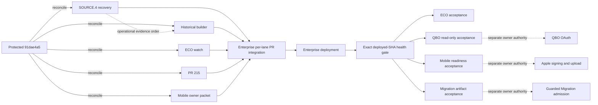

# OM1 Enterprise integration queue

Snapshot: 2026-09-12 17:48 America/New_York

## Authority and deployed state

- Protected authority: `91dae4a52084daef42048e21b7754742e5e5eba9`
- Protected tip: PR #260, Preview acceptance-fixture runtime wiring
- Deployed Preview: `52dc336766a67fc0c4698244b9894bab0fe65913`
- Preview health: application healthy; PostgreSQL and Redis connected
- Deployment gap: protected PRs #257, #258, #259, and #260
- GitHub CI evidence: no check runs or commit statuses are reported for the
  protected SHA. Local qualification does not substitute for the tests below.

Independent qualification of that exact protected-but-undeployed tranche on
2026-09-12 passed PostgreSQL zero-to-head, 20 affected backend tests, nine
affected frontend suites and 43 tests, full ESLint, and the production
TypeScript/Vite build. Four SQLAlchemy transaction-deassociation warnings were
emitted by Invoice tests and remain part of the evidence.

## Protected integration policy

GitHub ruleset `21781922` is active for exactly
`refs/heads/customer-management-v1`. It blocks branch deletion and
non-fast-forward updates and requires changes to enter through a pull request.
It allows merge, squash, or rebase integration. It has no bypass actors, but it
requires zero approving reviews, no code-owner review, no last-push approval,
and no status checks. Enterprise must therefore enforce the qualification and
acceptance gates in this packet operationally; GitHub will not enforce them.

## Active candidates

| Candidate | Head | Behind/ahead | Effective tree | State |
|---|---|---:|---|---|
| SOURCE.4 artifact recovery | `a3cad3d389b9ed69300939d15c19e2d7b08da063` | 2/1 | `e4bcdfdc5898ec62f6166d164b43d9416054d2f5` | Merge-clean; documentation-only; PR required |
| HCP historical safe-tranche builder | `b32f99ff80f447bf8140b73380d19191ccb8db59` | 12/1 | `9371c6ab231ae05a1feb2f3f38f3a90d8880145d` | Merge-clean; authority metadata stale |
| ECO reconciliation | `1c0e7b20db62b6a342548f2842ea1a3a45965386` | 4/13 | `657821646f4fcfc3eda071fa2b285b3903f5dbbd` | Merge-clean; qualified; authority metadata stale |
| PR #215 Payroll/QBO read UI | `724398348b566f655d2bc7127c20beeb6be52d6c` | 23/1 | `c964c398836e12ec16d398fbc81c246b66fec189` | Open/CLEAN; reconcile and refresh packet |
| Mobile Apple release packet | `0183eaec3e2825a79b683e9e684a761243c86ea7` | 9/15 | `fad3ab879576b7bfb392c8e30e68ed6df63e2425` | Merge-clean; refresh two manifests |

## Named launch queue coverage

| Lane originally requested | Current disposition |
|---|---|
| JOB-000306 owner-observed failure | Acceptance observation; reproduce only after the protected deployment gap is deployed. No independent candidate is present. |
| Scheduling mutation registry | `e26c9bd5...` now conflicts in the registry and its test; protected #237 is authoritative. Do not integrate the stale branch. |
| Laptop1-A CSR booking | `d172cd11...` conflicts with the evolved Scheduling UI; protected #241 and recovery #250 are authoritative. Do not integrate the stale branch. |
| Laptop1-B Customer office UX | `8516b08b...` conflicts in one add/add reliability test, while current-authority reconciliation `174fcd4e...` composes to zero delta. Superseded by #242 and #257. |
| Workforce / Payroll #216 | Merged as `d52d1178...`; already protected. |
| Workforce / Payroll #221, stacked #222, and #223 | Closed; their current successors are protected through #229, #231, and #235 respectively. |
| Payroll tax rule | Reconciled `9a44f714...` composes to zero delta; superseded by protected #236. |
| Identity #227 and #230 | Still open but superseded by protected #256 and #258; close, do not integrate. |
| Identity recovery successor | `4cf7bdf4...` composes to zero delta; protected #256 is authoritative. |
| Laptop1 Phone distribution readiness | `bf28a61c...` is an ancestor of the active Mobile owner-release packet; integrate only the successor packet. |
| ECO named commits and persistence | `d7ef88d1...` and `37b32949...` are superseded by patch-evolved equivalents; `fe7a9623...`, `f587c271...`, and persistence `863cab13...` feed the active ECO watch. |
| QBO `5fe11183...` | Superseded by protected real-company evidence #243. Preserve the OAuth owner gate. |
| Migration executor / acceptance | `5b8b02de...` and `83bbeef0...` are superseded by protected guarded execution and acceptance #253. Recovery and builder remain active preparation only. |
| Price Book operator readiness | `c1c90a0a...` is superseded by the broader held review candidate `49e852aa...`; no candidate is admissible yet. |

Zero-delta classifications above use a three-way composition with current
protected authority, not a direct endpoint diff. Conflicting stale branches are
not reconciliation inputs: use their named protected successors as authority.

All five effective deltas have zero pairwise file overlap and produce identical
trees in either integration order. The combined pre-metadata tree is
`7fe61501fb00d3d578d5b9eadec92d9eb412e5f1`; it changes 59 files and passes
`git diff --check`. Recompute all trees after protected movement or packet edits.

## Integration order and release waves

There is no Git-level dependency between active candidates. Prefer this
operational order:

1. SOURCE.4 artifact recovery, then safe-tranche builder (Wave C tooling).
2. ECO as its own database checkpoint.
3. PR #215 in Wave B if QBO read-evidence acceptance is scheduled.
4. Mobile in Wave D; authoritative Job Clock `d52d1178` is already protected.

Do not execute Migration admission, authorize QBO, execute Payroll, or sign or
upload an Apple build as part of integration.

## Dependency graph



Solid candidate-to-integration arrows do not require a combined batch; each lane
may enter independently through its own PR. There are no hard Git dependency
edges or effective file overlaps among the five candidates. The dotted
SOURCE.4-to-builder edge is operational ordering only. Dotted owner-gate edges
are explicitly outside this packet's authority. Price Book is omitted from the
integration path because it remains held.

## Batch boundaries and refresh checkpoints

All five lanes may be reconciled and qualified concurrently from the guarded
authority above. Integration remains sequential because the first protected PR
changes the authority for every remaining lane.

| Checkpoint | Enterprise action | Required stop condition |
|---|---|---|
| Existing deployment gap | Deploy and accept protected #257-#260 before attributing runtime results to a later candidate | `/backend-health` does not report the exact deployed protected SHA or either dependency is disconnected |
| Wave C preparation | Prepare SOURCE.4 recovery, then the historical builder | Artifact digest/loader check, builder tests, or authority metadata fails |
| ECO checkpoint | Integrate and deploy ECO independently | More than one Alembic head, drift, migration failure, or governed-policy acceptance failure |
| Wave B | Integrate PR #215 independently | QBO/Payroll projection tests fail or any provider mutation appears |
| Wave D | Integrate Mobile independently | Test/static/preflight failure or either manifest is stale |

After every protected integration, stop before integrating another candidate and
run this read-only checkpoint in a clone containing the remaining remote branch:

```bash
set -euo pipefail
git fetch origin --prune
prior_authority="REPLACE_WITH_AUTHORITY_USED_FOR_LAST_QUALIFICATION"
new_authority=$(git rev-parse origin/customer-management-v1)
test "$new_authority" != "$prior_authority"
lane=work/REMAINING_LANE
expected_head="REPLACE_WITH_EXPECTED_REMOTE_HEAD"
test "$(git rev-parse "origin/$lane")" = "$expected_head"
composed_tree=$(git merge-tree --write-tree "$new_authority" "origin/$lane")
git cat-file -e "$composed_tree^{tree}"
git diff --check "$new_authority^{tree}" "$composed_tree"
git diff --name-status "$new_authority^{tree}" "$composed_tree"
```

The command exits nonzero on a merge conflict. Recompute behind/ahead counts,
effective trees, pairwise overlaps, metadata edits, and test scope before the
next integration. If ECO is blocked, proceed with reconciliation and
qualification of PR #215 or Mobile; neither depends on ECO. Owner-gated
Migration admission, QBO OAuth, Payroll execution, and Apple distribution never
block preparation of an independent lane.

## Required reconciliation and qualification

All candidate heads remain fetchable from `origin`; PR #215's branch head and
`refs/pull/215/head` both resolve to `724398348b566f655d2bc7127c20beeb6be52d6c`.
Use a clean worktree for one lane at a time. The following sequence is
pre-integration only: it updates the candidate branch and never checks out,
pushes, or merges the protected branch.

```bash
git fetch origin --prune
test "$(git rev-parse origin/customer-management-v1)" = \
  91dae4a52084daef42048e21b7754742e5e5eba9

lane=work/REPLACE_WITH_LANE
expected=REPLACE_WITH_FULL_HEAD
test "$(git rev-parse "origin/$lane")" = "$expected"
git switch --force-create "$lane" "origin/$lane"
git merge --no-edit origin/customer-management-v1
git diff --check origin/customer-management-v1...HEAD
```

Replace the two placeholders with exactly one row below. Stop and recompute the
packet if either SHA guard fails or the merge conflicts.

| Lane | Expected head |
|---|---|
| `work/migration-source4-accepted-artifact-recovery-1` | `a3cad3d389b9ed69300939d15c19e2d7b08da063` |
| `work/hcp-historical-safe-tranche-1` | `b32f99ff80f447bf8140b73380d19191ccb8db59` |
| `work/eco-migration-reconciliation-integration-watch-1` | `1c0e7b20db62b6a342548f2842ea1a3a45965386` |
| `work/om2b-payroll-accounting-continuation-1` | `724398348b566f655d2bc7127c20beeb6be52d6c` |
| `work/mobile-apple-owner-release-packet-1` | `0183eaec3e2825a79b683e9e684a761243c86ea7` |

After the lane-specific edits and tests below, commit and push only that lane,
then open or refresh its PR into `customer-management-v1`. Enterprise must
review the resulting PR delta and integrate it through the ruleset-required PR
flow; direct protected updates are not an execution option.

### SOURCE.4 artifact recovery

Merge current protected authority into
`work/migration-source4-accepted-artifact-recovery-1`, require tree
`e4bcdfdc5898ec62f6166d164b43d9416054d2f5`, run `git diff --check`, push the
lane branch, and open a documentation PR. The packet contains no protected SHA
that needs editing.

Independent host revalidation on 2026-09-12 confirmed both documented byte
SHA-256 values, sizes, owner/group, and mode `0600`. The protected
`CurrentOverlayManifest.load` accepted the `hcp-current-overlay/v1` artifact at
canonical digest `e23b7bcf5ac34ea650184afacc711af0c7028e83a6b1f7405e2ae17e13441eb2`
with exactly 503 records. The hold packet binds the documented delta digest and
contains 10 duplicate-risk plus 3 insufficient-evidence Appointment holds, 22
Location-unresolved Job holds, and zero true global blockers.

Reproduce the read-only artifact checks on the host that owns the recovered
files. Do not run the recovery packet's staging/install or executor commands.

```bash
SOURCE_ROOT=/Users/michaelbfouse/.acp-enterprise/migration/housecall-pro/hcp-current-admission-packet-20260912T170000Z
test "$(stat -f '%Lp' "$SOURCE_ROOT/current-overlay-merge-packet.json")" = 600
test "$(stat -f '%Lp' "$SOURCE_ROOT/current-operational-hold-dispositions.json")" = 600
test "$(shasum -a 256 "$SOURCE_ROOT/current-overlay-merge-packet.json" | awk '{print $1}')" = ce9d4ea1e048a70b7a8a5b85fab33fd1a0568eb5cb1356229187144ab8bc7558
test "$(shasum -a 256 "$SOURCE_ROOT/current-operational-hold-dispositions.json" | awk '{print $1}')" = c13cb0b565d2b86d34365f12d565f37f0e7ba6ec6bfa0d65de7f4a81ee088324
ENVIRONMENT=test PYTHONPATH=backend python -c 'from pathlib import Path; from app.operational_migration.hcp_current_overlay import CurrentOverlayManifest; p=Path("/Users/michaelbfouse/.acp-enterprise/migration/housecall-pro/hcp-current-admission-packet-20260912T170000Z/current-overlay-merge-packet.json"); m=CurrentOverlayManifest.load(p); assert m.digest == "e23b7bcf5ac34ea650184afacc711af0c7028e83a6b1f7405e2ae17e13441eb2"'
```

### HCP historical safe-tranche builder

Update the packet authority from `9096a777...` to `91dae4a5...` and state that
the executor and post-admission acceptance are protected through PR #253 at
`96d67cb73dbe4838e882e1551de5906eda598f4e`. Run:

```bash
ENVIRONMENT=test PYTHONPATH=backend python -m pytest -q \
  backend/tests/operational_migration/test_hcp_historical_safe_tranche.py
python -m compileall -q \
  backend/app/operational_migration/hcp_historical_safe_tranche.py \
  backend/scripts/hcp_historical_safe_tranche.py
```

The builder is read-only with respect to application data, but writes the
explicit `--output` artifact. It must not be treated as admission authority.

Independent qualification on 2026-09-12 composed the exact head onto protected
authority at tree `9371c6ab231ae05a1feb2f3f38f3a90d8880145d`: all three focused
tests and Python compilation passed. The tests cover accepted-record selection,
HOLD treatment for unbound updates, `execution_allowed = false`, acceptance-plan
digest tampering, and conflicting cross-scope native bindings.

### ECO

Update the current integration-watch authority from `52dc3367...` to
`91dae4a5...`. Current composition qualification has passed:

- PostgreSQL zero-to-head and current-head checks;
- Alembic head `g7i9k1m3o5q7`, down revision `f6h8j0l2n4p6`;
- no Alembic autogenerate drift;
- 252 Business Economics tests;
- clean Python compilation for the affected application, migration, and tests.

The repository does not configure a Ruff, mypy, Flake8, or backend
`pyproject.toml` gate; clean compilation must not be represented as coverage by
those tools.

Reproduce the database evidence against an empty disposable PostgreSQL
database. Never point this sequence at Preview or Production.

```bash
test -n "$QUALIFICATION_DATABASE_URL"
cd backend
ENVIRONMENT=test DATABASE_URL="$QUALIFICATION_DATABASE_URL" alembic upgrade head
ENVIRONMENT=test DATABASE_URL="$QUALIFICATION_DATABASE_URL" alembic current
ENVIRONMENT=test DATABASE_URL="$QUALIFICATION_DATABASE_URL" alembic heads
ENVIRONMENT=test DATABASE_URL="$QUALIFICATION_DATABASE_URL" alembic check
ENVIRONMENT=test DATABASE_URL="$QUALIFICATION_DATABASE_URL" pytest -q tests/business_economics
python -m compileall -q app/business_economics \
  alembic/versions/g7i9k1m3o5q7_create_break_even_policy_events.py
```

Require exactly one head/current revision, `g7i9k1m3o5q7`, and no new upgrade
operations from `alembic check`.

### PR #215

Run the three affected Vitest suites plus frontend lint, typecheck/build. Confirm
the eight-file effective delta contains no OAuth connect/disconnect mutation and
continues to report `mutation_authority: none`. GitHub reports no checks on the
candidate branch, so Enterprise must require and record these results before
integration.

Independent qualification on 2026-09-12 composed the exact head onto protected
authority at tree `c964c398836e12ec16d398fbc81c246b66fec189`: three suites and
nine tests passed, followed by clean full ESLint and production TypeScript/Vite
builds. This evidence does not replace Enterprise's final rerun after branch
reconciliation.

```bash
cd frontend
npm run test:run -- \
  src/api/qboAccountingEvidence.test.ts \
  src/components/accounting/QboSourceEvidence.test.tsx \
  src/routes/PayrollRoute.test.tsx
npm run lint
npm run build
```

### Mobile

Refresh protected authority and reconciliation commit in:

- `MOBILE.APPLE.RELEASE.INTEGRATION.PREFLIGHT.1.json`
- `MOBILE.DISTRIBUTION.PACKAGE.COMPLETION.1.integration.json`

Retain the 138-test qualification count. Run Mobile tests, typecheck, lint,
configuration validation, and Apple preflight. Signing/upload remains an owner
operation.

Independent qualification on 2026-09-12 composed the exact head onto protected
authority at tree `fad3ab879576b7bfb392c8e30e68ed6df63e2425`: all 18 suites
and 138 tests passed, followed by clean typecheck, lint, configuration
validation, and the non-mutating Apple distribution preflight. Jest emitted
React `VirtualizedList` updates-not-wrapped-in-`act(...)` warnings; these did not
fail the run but should remain visible in final qualification evidence.

```bash
cd mobile
npm test
npm run typecheck
npm run lint
npm run config:validate
npm run apple:preflight
```

Do not run `beta:aasa:verify`, `apple:release:qualify`, account-authenticated EAS
commands, signing, or upload during pre-integration qualification.

## Enterprise PR handoff

Run this only after a lane's reconciliation, metadata edits, tests, and
`git diff --check` pass. It pushes the candidate lane, never the protected
branch. `PR_TITLE` and `PR_BODY` must describe the effective delta, exact test
results, warnings, owner gates, rollback, and acceptance steps.

```bash
set -euo pipefail
test "$(git branch --show-current)" = "$lane"
candidate_head=$(git rev-parse HEAD)
test -n "$PR_TITLE"
test -f "$PR_BODY"
git push origin "HEAD:refs/heads/$lane"
remote_head=$(git ls-remote --heads origin "refs/heads/$lane" | cut -f1)
test "$remote_head" = "$candidate_head"

pr_number=$(gh pr list --repo ACPEnterprise/ACP-Enterprise \
  --state open --base customer-management-v1 --head "$lane" \
  --json number --jq '.[0].number // empty')
if test -z "$pr_number"; then
  gh pr create --repo ACPEnterprise/ACP-Enterprise \
    --base customer-management-v1 --head "$lane" \
    --title "$PR_TITLE" --body-file "$PR_BODY"
  pr_number=$(gh pr list --repo ACPEnterprise/ACP-Enterprise \
    --state open --base customer-management-v1 --head "$lane" \
    --json number --jq '.[0].number')
else
  gh pr edit "$pr_number" --repo ACPEnterprise/ACP-Enterprise \
    --title "$PR_TITLE" --body-file "$PR_BODY"
fi

gh pr view "$pr_number" --repo ACPEnterprise/ACP-Enterprise \
  --json baseRefName,headRefName,headRefOid,isDraft,mergeable,mergeStateStatus | \
  jq -e --arg lane "$lane" --arg head "$candidate_head" \
    '.baseRefName == "customer-management-v1" and .headRefName == $lane and .headRefOid == $head and .isDraft == false and .mergeable == "MERGEABLE" and .mergeStateStatus == "CLEAN"'
```

If GitHub initially reports `UNKNOWN`, wait for mergeability computation and
rerun only the final `gh pr view` check. Empty GitHub checks are not a pass:
attach the required local qualification log because ruleset `21781922` does not
require status checks or approvals. Send the new PR number and candidate head
back through this queue refresh before Enterprise integrates it.

## Held candidate

Price Book `49e852aa8c931c8042de0634b68d993b0e02452e` supersedes the smaller
`c1c90a0a...` candidate but remains held for:

1. savepoint-based test isolation;
2. fail-closed `effective_catalog` multiple-match handling;
3. review-route authorization matrix coverage.

Independent PostgreSQL qualification on 2026-09-12 composed the exact candidate
onto protected authority at tree `34ef9d4e85b7e2f3937abe386a03c55078504b34`:
26 tests passed and one failed. In
`test_operator_catalog_and_optimistic_metadata_management`, the expected stale
tax conflict deassociated the enclosing fixture transaction and removed the
seeded category; the following category update raised `PriceBookNotFound`.
The run also emitted ten SQLAlchemy transaction-deassociation warnings. This is
the deterministic isolation blocker and is not an intermittent failure.

The frontend portion of that exact composition is independently green: all five
focused suites and 14 tests passed, followed by clean full ESLint and production
TypeScript/Vite builds. The hold is therefore specifically the backend isolation
defect plus the unclosed ambiguity and authorization-coverage requirements; it
is not a general UI qualification failure.

## Secrets and owner gates

- Preserve the QBO OAuth owner gate; no active candidate requires new OAuth.
- No active candidate rotates secrets.
- Preview fixture defaults disabled. Authorized use requires Preview environment,
  `PREVIEW_ACCEPTANCE_FIXTURE_ENABLED=true`, an access token read from stdin,
  and `COMPANY_ADMINISTER` plus `IDENTITY_ONBOARDING_MANAGE`.
- Fixture creation/reuse is audited. Do not invoke internal `record_reset`.
- Migration generation/admission, Payroll execution, and Apple distribution stay
  separately owner-authorized.

## Post-deployment acceptance

1. Set `EXPECTED_PROTECTED_SHA` to the integrated protected tip and run the
   command below. Do not begin lane acceptance until it passes.

   ```bash
   EXPECTED_PROTECTED_SHA="REPLACE_WITH_FULL_INTEGRATED_PROTECTED_SHA"
   curl --fail --silent --show-error \
     https://preview.allcountyhomeservices.com/backend-health | \
     jq -e --arg sha "$EXPECTED_PROTECTED_SHA" \
       '.status == "healthy" and .environment == "preview" and .database == "connected" and .redis == "connected" and .version == $sha'
   ```

2. Scheduling: reproduce JOB-000306 and verify authoritative mutation recovery.
3. Customer: exercise search, multiple Locations, Job/Appointment/Invoice return
   paths, open/history separation, source limitations, retry, and phone width.
4. Employee/Identity: verify Payroll Setup navigation, authorization failure,
   conflict-without-mutation, and actual password recovery delivery/reset.
5. ECO: verify migration head, then create/read/update governed policy behavior
   and immutable event audit evidence.
6. QBO: validate read evidence without OAuth or provider mutation.
7. Mobile: run distribution readiness; do not sign or upload without owner action.
8. Migration: validate recovered artifacts and builder output; do not execute
   guarded admission without separate authority.

### Acceptance evidence and rejection rules

Create one immutable acceptance record per deployed batch. Bind it to the
candidate head, integrated PR, protected merge SHA, deployed SHA, environment,
UTC start/end time, qualification-log location, sanitized correlation/audit
identifiers, observer, and `ACCEPTED` or `REJECTED` decision. The integrated and
deployed SHAs must be identical. Never record access tokens, passwords, recovery
links, Payroll values, provider payloads, Apple credentials, or Customer PII.

| Lane | Minimum acceptance evidence | Reject and stop on |
|---|---|---|
| Scheduling | JOB-000306 before/after state; authoritative mutation outcome; repeated-idempotency result; Appointment count | Failure/unknown outcome, duplicate Appointment, changed arrival window, or non-idempotent retry |
| Customer | Search and selected Customer IDs; Location count; Job/Appointment/Invoice return paths; open/history state; phone-width capture | Missing/foreign data, wrong source limitation, stale retry failure, or unusable phone layout |
| Employee / Identity | Tested role and Branch; Payroll Setup route result; direct authorization denial; conflict-without-mutation result; delivery/reset audit IDs | Privilege expansion, cross-Branch visibility, mutation on conflict, delivery ambiguity, or reusable/expired reset success |
| ECO | Alembic current/head output; governed policy create/read/update correlation IDs; immutable event IDs and ordering | Wrong/multiple head, drift, mutable/missing audit event, cross-Company visibility, or unexplained calculation variance |
| PR #215 / QBO | Payroll evidence projection and QBO source-evidence response; role-negative result; before/after provider connection state | OAuth prompt/change, provider write, fabricated readiness, unauthorized financial visibility, or `mutation_authority` other than `none` |
| Mobile | App/config version; Preview API target; permission-derived navigation; Job Clock recovery; offline/stale behavior; unsigned preflight result | Production target, stale authority enabling mutation, cross-Branch cache visibility, duplicate clock mutation, or any signing/upload attempt |
| Migration preparation | Both input SHA-256 values; manifest digest and record count; hold counts; builder output SHA-256 and `execution_allowed` value | Digest/count mismatch, weakened HOLD, global blocker, `execution_allowed = true`, or any admission/executor invocation |

Any rejection freezes that lane, preserves logs and immutable audit evidence,
and invokes the applicable rollback below. It does not authorize destructive
cleanup. Continue preparing other independent lanes after refreshing protected
authority and recomputing their compositions.

## Rollback

- #257-#260, PR #215, and Mobile have no schema rollback. Rebuild the previous
  approved application image and retain evidence.
- Disable the Preview fixture flag rather than deleting its tenant or audit data.
- ECO application rollback should retain additive migration `g7i9k1m3o5q7`.
  Its downgrade drops the immutable event table and requires database-owner
  review, verified backup/restore, and preserved event evidence.
- Migration tooling rollback must retain recovered and generated immutable
  artifacts.

## Superseded open PRs

Close, do not integrate: #255, #252, #249, #248, #247, #246, #245, #244,
#240, #239, #238, #234, #233, #232, #230, #228, #227, #226, #225, #198,
#132, #97, and #65. Their product changes are zero-delta, patch-equivalent, or
represented by protected successor waves. PR #215 is intentionally retained.
