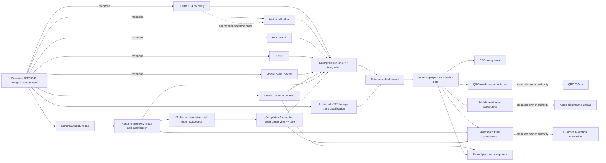

# OM1 Enterprise integration queue

Snapshot: 2026-09-14 15:54 America/New_York

## Authority and deployed state

- Protected authority: `60263349a75250ce08645898d6199925d5a69ca9`
- Protected tip: PR #269, v4 Location-scope preflight repair
- Deployed Preview: `60263349a75250ce08645898d6199925d5a69ca9`
- Preview health: application healthy; PostgreSQL and Redis connected
- Deployment gap: none; deployed and protected SHAs match
- Acceptance state: pending. Preview initially remained at `b296cc6b...` after
  #265 merged, then by 2026-09-14 14:00 America/New_York returned HTTP 200 at
  exact SHA `b4bf00d3...` with healthy application and connected PostgreSQL and
  Redis. A separate HTTP 502 occurred at 14:16:45 with no authority/PR/head
  change; four consecutive checks from 14:17:23 through 14:17:34 recovered HTTP
  200 at the same exact SHA with both dependencies connected. Preserve both
  transient incidents in acceptance evidence. Required #261-#269 evidence and
  authenticated persona evidence have not all been supplied. Do not run #265's
  command or #266's generators until repair successors land. During #266 rollout,
  Preview returned HTTP 502 at 15:10, then reported exact `9e866898...` with a
  healthy application and connected PostgreSQL/Redis at 15:11 and 15:12. Preserve
  that transient and require consecutive exact-SHA responses in final acceptance.
  After #268 merged, Preview remained healthy on `9e866898...` at 15:41, then
  reported exact `8b755ee6...` healthy with both dependencies connected at 15:42
  and 15:43. After #269 merged, Preview remained healthy on `8b755ee6...` at
  15:53, then reported exact `60263349...` healthy with both dependencies
  connected at 15:54. Deployment does not authorize the executor command.
- GitHub CI evidence: no check runs or commit statuses are reported for the
  protected SHA. PR #264's body reports 698 migration/job/scheduling regressions,
  16 focused tests, PostgreSQL zero-to-head/current=head, and zero drift, but no
  check run, status, review, comment, or linked qualification log substantiates
  those claims in GitHub. Preserve the originating log before acceptance or
  guarded execution. Local qualification does not substitute for the gates below.
- PR #265 has no GitHub checks or statuses. Its body claims one focused
  non-short-circuit regression plus Ruff/compile/diff checks, but no command-level
  tests. Exact-head inspection found unsafe private-output creation, an unverified
  cohort-authority boundary, and inverted rejection labels. Deployment does not
  cure those defects; keep the command operationally disabled pending repair.
- PR #266 merged at 2026-09-14 15:09 America/New_York as `9e866898...` from
  unchanged head `452d1bb3...`. It has no checks, statuses, reviews, or comments.
  Its two commits are the exact previously qualified v3-plus-v4 stack, so
  protected integration does not clear the
  unsafe output, unbound decision inputs, incomplete authority/verifier/tests,
  contradictory readiness, or missing compatible-executor blockers. Do not
  execute the protected generators or treat their output as admission authority;
  require bounded repair successors.
- PR #267 opened from executor head `8fc29014...` and was closed at 15:36 as
  superseded by PR #268. PR #268 merged at 15:39 as protected `8b755ee6...` from
  head `b6a78204...`, whose only additional change is one blank import separator.
  It has no checks, statuses, reviews, comments, or linked qualification evidence;
  its body says the isolated PostgreSQL suite is “in progress,” which is not
  evidence. Keep the protected executor operationally disabled for the exact
  defects and predecessor order below.
- PR #269 merged at 15:53 as protected `60263349...` from head `63442c3e...`.
  It has no checks, statuses, reviews, comments, or linked evidence. It fixes the
  Location Company lookup and adds only a mocked matching-Company success test;
  all other executor blockers below remain. Keep the command disabled.

Independent qualification on 2026-09-12 covered the earlier #257-#260 tranche,
not later #261-#269. That bounded run passed PostgreSQL zero-to-head, 20 affected
backend tests, nine affected frontend suites and 43 tests, full ESLint, and the
production TypeScript/Vite build. Four SQLAlchemy transaction-deassociation
warnings were emitted by Invoice tests and remain part of that bounded evidence.

PR #261 added an explicit rollback between read-only authorization resolution
and fixture mutation plus one focused regression test. It has no GitHub checks.
Composition and `git diff --check` were revalidated at the exact protected SHA
on 2026-09-14. The focused test could not be rerun on this host: the installed
pytest uses Python 3.9, which cannot import the repository's modern type syntax,
while the available Python 3.12 environment has no pytest. Enterprise must run
that test under the supported backend environment before accepting this
deployment or deploying another batch:

```bash
ENVIRONMENT=test PYTHONPATH=backend python -m pytest -q \
  backend/tests/platform/test_preview_tenant_fixture_command.py
```

PR #262 integrated the lineage bootstrap without GitHub checks or statuses.
Its focused PostgreSQL tests and zero-to-head migration qualification remain
mandatory before accepting this deployment or deploying another batch; exact
commands appear in the lineage section.

PR #263 integrated deterministic Customer-to-Location-to-Job-to-Appointment
ordering without GitHub checks or statuses. PR #264 then integrated native
binding at additive schema revision `h8j0l2n4p6r8`, also without GitHub checks.
Their focused overlay/native-binding suites and exact database evidence are
mandatory before accepting this deployment or guarded execution. PR #265 then
integrated the runtime inventory without GitHub checks and with the operational
defects recorded above.

## Protected integration policy

GitHub ruleset `21781922` is active for exactly
`refs/heads/customer-management-v1`. It blocks branch deletion and
non-fast-forward updates and requires changes to enter through a pull request.
It allows merge, squash, or rebase integration. It has no bypass actors, but it
requires zero approving reviews, no code-owner review, no last-push approval,
and no status checks. Enterprise must therefore enforce the qualification and
acceptance gates in this packet operationally; GitHub will not enforce them.

## Active candidates

| Candidate | Exact branch | Head | PR | Behind/ahead | Effective tree | Classification |
|---|---|---|---|---:|---|---|
| OM2-C persona contract and acceptance harness | `work/om2c-launch-20260911-e2e-acceptance-1` | `1fb0481a043caaca749ae5dd49dc6cdf6d994061` | None; prior #212 is merged | 5/46 | `29f38e6894dc3f561b098c7623a59bc8400c8785` | Stale but reconcilable; merge-clean; protected/schema bindings must advance; acceptance execution blocked on missing platform service principal |
| SOURCE.4 artifact recovery | `work/migration-source4-accepted-artifact-recovery-1` | `a3cad3d389b9ed69300939d15c19e2d7b08da063` | None | 10/1 | `c3fadf8c98eed8a0de26498791e1ecbbfbeafa13` | Stale but reconcilable; merge-clean; documentation-only |
| HCP historical safe-tranche builder | `work/hcp-historical-safe-tranche-1` | `b32f99ff80f447bf8140b73380d19191ccb8db59` | None | 20/1 | `3c926afaa5ce25f1703592de3bba50507eb0ba72` | Stale but reconcilable; merge-clean; metadata edit required |
| SOURCE.4 UPDATE cohort authority | `work/hcp-update-cohort-authority-1` | `d53e5d36422218bd715f07d8099e09865167e0f1` | None | 4/1 | `9e0607379dbfbd7d7facdf31751056a82430139f` | Stale but reconcilable; merge-clean, but blocked: unsafe overwrite/symlink handling, incomplete authority verification, and no command/generator integration tests |
| ECO reconciliation | `work/eco-migration-reconciliation-integration-watch-1` | `1c0e7b20db62b6a342548f2842ea1a3a45965386` | None | 12/13 | `fba2a4ba533ed2d919a2a6a07fe96ba250577383` | Blocked on schema reconciliation; duplicate protected revision ID; rebase and assign a new revision downstream of `h8j0l2n4p6r8` |
| Payroll/QBO read UI | `work/om2b-payroll-accounting-continuation-1` | `724398348b566f655d2bc7127c20beeb6be52d6c` | #215 open/CLEAN | 31/1 | `1ee9cb34d0ed190fa6adaaf1dee53efa4f5053d3` | Stale but reconcilable; merge-clean; PR refresh required |
| Mobile Apple release packet | `work/mobile-apple-owner-release-packet-1` | `0183eaec3e2825a79b683e9e684a761243c86ea7` | None | 17/15 | `4df4da86f1719aeef4c28f21edc07ab3103dd384` | Stale but reconcilable; merge-clean; two manifest edits required |

## Named launch queue coverage

| Lane originally requested | Current disposition |
|---|---|
| JOB-000306 owner-observed failure | Acceptance observation; reproduce only after the protected deployment gap is deployed. No independent candidate is present. |
| Scheduling mutation registry | `e26c9bd5...` now conflicts in the registry and its test; protected #237 is authoritative. Do not integrate the stale branch. |
| Laptop1-A CSR booking | `d172cd11...` conflicts with the evolved Scheduling UI; protected #241 and recovery #250 are authoritative. Do not integrate the stale branch. |
| Laptop1-B Customer office UX | `8516b08b...` conflicts in one add/add reliability test, while current-authority reconciliation `174fcd4e...` composes to zero delta. Superseded by #242 and #257. |
| Workforce / Payroll #216 | Merged as `d52d1178...`; already protected. |
| Workforce / Payroll #221, stacked #222, and #223 | Closed; their current successors are protected through #229, #231, and #235 respectively. |
| Current OM2 successor | Persona-contract successor `1fb0481a...` is active but five protected commits stale. Reconcile it to `60263349...`, update protected/schema bindings, and retain its fail-closed missing-service-principal state. Its former PR #212 does not cover the new head; open a fresh PR after reconciliation. |
| Payroll tax rule | Reconciled `9a44f714...` composes to zero delta; superseded by protected #236. |
| Identity #227 and #230 | Still open but superseded by protected #256 and #258; close, do not integrate. |
| Identity recovery successor | `4cf7bdf4...` composes to zero delta; protected #256 is authoritative. |
| Laptop1 Phone distribution readiness | `bf28a61c...` is an ancestor of the active Mobile owner-release packet; integrate only the successor packet. |
| ECO named commits and persistence | `d7ef88d1...` and `37b32949...` are superseded by patch-evolved equivalents; `fe7a9623...`, `f587c271...`, and persistence `863cab13...` feed the active ECO watch. |
| QBO `5fe11183...` | Superseded by protected real-company evidence #243. Preserve the OAuth owner gate. |
| Migration executor / acceptance | `5b8b02de...` and `83bbeef0...` are superseded by protected guarded execution and acceptance #253. Lineage, native binding, runtime inventory, v4 completeness, the v4 executor, and its Location lookup repair are protected through #262-#269. Recovery, builder, cohort authority, runtime repair, v4 repair, and a complete executor repair remain preparation. V4 adds 19 missing current members and releases 13 dependent holds, but protected #269 is not qualified execution authority. Do not run its generators, executor command, or guarded admission. |
| Price Book operator readiness | `c1c90a0a...` is superseded by the broader held review candidate `49e852aa...`; no candidate is admissible yet. |

Zero-delta classifications above use a three-way composition with current
protected authority, not a direct endpoint diff. Conflicting stale branches are
not reconciliation inputs: use their named protected successors as authority.

The seven remaining effective deltas have zero pairwise file overlap. ECO and
cohort authority are not admissible: ECO's
differently named migration still declares protected revision `g7i9k1m3o5q7`
from `f6h8j0l2n4p6`; cohort authority has unsafe file handling, incomplete verification,
and missing command/generator coverage. Protected #266 retains v4's unbound
inputs, unsafe output, incomplete authority/verifier/tests, and contradictory
readiness; those defects now require successors rather than candidate edits.
Protected executor through #269 depends on those repairs and adds independent
authority/file-verification and execution-test gaps; #269 fixes only its
Location lookup. The five-candidate combined tree excluding both blocked
active lanes is
`2a913a9ab89b6669a58b0fc2332fc6fad033289b`; it changes 51 files and passes
`git diff --check`. Recompute all trees after protected movement or packet edits.

## Integration order and release waves

There is no Git-level dependency between active candidates. Prefer this
operational order:

1. OM2-C persona contract and acceptance harness; integrate tooling independently,
   but do not attempt persona issuance until the missing platform primitive exists.
2. SOURCE.4 artifact recovery and safe-tranche builder preparation.
3. Preserve #264 as the Wave C schema/runtime checkpoint and attach its exact
   qualification evidence. Treat protected #265 and #266 as rejected for
   operational use; repair and qualify cohort authority, then stack a read-only
   runtime-inventory repair and a v4 repair on the strengthened verifier.
4. Require the v4 repair to bind every input, use safe output, enforce its full
   contract, and make non-executable authority explicit. Its protected arithmetic
   supplies 19 missing records and releases 13 dependent holds, yielding all 55
   current members without a current hold, but does not authorize execution.
5. Treat protected executor through #269 as operationally disabled. Preserve
   #269's bounded Location-scope fix, then prepare a complete successor
   only after steps 3-4; do not create an execution authority.
6. Reconcile ECO to a new revision downstream of protected `h8j0l2n4p6r8`, then
   integrate ECO as its own later database checkpoint.
7. PR #215 in Wave B if QBO read-evidence acceptance is scheduled.
8. Mobile in Wave D; authoritative Job Clock `d52d1178` is already protected.

Do not execute Migration admission, authorize QBO, execute Payroll, or sign or
upload an Apple build as part of integration.

## Dependency graph



Solid candidate-to-integration arrows do not require a combined batch; each lane
may enter independently through its own PR. There are no hard Git dependency
edges or effective file overlaps among the five admissible candidates. The dotted
SOURCE.4-to-builder edge is operational ordering only. ECO must reconcile
downstream of protected `h8j0l2n4p6r8`; that is not permission to batch. Dotted owner-gate edges
are explicitly outside this packet's authority. Price Book is omitted from the
integration path because it remains held.

## Batch boundaries and refresh checkpoints

All seven remaining active lanes may be inspected concurrently from the guarded
authority above. Integration remains sequential because the first protected PR
changes the authority for every remaining lane. ECO qualification cannot
complete until its duplicate revision is replaced downstream of now-protected
`h8j0l2n4p6r8`.

| Checkpoint | Enterprise action | Required stop condition |
|---|---|---|
| Acceptance tooling | Reconcile `1fb0481a...` to `60263349...`, update schema/release bindings, then open a fresh PR. Route the declared service-principal/activation/session/token-writer gaps to Enterprise/platform before persona issuance | Contract tests fail, protected SHA moves, platform primitive remains missing at execution time, persona permissions/digests differ, or secret material appears in arguments/evidence |
| Current deployed acceptance | Preserve the healthy exact-`60263349...` response from 15:54 onward and all prior rollout evidence; attach or rerun missing #261-#269 qualification; keep the protected #265/#266 generators and executor through #269 disabled | Deployed SHA differs, focused test, zero-to-head migration, exactly-one-head/drift check fails, required evidence cannot be produced, defective tooling is exercised, or health/dependency state regresses |
| Wave C preparation | Treat #264-#269 as integrated, but #265/#266 and the executor through #269 operationally rejected; repair cohort/runtime/v4/executor evidence in that order; prepare recovery and historical builder independently | Any unbound input, unsafe private-file path, missing or ambiguous execution authority, test/digest/count failure, current graph other than 11/11/15/18 with zero holds, exactly-one-head/drift/migration failure, or authority mismatch |
| ECO checkpoint | Native binding is protected; assign ECO a unique revision with down-revision `h8j0l2n4p6r8`, requalify, then integrate/deploy independently | Duplicate/multiple Alembic head, drift, migration failure, or governed-policy acceptance failure |
| Wave B | Integrate PR #215 independently | QBO/Payroll projection tests fail or any provider mutation appears |
| Wave D | Integrate Mobile independently | Test/static/preflight failure or either manifest is stale |

After every protected integration, stop before integrating another candidate and
run this read-only checkpoint in a clone containing the remaining remote branch:

```bash
set -euo pipefail
git fetch origin --prune
prior_authority="REPLACE_WITH_AUTHORITY_USED_FOR_LAST_QUALIFICATION"
new_authority=$(git rev-parse origin/customer-management-v1)
test "$new_authority" != "$prior_authority"
lane=work/REMAINING_LANE
expected_head="REPLACE_WITH_EXPECTED_REMOTE_HEAD"
test "$(git rev-parse "origin/$lane")" = "$expected_head"
composed_tree=$(git merge-tree --write-tree "$new_authority" "origin/$lane")
git cat-file -e "$composed_tree^{tree}"
git diff --check "$new_authority^{tree}" "$composed_tree"
git diff --name-status "$new_authority^{tree}" "$composed_tree"
```

The command exits nonzero on a merge conflict. Recompute behind/ahead counts,
effective trees, pairwise overlaps, metadata edits, and test scope before the
next integration. If ECO is blocked, proceed with reconciliation and
qualification of PR #215 or Mobile; neither depends on ECO. Owner-gated
Migration admission, QBO OAuth, Payroll execution, and Apple distribution never
block preparation of an independent lane.

## Required reconciliation and qualification

All candidate heads remain fetchable from `origin`; PR #215's branch head and
`refs/pull/215/head` both resolve to `724398348b566f655d2bc7127c20beeb6be52d6c`.
Use a clean worktree for one lane at a time. The following sequence is
pre-integration only: it updates the candidate branch and never checks out,
pushes, or merges the protected branch.

```bash
git fetch origin --prune
test "$(git rev-parse origin/customer-management-v1)" = \
  60263349a75250ce08645898d6199925d5a69ca9

lane=work/REPLACE_WITH_LANE
expected=REPLACE_WITH_FULL_HEAD
test "$(git rev-parse "origin/$lane")" = "$expected"
git switch --force-create "$lane" "origin/$lane"
git merge --no-edit origin/customer-management-v1
git diff --check origin/customer-management-v1...HEAD
```

Replace the two placeholders with exactly one row below. Stop and recompute the
packet if either SHA guard fails or the merge conflicts.

| Lane | Expected head |
|---|---|
| `work/om2c-launch-20260911-e2e-acceptance-1` | `1fb0481a043caaca749ae5dd49dc6cdf6d994061` |
| `work/migration-source4-accepted-artifact-recovery-1` | `a3cad3d389b9ed69300939d15c19e2d7b08da063` |
| `work/hcp-historical-safe-tranche-1` | `b32f99ff80f447bf8140b73380d19191ccb8db59` |
| `work/hcp-update-cohort-authority-1` | `d53e5d36422218bd715f07d8099e09865167e0f1` |
| `work/eco-migration-reconciliation-integration-watch-1` | `1c0e7b20db62b6a342548f2842ea1a3a45965386` |
| `work/om2b-payroll-accounting-continuation-1` | `724398348b566f655d2bc7127c20beeb6be52d6c` |
| `work/mobile-apple-owner-release-packet-1` | `0183eaec3e2825a79b683e9e684a761243c86ea7` |

After the lane-specific edits and tests below, commit and push only that lane,
then open or refresh its PR into `customer-management-v1`. Enterprise must
review the resulting PR delta and integrate it through the ruleset-required PR
flow; direct protected updates are not an execution option.

### OM2-C persona contract and acceptance harness

The branch is five commits behind protected authority and has no open PR. PR #212 is
historical and already merged; do not append this head to that closed identity.
Open a fresh PR for the 15-file effective delta. It has no Alembic migration and
zero file overlap with every other active or held lane.

Static qualification at current head `1fb0481a...` on 2026-09-14 passed Python
3.12 compilation for both scripts and the test module, JSON parsing for all five
Preview operation JSON files, and assertions for protected SHA, schema head, and
the fail-closed orchestration state. Full pytest was not runnable locally because
the Python 3.12 environment lacks pytest; require it in the supported backend
environment before integration:

```bash
ENVIRONMENT=test PYTHONPATH=backend python -m pytest -q \
  backend/tests/platform/test_authenticated_preview_acceptance.py
python -m compileall -q \
  backend/scripts/acceptance_identity_provisioning_contract.py \
  backend/scripts/authenticated_preview_acceptance.py
```

After merging protected authority, update the successor's protected binding to
`60263349...` and its deployed binding only after Preview reports that exact SHA;
retain schema binding `h8j0l2n4p6r8` and recompute any
contract/report digests affected by those edits. Retain the qualified frontend
digest unless the deployed frontend artifact proves it changed. Require those
exact bindings, exact synthetic Company/Branch IDs,
exact permission digests, file references under
`/run/secrets/acp-preview-acceptance/v1/{run_id}`, directory mode `0700`, file
mode `0600`, and no credential content in contract, attestation, report, logs,
or command arguments. EMPLOYEE, OFFICE, and QBO_READ must retain empty maximum
mutation lists. CSR may name only the scheduling route and receives no mutation
authority unless Enterprise seals that route into the run attestation.

The canonical contract declares
`BLOCKED_MISSING_PLATFORM_SERVICE_PRINCIPAL`. Integration makes the fail-closed
tooling available; it does not authorize an acceptance run. Before persona
issuance, Enterprise/platform must provide the Preview-only, fixture-only,
non-member durable audit principal plus bounded activation, one-hour session
issuance, atomic mode-0600 token writing, deterministic reuse/reset, and audit
retention. Production and ACP/MAIN must remain impossible targets.

### SOURCE.4 bounded lineage bootstrap

PR #262 integrated `9b9d3023...` as `efbe85fa...`; PR #263 then integrated
deterministic parent ordering as `7cdfb183...`, and #264 advanced protected to
`b296cc6b...`. Together they close the
missing SOURCE.4 run-lineage dependency for bounded current-operational overlay
admission without admitting the canonical population. It retains 1,389
canonical holds and `canonical_admission_allowed: false`. Do not integrate the
current ECO head because its migration reuses protected revision
`g7i9k1m3o5q7`; #264 now owns `h8j0l2n4p6r8`, so ECO must receive a new revision
downstream of `h8j0l2n4p6r8`.

Static qualification on 2026-09-14 passed Python 3.12 compilation for the
affected #262 application/model files, migration, and tests, plus the #263
executor and test. The protected tranche adds four lineage tests, updates two
command tests, and adds the parent-order case to the seven-test executor module.
Full tests and database qualification remain required in a supported environment
with a fresh disposable PostgreSQL database:

```bash
test -n "$QUALIFICATION_DATABASE_URL"
cd backend
ENVIRONMENT=test DATABASE_URL="$QUALIFICATION_DATABASE_URL" alembic upgrade head
ENVIRONMENT=test DATABASE_URL="$QUALIFICATION_DATABASE_URL" alembic current
ENVIRONMENT=test DATABASE_URL="$QUALIFICATION_DATABASE_URL" alembic heads
ENVIRONMENT=test DATABASE_URL="$QUALIFICATION_DATABASE_URL" alembic check
ENVIRONMENT=test DATABASE_URL="$QUALIFICATION_DATABASE_URL" pytest -q \
  tests/operational_migration/test_hcp_current_overlay_lineage.py \
  tests/operational_migration/test_hcp_current_overlay_command.py \
  tests/operational_migration/test_hcp_current_overlay.py
python -m compileall -q \
  app/operational_migration/hcp_current_overlay.py \
  app/operational_migration/hcp_current_overlay_adapter.py \
  app/operational_migration/hcp_current_overlay_command.py \
  app/operational_migration/hcp_current_overlay_lineage.py \
  app/operational_migration/hcp_current_overlay_native.py \
  app/operational_migration/models.py \
  tests/operational_migration/test_hcp_current_overlay.py \
  tests/operational_migration/test_hcp_current_overlay_command.py \
  tests/operational_migration/test_hcp_current_overlay_lineage.py
```

Require exactly one current/head revision and no drift. Validate atomic master
and child creation, deterministic replay, fail-closed conflicting bindings,
rollback on failure, receipt persistence, the 503-assertion scope, canonical
hold count 1,389, terminal status `completed_current_operational`, and ordered
Customer-to-Location-to-Job-to-Appointment processing even when the packet is
child-first. These tests and integration do not authorize
`--authorize-preview-execution`; guarded
Preview execution remains a separate owner action requiring a fresh backup,
verified isolated-restore receipt, mode-0600 v2 authority, exact deployed SHA,
and exact schema head.

### SOURCE.4 native-binding bootstrap

PR #264 integrated branch `work/hcp-source4-native-binding-bootstrap-1` head
`90de05e9ac7a1ee918aba3f90b55161a319c6676` as protected merge
`b296cc6b30a834a978618d49973bfb7419f4f026`. Its additive revision
`h8j0l2n4p6r8` directly revises protected `g7i9k1m3o5q7`; it adds immutable
native-binding evidence and fail-closed exact successor resolution for the 280
SOURCE.4 UPDATE assertions. It does not change the guarded command or current
owner authority.

Local static qualification on 2026-09-14 passed `git diff --check` and Python 3.12
compilation of the migration, operational-migration package, and affected tests.
The candidate adds three focused native-binding tests and extends lineage
coverage. The PR body reports 698 regression tests, 16 focused tests, and clean
PostgreSQL zero-to-head/current=head/drift results, but GitHub contains no check
or linked log. Pytest, SQLAlchemy, and Alembic are absent from this host's Python
3.12 environment, so Enterprise must preserve that originating log or rerun the
following against disposable PostgreSQL before deployment acceptance or guarded
execution:

```bash
test -n "$QUALIFICATION_DATABASE_URL"
cd backend
ENVIRONMENT=test DATABASE_URL="$QUALIFICATION_DATABASE_URL" alembic upgrade head
test "$(ENVIRONMENT=test DATABASE_URL="$QUALIFICATION_DATABASE_URL" alembic heads | awk 'NR == 1 {print $1}')" = h8j0l2n4p6r8
test "$(ENVIRONMENT=test DATABASE_URL="$QUALIFICATION_DATABASE_URL" alembic heads | wc -l | tr -d ' ')" = 1
ENVIRONMENT=test DATABASE_URL="$QUALIFICATION_DATABASE_URL" alembic current
ENVIRONMENT=test DATABASE_URL="$QUALIFICATION_DATABASE_URL" alembic check
ENVIRONMENT=test DATABASE_URL="$QUALIFICATION_DATABASE_URL" pytest -q \
  tests/operational_migration/test_hcp_source4_native_binding.py \
  tests/operational_migration/test_hcp_current_overlay_lineage.py \
  tests/operational_migration/test_hcp_current_overlay_command.py \
  tests/operational_migration/test_hcp_current_overlay.py
python -m compileall -q \
  alembic/versions/h8j0l2n4p6r8_create_source4_native_binding_evidence.py \
  app/operational_migration tests/operational_migration/test_hcp_source4_native_binding.py
```

Require exactly one head/current revision, no drift, exact/replay-safe bindings,
fail-closed missing/ambiguous/conflicting/cross-scope/graph-inconsistent cases,
and full transaction rollback on downstream failure. Runtime preflight must
report database-derived counts for all 280 UPDATE assertions, including the eight
current-calendar dependencies, before mutation. Do not invoke
`--authorize-preview-execution` during qualification.

### SOURCE.4 UPDATE cohort authority

Branch `work/hcp-update-cohort-authority-1` is current at
`d53e5d36422218bd715f07d8099e09865167e0f1`, has no PR, is 4 behind / 1 ahead,
and composes merge-clean at tree
`9e0607379dbfbd7d7facdf31751056a82430139f`. It has no schema change and is the
intended sealed input authority for a post-#265 repair successor.

The documented local artifact at
`/Users/michaelbfouse/.acp-enterprise/migration/housecall-pro/hcp-source4-update-cohort-authority-v1/update-cohort-authority.json` was
independently read-only checked on 2026-09-14: mode `0600`, size 303,851 bytes,
file SHA-256 `607db4495c79114ab625cdbd9480cfe36e345377ec0de4cb57bc57a5cfb4205d`,
internal digest `7c743c5e46af4b065d10b8e193ec7a5a0c568c385159bf33c5ed5f012eeb6b53`,
280 unique UPDATE keys, domain counts Customer 20 / Job 254 / Appointment 6,
and cohorts CURRENT_OPERATIONAL 8 / SAFE_UPDATE 37 / OTHER_HELD 235. Static
Python 3.12 compilation and `git diff --check` pass.

Do not open a PR at current head. A bounded successor must:

1. create a new sealed output with exclusive, non-symlink mode-`0600` semantics;
   current `O_TRUNC` can follow or overwrite an existing target;
2. make verification enforce the full authority contract, including generation
   version, `mutation_authority: none`, Company/Branch/scope, all accepted input
   digests, cardinality/count declarations, current/supporting flags, ordering,
   and regular non-symlink private-file mode;
3. add command/generator tests covering exact accepted-input construction,
   deterministic byte identity, output mode, existing-path/symlink rejection,
   tampering of every authority binding, and no output on failure.

After repair, integrate this lane first or explicitly stack the runtime repair
successor on it. The runtime consumer must call the strengthened verifier before
using any cohort row; checking only `contract` and key coverage is not an
authority check.

### SOURCE.4 runtime-successor inventory

PR #265 integrated branch `work/hcp-update-runtime-successor-reconciliation-1`
head `cccd655bef62375f6c9ccae7080ccdfd3ed136d0` as protected merge
`b4bf00d32cd1e4b98dc5a3667ee74724f6f95879`. It has no schema migration and
depends directly on protected #264. Its intended operation is read-only:
validate the existing v2 authority and exact schema, classify every UPDATE under
`SET TRANSACTION READ ONLY`, roll back, and write a private inventory with
`mutation_authority: none`.

Do not run the deployed command. A bounded repair successor must:

1. create a new output exclusively at mode `0600` using a descriptor opened with
   `O_CREAT|O_EXCL` (and reject symlinks/non-regular targets), instead of
   `Path.write_text()` followed by `chmod()`;
2. require both authority and cohort inputs to be regular, non-symlink files with
   the contract's exact private mode and reject missing/additional/duplicate or
   unknown cohort rows;
3. call the cohort lane's strengthened `verify_authority` before consuming rows,
   and bind the accepted artifact/internal digests and `mutation_authority: none`;
4. correct the inverted rejection labels: an existing different SOURCE.4
   identity on the target is `CONFLICTING_SOURCE4_BINDING`; a failed native
   parent graph is `PARENT_GRAPH_MISMATCH`;
5. add command-level tests for environment boundaries, repository/schema
   authority, exact 280-UPDATE coverage, every disposition/cohort aggregation,
   read-only transaction plus rollback, current-graph blocker calculation,
   private output creation, existing-path/symlink rejection, and no output on
   failure.

Pre-merge qualification passed `git diff --check` and Python 3.12 compilation
of both application files and the affected test. GitHub reports no checks; the
PR body claims one focused regression plus Ruff/compile/diff checks, but it does
not claim command coverage. Its second commit changes lint only and leaves the
identified blockers intact. No pytest/Alembic environment is available on this host.
After the repair, run the affected native-binding and new command tests under
supported Python, integrate and deploy that successor, then execute the command only as a
separately authorized read-only Preview inventory using fresh mode-0600 authority
and cohort files. It may create the named private output file; it must not invoke
the guarded write executor or mutate application data.

### HCP Preview-baseline v3 and complete-current-graph v4

PR #266 integrated branch `work/hcp-current-graph-completeness-1` head
`452d1bb326bd0abb4acec9a8525df5ff96ff359a` as protected merge
`9e86689838417fce719c22d85aa921525dfae105`. Its first commit is exact v3 head
`0f7ffae2...`; the protected stack therefore supersedes the standalone v3 lane.
It has no schema change and does not replace or authorize the v2 guarded
executor. GitHub records no checks, statuses, reviews, or comments for #266.

Read-only local evidence inspection on 2026-09-14 confirmed mode `0600` and the
documented SHA-256 for all three private outputs: runtime inventory
`995c6ccf6374a8b28aec51746dc4d7289b20d1a32bf06b60198cc6c2b8610e35`, Preview
baseline `b0aac4cc4f26964b9fd4ede69d448eaa62e26dd3bb6d6ac8cce286e36873ae89`, and
v3 overlay `8d5d0a66915b571608662dc9fd8fef07ee17d0225627ac6e00c1b556ab194764`.
The runtime artifact binds protected/deployed `b4bf00d3...`, schema
`h8j0l2n4p6r8`, `mutation_authority: none`, 280 UPDATE rows, and reports every
row `NATIVE_SUCCESSOR_MISSING`; all eight CURRENT_OPERATIONAL rows are blockers.
The baseline covers 503 assertions. V3 aggregate evidence is 146 CREATE_NEW,
5 UPDATE_EXISTING, 352 HOLD, 19 current members absent from v2, and 32 held or
unresolved current members. Its `current_operational_graph_admittable` and
`ready_for_guarded_execution` values are false. No raw Customer or Employee data
belongs in the integration packet or acceptance record.

The sealed v4 artifact was independently checked at mode `0600`, size 1,640,025
bytes, file SHA-256
`e886eaeddea4c3c9a7f00e1987beb813eebe872bb9c28953efe78ba3a2fc91ee`, and valid
internal digest `d2bb1e759935c2601140213905b761738543e3bb30bf86542778fed6ca8f1af9`.
It has 522 unique identities: the original 503 plus 19 completions. Aggregate
dispositions are 174 CREATE_NEW, 4 REUSE_EXISTING, 5 UPDATE_EXISTING, and 339
historical HOLD. The 19 additions comprise 15 creates and four reuses; 13
dependent current holds are released. Its current graph is exactly Customer 11,
Location 11, Job 15, Appointment 18, with zero current holds.

Current stacked-head `git diff --check` and Python 3.12 compilation of both
generators, commands, and test modules pass. Full pytest was unavailable in the
local Python 3.12 environment; static success does not qualify the decision logic.

Do not run the protected generators. A bounded repair successor must:

1. bind and verify byte hashes plus semantic contracts for every decision input,
   including the currently unhashed original overlay, current-delta manifest,
   legacy classifier, successor manifest, refresh pages, and schedule pages;
2. use exclusive regular-file mode-`0600` creation and reject existing targets,
   symlinks, non-private inputs, and partial output;
3. add explicit top-level `mutation_authority: none` and
   `execution_allowed: false` to both artifacts; v4 must not set
   `ready_for_guarded_execution: true` before an executor and separate authority
   support its semantics; replace `holds_authorized: true` and
   `historical_holds_authorized: true` with unambiguous
   evidence-classification language that grants no write authority;
4. derive rather than hardcode duplicate-safety, target-proof, immutable-input,
   graph-completeness, hold, and readiness statements, and make the verifier
   enforce every authority/schema/digest/count/Company/Branch/current-graph field;
5. add build/command tests using representative Customer/Location/Job/Appointment
   dependency graphs, all input-tamper cases, parent-hold propagation, the exact
   503/19/522 and 11/11/15/18 counts, 13 hold releases, deterministic bytes, and
   safe failure/output paths.

The protected v4 stack is mechanically derived 19-record completion evidence,
but a successor must reconcile it onto repaired cohort/runtime evidence and
requalify it before operational use. A separate executor successor must implement and
test v4 CREATE_NEW/REUSE_EXISTING/UPDATE_EXISTING/HOLD semantics. Any future
execution authority must
also bind fresh protected/deployed SHA, schema, backup and verified restore
receipt, Company/Branch, complete artifact lineage, and idempotency identity.

### HCP v4 executor candidate

PR #268 integrated branch `work/hcp-current-overlay-v4-executor-1-reconciled`
head `b6a782045db161d613e51e24d031f53854027bb9` as protected merge
`8b755ee6ce15abef7a4906d975d85acfdc6d7ac4`. It has no GitHub checks, reviews,
comments, or linked qualification evidence and no schema change. It adds an
executable `--authorize-preview-execution` command and changes shared overlay
and native services. The second commit adds only a blank import separator to the
test file. `git diff --check` and Python 3.12 compilation pass; pytest is
unavailable in the local Python 3.12 environment.

Do not run the protected command. It is stacked on
unrepaired protected #265/#266 evidence and has independent blockers:

1. authority and artifact inspection uses `stat()`, `is_file()`, and byte reads
   that follow symlinks; it does not require regular non-symlink files or exact
   file mode `0600` and directory mode `0700`;
2. predecessor semantic-digest fields are compared with values carried by the
   same unqualified v4 artifact, but the SOURCE.4, v3, original-overlay, cohort,
   runtime, baseline, and restore contracts are not parsed through their
   authoritative verifiers;
3. the execution authority has no sealed self-digest or explicit bounded
   mutation/execution grant, and restore qualification trusts selected JSON
   booleans/fields instead of a complete verified receipt contract;
4. the five tests cover synthetic v4 parsing, aggregate preflight, and rejection
   of the v2 authority contract, but do not exercise the CLI boundary, real
   PostgreSQL preflight/write transaction, all 522 dispositions, qualified
   reuse/update persistence, deterministic lineage and receipt replay, injected
   rollback, backup/restore verification, or any symlink/mode/tamper matrix.

A bounded successor must first consume repaired cohort, runtime, and v4
authorities; use non-following descriptor-based private-file validation; verify
every predecessor semantically; seal the full execution authority; and add
command plus PostgreSQL integration coverage for complete success, replay, and
rollback. Only after that successor is integrated and deployed may Enterprise
prepare a separate exact-SHA owner authority. This packet does not authorize it.

PR #269 integrated the final amended Location-scope repair head
`63442c3ea1e623b5472bd22466b0f73508ce1001` as protected merge
`60263349a75250ce08645898d6199925d5a69ca9`, with no schema change or GitHub
qualification evidence. The repair correctly resolves a qualified Service
Location's Company through its owning Customer instead of reading a
nonexistent/direct Location company field. Its added test covers only the
matching-Company success path with mocked loads; it does not cover missing or
cross-Company owners, Branch implications, the command, or database transaction
behavior. Preserve the protected fix in the eventual complete executor repair,
but do not treat #269 as execution readiness and do not run the command.

### SOURCE.4 artifact recovery

Merge current protected authority into
`work/migration-source4-accepted-artifact-recovery-1`, require tree
`c3fadf8c98eed8a0de26498791e1ecbbfbeafa13`, run `git diff --check`, push the
lane branch, and open a documentation PR. The packet contains no protected SHA
that needs editing.

Independent host revalidation on 2026-09-12 confirmed both documented byte
SHA-256 values, sizes, owner/group, and mode `0600`. The protected
`CurrentOverlayManifest.load` accepted the `hcp-current-overlay/v1` artifact at
canonical digest `e23b7bcf5ac34ea650184afacc711af0c7028e83a6b1f7405e2ae17e13441eb2`
with exactly 503 records. The hold packet binds the documented delta digest and
contains 10 duplicate-risk plus 3 insufficient-evidence Appointment holds, 22
Location-unresolved Job holds, and zero true global blockers.

Reproduce the read-only artifact checks on the host that owns the recovered
files. Do not run the recovery packet's staging/install or executor commands.

```bash
SOURCE_ROOT=/Users/michaelbfouse/.acp-enterprise/migration/housecall-pro/hcp-current-admission-packet-20260912T170000Z
test "$(stat -f '%Lp' "$SOURCE_ROOT/current-overlay-merge-packet.json")" = 600
test "$(stat -f '%Lp' "$SOURCE_ROOT/current-operational-hold-dispositions.json")" = 600
test "$(shasum -a 256 "$SOURCE_ROOT/current-overlay-merge-packet.json" | awk '{print $1}')" = ce9d4ea1e048a70b7a8a5b85fab33fd1a0568eb5cb1356229187144ab8bc7558
test "$(shasum -a 256 "$SOURCE_ROOT/current-operational-hold-dispositions.json" | awk '{print $1}')" = c13cb0b565d2b86d34365f12d565f37f0e7ba6ec6bfa0d65de7f4a81ee088324
ENVIRONMENT=test PYTHONPATH=backend python -c 'from pathlib import Path; from app.operational_migration.hcp_current_overlay import CurrentOverlayManifest; p=Path("/Users/michaelbfouse/.acp-enterprise/migration/housecall-pro/hcp-current-admission-packet-20260912T170000Z/current-overlay-merge-packet.json"); m=CurrentOverlayManifest.load(p); assert m.digest == "e23b7bcf5ac34ea650184afacc711af0c7028e83a6b1f7405e2ae17e13441eb2"'
```

### HCP historical safe-tranche builder

Update the packet authority from `9096a777...` to `60263349...` and state that
the executor and post-admission acceptance are protected through PR #253 at
`96d67cb73dbe4838e882e1551de5906eda598f4e`. Run:

```bash
ENVIRONMENT=test PYTHONPATH=backend python -m pytest -q \
  backend/tests/operational_migration/test_hcp_historical_safe_tranche.py
python -m compileall -q \
  backend/app/operational_migration/hcp_historical_safe_tranche.py \
  backend/scripts/hcp_historical_safe_tranche.py
```

The builder is read-only with respect to application data, but writes the
explicit `--output` artifact. It must not be treated as admission authority.

Composition was revalidated on 2026-09-14 at tree
`3c926afaa5ce25f1703592de3bba50507eb0ba72`; lane qualification on 2026-09-12
passed all three focused tests and Python compilation. The tests cover accepted-record selection,
HOLD treatment for unbound updates, `execution_allowed = false`, acceptance-plan
digest tampering, and conflicting cross-scope native bindings.

### ECO

Update the current integration-watch authority from `52dc3367...` to
the protected authority produced by native-binding integration. The existing ECO
candidate independently declares Alembic revision `g7i9k1m3o5q7` from
`f6h8j0l2n4p6`; that identity is now reserved by the lineage candidate. Before
opening ECO's PR, wait until native binding is protected, merge the new authority,
rename ECO's migration file and internal `revision` to a new unique ID, set
`down_revision` to `h8j0l2n4p6r8`, and update every ECO packet/test reference.

Prior isolated ECO qualification passed:

- PostgreSQL zero-to-head and current-head checks;
- its then-isolated `g7i9k1m3o5q7` revision from `f6h8j0l2n4p6`;
- no Alembic autogenerate drift;
- 252 Business Economics tests;
- clean Python compilation for the affected application, migration, and tests.

That database evidence is superseded for integration purposes by the collision
and must be rerun after revision reconciliation.

The repository does not configure a Ruff, mypy, Flake8, or backend
`pyproject.toml` gate; clean compilation must not be represented as coverage by
those tools.

Reproduce the database evidence against an empty disposable PostgreSQL
database. Never point this sequence at Preview or Production.

```bash
test -n "$QUALIFICATION_DATABASE_URL"
test -n "$EXPECTED_ECO_REVISION"
test -n "$ECO_MIGRATION_FILE"
cd backend
ENVIRONMENT=test DATABASE_URL="$QUALIFICATION_DATABASE_URL" alembic upgrade head
test "$(ENVIRONMENT=test DATABASE_URL="$QUALIFICATION_DATABASE_URL" alembic current | awk 'NR == 1 {print $1}')" = "$EXPECTED_ECO_REVISION"
test "$(ENVIRONMENT=test DATABASE_URL="$QUALIFICATION_DATABASE_URL" alembic heads | awk 'NR == 1 {print $1}')" = "$EXPECTED_ECO_REVISION"
test "$(ENVIRONMENT=test DATABASE_URL="$QUALIFICATION_DATABASE_URL" alembic heads | wc -l | tr -d ' ')" = 1
ENVIRONMENT=test DATABASE_URL="$QUALIFICATION_DATABASE_URL" alembic check
ENVIRONMENT=test DATABASE_URL="$QUALIFICATION_DATABASE_URL" pytest -q tests/business_economics
python -m compileall -q app/business_economics \
  "$ECO_MIGRATION_FILE"
```

Require exactly one head/current revision equal to the newly assigned ECO
revision and no new upgrade operations from `alembic check`.

### PR #215

Run the three affected Vitest suites plus frontend lint, typecheck/build. Confirm
the eight-file effective delta contains no OAuth connect/disconnect mutation and
continues to report `mutation_authority: none`. GitHub reports no checks on the
candidate branch, so Enterprise must require and record these results before
integration.

Composition was revalidated on 2026-09-14 at tree
`1ee9cb34d0ed190fa6adaaf1dee53efa4f5053d3`; lane qualification on 2026-09-12
passed three suites and nine tests, followed by clean full ESLint and production
TypeScript/Vite builds. This evidence does not replace Enterprise's final rerun
after branch reconciliation.

```bash
cd frontend
npm run test:run -- \
  src/api/qboAccountingEvidence.test.ts \
  src/components/accounting/QboSourceEvidence.test.tsx \
  src/routes/PayrollRoute.test.tsx
npm run lint
npm run build
```

### Mobile

Refresh protected authority and reconciliation commit in:

- `MOBILE.APPLE.RELEASE.INTEGRATION.PREFLIGHT.1.json`
- `MOBILE.DISTRIBUTION.PACKAGE.COMPLETION.1.integration.json`

Retain the 138-test qualification count. Run Mobile tests, typecheck, lint,
configuration validation, and Apple preflight. Signing/upload remains an owner
operation.

Composition was revalidated on 2026-09-14 at tree
`4df4da86f1719aeef4c28f21edc07ab3103dd384`; lane qualification on 2026-09-12
passed all 18 suites and 138 tests, followed by clean typecheck, lint, configuration
validation, and the non-mutating Apple distribution preflight. Jest emitted
React `VirtualizedList` updates-not-wrapped-in-`act(...)` warnings; these did not
fail the run but should remain visible in final qualification evidence.

```bash
cd mobile
npm test
npm run typecheck
npm run lint
npm run config:validate
npm run apple:preflight
```

Do not run `beta:aasa:verify`, `apple:release:qualify`, account-authenticated EAS
commands, signing, or upload during pre-integration qualification.

## Enterprise PR handoff

Run this only after a lane's reconciliation, metadata edits, tests, and
`git diff --check` pass. It pushes the candidate lane, never the protected
branch. `PR_TITLE` and `PR_BODY` must describe the effective delta, exact test
results, warnings, owner gates, rollback, and acceptance steps.

```bash
set -euo pipefail
test "$(git branch --show-current)" = "$lane"
candidate_head=$(git rev-parse HEAD)
test -n "$PR_TITLE"
test -f "$PR_BODY"
git push origin "HEAD:refs/heads/$lane"
remote_head=$(git ls-remote --heads origin "refs/heads/$lane" | cut -f1)
test "$remote_head" = "$candidate_head"

pr_number=$(gh pr list --repo ACPEnterprise/ACP-Enterprise \
  --state open --base customer-management-v1 --head "$lane" \
  --json number --jq '.[0].number // empty')
if test -z "$pr_number"; then
  gh pr create --repo ACPEnterprise/ACP-Enterprise \
    --base customer-management-v1 --head "$lane" \
    --title "$PR_TITLE" --body-file "$PR_BODY"
  pr_number=$(gh pr list --repo ACPEnterprise/ACP-Enterprise \
    --state open --base customer-management-v1 --head "$lane" \
    --json number --jq '.[0].number')
else
  gh pr edit "$pr_number" --repo ACPEnterprise/ACP-Enterprise \
    --title "$PR_TITLE" --body-file "$PR_BODY"
fi

gh pr view "$pr_number" --repo ACPEnterprise/ACP-Enterprise \
  --json baseRefName,headRefName,headRefOid,isDraft,mergeable,mergeStateStatus | \
  jq -e --arg lane "$lane" --arg head "$candidate_head" \
    '.baseRefName == "customer-management-v1" and .headRefName == $lane and .headRefOid == $head and .isDraft == false and .mergeable == "MERGEABLE" and .mergeStateStatus == "CLEAN"'
```

If GitHub initially reports `UNKNOWN`, wait for mergeability computation and
rerun only the final `gh pr view` check. Empty GitHub checks are not a pass:
attach the required local qualification log because ruleset `21781922` does not
require status checks or approvals. Send the new PR number and candidate head
back through this queue refresh before Enterprise integrates it.

## Held candidate

Price Book branch `work/pricebook-allcounty-review-readiness-1` at
`49e852aa8c931c8042de0634b68d993b0e02452e` is 12 behind / 13 ahead, has no PR,
and composes merge-clean at tree
`c4a5754193c3a819200ddbfb8621d7862698255f`. It is stale and Git-reconcilable,
but not qualification-admissible. It supersedes the smaller `c1c90a0a...`
candidate and remains held for:

1. savepoint-based test isolation;
2. fail-closed `effective_catalog` multiple-match handling;
3. review-route authorization matrix coverage.

Composition was revalidated on 2026-09-14 at tree
`c4a5754193c3a819200ddbfb8621d7862698255f`; PostgreSQL qualification on
2026-09-12 produced 26 passing tests and one failure. In
`test_operator_catalog_and_optimistic_metadata_management`, the expected stale
tax conflict deassociated the enclosing fixture transaction and removed the
seeded category; the following category update raised `PriceBookNotFound`.
The run also emitted ten SQLAlchemy transaction-deassociation warnings. This is
the deterministic isolation blocker and is not an intermittent failure.

The frontend portion of that exact composition is independently green: all five
focused suites and 14 tests passed, followed by clean full ESLint and production
TypeScript/Vite builds. The hold is therefore specifically the backend isolation
defect plus the unclosed ambiguity and authorization-coverage requirements; it
is not a general UI qualification failure.

## Secrets and owner gates

- Preserve the QBO OAuth owner gate; no active candidate requires new OAuth.
- No active candidate rotates secrets.
- Preview fixture defaults disabled. Authorized use requires Preview environment,
  `PREVIEW_ACCEPTANCE_FIXTURE_ENABLED=true`, an access token read from stdin,
  and `COMPANY_ADMINISTER` plus `IDENTITY_ONBOARDING_MANAGE`.
- Persona tokens and attestations must exist only under the contract's `0700`
  run directory as `0600` files. Pass token-file references, never token values,
  to the acceptance tooling; revoke the bounded sessions after the run.
- OM2-C requires a new Preview-only durable platform service principal and
  bounded fixture orchestration interfaces, not a reusable owner credential or
  tenant Membership. No such principal exists at this snapshot; keep issuance
  blocked until Enterprise/platform supplies and qualifies it.
- Runtime-successor inventory requires fresh exact-SHA/schema v2 authority and a
  complete 280-row cohort artifact, both regular non-symlink private files. Its
  output is private migration evidence, must be created exclusively at mode
  `0600`, and must never contain credentials or grant mutation authority.
- Cohort generation reads accepted private Migration artifacts and writes a
  private authority file. It needs no Preview access or secrets; preserve its
  published file/internal digests and never treat it as execution authority.
- Preview-baseline, v3, and v4 artifacts contain private operational evidence and
  source payloads. Keep their directories `0700`, files `0600`, never attach raw
  contents to GitHub or acceptance records, and pass paths rather than bytes.
- Fixture creation/reuse is audited. Do not invoke internal `record_reset`.
- Migration generation/admission, Payroll execution, and Apple distribution stay
  separately owner-authorized.

## Post-deployment acceptance

1. Set `EXPECTED_PROTECTED_SHA` to the integrated protected tip and run the
   command below. Do not begin lane acceptance until it passes.

   ```bash
   EXPECTED_PROTECTED_SHA="REPLACE_WITH_FULL_INTEGRATED_PROTECTED_SHA"
   curl --fail --silent --show-error \
     https://preview.allcountyhomeservices.com/backend-health | \
     jq -e --arg sha "$EXPECTED_PROTECTED_SHA" \
       '.status == "healthy" and .environment == "preview" and .database == "connected" and .redis == "connected" and .version == $sha'
   ```

2. After Enterprise/platform supplies and qualifies the missing service-principal
   and bounded orchestration primitives, Enterprise/operator may enable the
   Preview-only fixture flag, create or reuse the
   exact synthetic Company/Branch, provision CSR, EMPLOYEE, OFFICE, and QBO_READ
   identities with the contract's exact permissions, and seal one attestation per
   persona to the deployed SHA, Alembic head, frontend digest, expiry, and empty
   default mutation allowlist. Run `authenticated_preview_acceptance.py` using
   token-file and attestation-file references. Revoke all sessions after evidence
   capture. CSR scheduling mutation requires a separately sealed allowlist entry;
   all other personas remain GET-only.
3. Scheduling: reproduce JOB-000306 and verify authoritative mutation recovery.
4. Customer: exercise search, multiple Locations, Job/Appointment/Invoice return
   paths, open/history separation, source limitations, retry, and phone width.
5. Employee/Identity: verify Payroll Setup navigation, authorization failure,
   conflict-without-mutation, and actual password recovery delivery/reset.
6. ECO: verify migration head, then create/read/update governed policy behavior
   and immutable event audit evidence.
7. QBO: validate read evidence without OAuth or provider mutation.
8. Mobile: run distribution readiness; do not sign or upload without owner action.
9. Migration: validate recovered artifacts and builder output. If native binding
   is deployed, confirm exact head `h8j0l2n4p6r8`. Preserve the already-created
   runtime/baseline/v3/v4 evidence privately; do not rerun inventory until its
   repair is deployed and separately authorized. V4's 55-member/zero-current-hold
   arithmetic is preparation evidence only. Reject guarded admission until v4,
   its executor semantics, and every input binding are qualified; separate owner
   authority alone cannot override those gates.

### Acceptance evidence and rejection rules

Create one immutable acceptance record per deployed batch. Bind it to the
candidate head, integrated PR, protected merge SHA, deployed SHA, environment,
UTC start/end time, qualification-log location, sanitized correlation/audit
identifiers, observer, and `ACCEPTED` or `REJECTED` decision. The integrated and
deployed SHAs must be identical. Never record access tokens, passwords, recovery
links, Payroll values, provider payloads, Apple credentials, or Customer PII.

| Lane | Minimum acceptance evidence | Reject and stop on |
|---|---|---|
| OM2-C persona harness | Platform service-principal evidence; contract SHA; deployed release/schema/frontend bindings; exact Company/Branch; persona permission digests; token/attestation file modes and expiry; sanitized audit/session revocation references | Missing/non-durable service principal, any production target, raw credential exposure, identity or permission mismatch, stale binding, expired attestation, unauthorized mutation route, or session left active |
| Scheduling | JOB-000306 before/after state; authoritative mutation outcome; repeated-idempotency result; Appointment count | Failure/unknown outcome, duplicate Appointment, changed arrival window, or non-idempotent retry |
| Customer | Search and selected Customer IDs; Location count; Job/Appointment/Invoice return paths; open/history state; phone-width capture | Missing/foreign data, wrong source limitation, stale retry failure, or unusable phone layout |
| Employee / Identity | Tested role and Branch; Payroll Setup route result; direct authorization denial; conflict-without-mutation result; delivery/reset audit IDs | Privilege expansion, cross-Branch visibility, mutation on conflict, delivery ambiguity, or reusable/expired reset success |
| ECO | Alembic current/head output; governed policy create/read/update correlation IDs; immutable event IDs and ordering | Wrong/multiple head, drift, mutable/missing audit event, cross-Company visibility, or unexplained calculation variance |
| PR #215 / QBO | Payroll evidence projection and QBO source-evidence response; role-negative result; before/after provider connection state | OAuth prompt/change, provider write, fabricated readiness, unauthorized financial visibility, or `mutation_authority` other than `none` |
| Mobile | App/config version; Preview API target; permission-derived navigation; Job Clock recovery; offline/stale behavior; unsigned preflight result | Production target, stale authority enabling mutation, cross-Branch cache visibility, duplicate clock mutation, or any signing/upload attempt |
| Migration lineage | Exactly one schema head; v2 authority SHA/file mode; SOURCE.4 package identity; 503 assertions; 1,389 canonical holds; deterministic master/child IDs; `completed_current_operational`; receipt/replay and rollback evidence | Duplicate/multiple revision, changed hold/scope/digest, canonical admission enabled, lineage conflict, partial rows/native graph, non-idempotent replay, missing backup/restore receipt, or execution without separate owner authority |
| Migration native binding | Head `h8j0l2n4p6r8`; 280-UPDATE database inventory and disposition counts; eight current-calendar dependencies; exact immutable binding/evidence IDs; replay and transaction rollback results | Missing/ambiguous/conflicting/cross-scope/graph-inconsistent binding, count mismatch, partial evidence/native mutation, wrong head, or guarded execution without separate owner authority |
| Migration cohort authority | Candidate/merge SHA; all accepted input digests; generated file/internal digest; exact 280 unique UPDATE keys and 20/254/6 domain plus 8/37/235 cohort counts; regular mode-0600 file evidence | Input/digest/count drift, inferred native identity, mutation authority, unsafe overwrite/symlink, non-deterministic bytes, or incomplete contract verification |
| Migration runtime inventory | Candidate/merge/deployed SHAs; exact schema and input digests/modes; all 280 UPDATE rows exactly once by cohort/domain/disposition; current blocker count; output mode and `mutation_authority: none`; read-only transaction/rollback evidence | Unsafe output path/mode, incomplete/duplicate/unknown cohort, mislabeled disposition, schema/authority mismatch, database mutation, runtime hold authorization, or guarded executor invocation |
| Migration Preview baseline/v3/v4 | Runtime/baseline/v3/v4 hashes and modes; v3 503 coverage and 146/5/352 dispositions; v4 503+19=522 coverage, 174/4/5/339 dispositions, 13 released holds, exact 11/11/15/18 zero-hold graph; explicit non-executable state; sanitized evidence only | Any unbound input, unsafe file handling, hardcoded or contradictory readiness, missing authority field, PII disclosure, count/digest/authority drift, unsupported executor semantics, or execution attempt |
| Migration v4 executor | Repaired cohort/runtime/v4 authority chain; exact candidate/merge/deployed SHA; sealed execution-authority digest and scope; every input's byte and semantic verification; private-file/symlink evidence; PostgreSQL 522-record preflight, write, replay, and injected rollback evidence; verified backup/restore receipt | Any unrepaired predecessor, followed symlink, non-exact mode, unverified semantic input, incomplete execution grant, missing database/CLI/replay/rollback coverage, partial mutation, or execution without separate owner authority |
| Migration preparation | Both input SHA-256 values; manifest digest and record count; hold counts; builder output SHA-256 and `execution_allowed` value | Digest/count mismatch, weakened HOLD, global blocker, `execution_allowed = true`, or any admission/executor invocation |

Any rejection freezes that lane, preserves logs and immutable audit evidence,
and invokes the applicable rollback below. It does not authorize destructive
cleanup. Continue preparing other independent lanes after refreshing protected
authority and recomputing their compositions.

## Rollback

- #257-#269, PR #215, and Mobile have no application-state rollback. Rebuild the previous
  approved application image and retain evidence.
- Disable the Preview fixture flag rather than deleting its tenant or audit data.
- ECO application rollback should retain its additive migration under the
  post-reconciliation unique revision. Its downgrade drops the immutable event
  table and requires database-owner review, verified backup/restore, and
  preserved event evidence.
- Lineage rollback requires database-owner review. Do not narrow the status
  column or restore its old check constraint while any
  `completed_current_operational` row exists; preserve master/child, receipt,
  provenance, Business Event, backup, and restore evidence.
- Native-binding rollback requires database-owner review. Its downgrade drops
  immutable binding custody; retain the additive table and evidence whenever any
  SOURCE.4 binding or dependent overlay receipt exists.
- Migration tooling rollback must retain recovered and generated immutable
  artifacts.
- Runtime-inventory tooling has no application-state rollback. Disable/remove the
  command in the next image if rejected and retain its private inventory and
  qualification evidence; do not delete or reinterpret it as write authority.
- V3/v4 reconciliation has no application-state rollback and must remain
  explicitly non-executable. Retain private artifacts and evidence, disable the
  generators if rejected, and never promote either historical HOLDs or v4
  readiness booleans into write authority.
- The protected v4 executor through #269 has not run and has no application-state rollback.
  If later integrated but rejected, disable its command in the next image and
  retain authority, transaction, receipt, backup, and restore evidence; never
  attempt cleanup by rerunning the executor.

## Superseded open PRs

PR #267 is already closed and superseded by protected #268; do not reopen it.

Close, do not integrate: #255, #252, #249, #248, #247, #246, #245, #244,
#240, #239, #238, #234, #233, #232, #230, #228, #227, #226, #225, #198,
#132, #97, and #65. Their product changes are zero-delta, patch-equivalent, or
represented by protected successor waves. PR #215 is intentionally retained.
